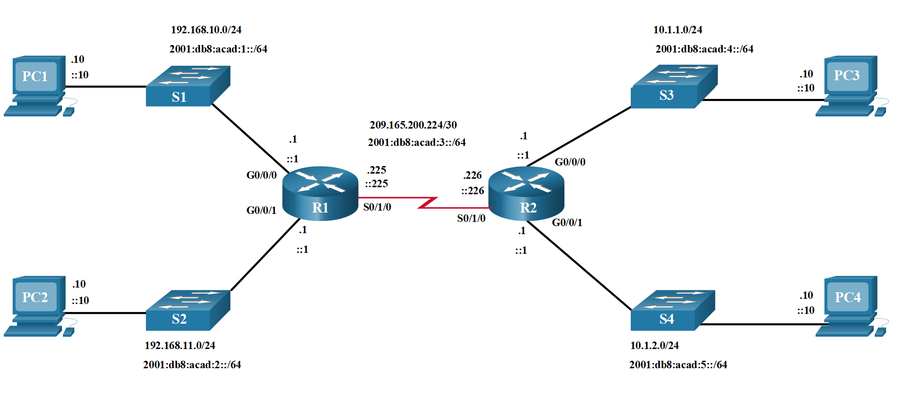

<!-- 1.4.1 -->
## Настройка основных параметров маршрутизатора

До сих пор этот модуль охватывал только коммутаторы. Если вы хотите, чтобы устройства могли отправлять и получать данные за пределами вашей сети, вам придется настроить маршрутизаторы. В этом разделе описывается базовая конфигурация маршрутизатора и предлагаются две проверки синтаксиса и действия трассировки пакетов, чтобы вы могли практиковать эти навыки.

Маршрутизаторы и коммутаторы Cisco во многом похожи. Они поддерживают сходные модальные операционные системы, используют одинаковые структуры команд и команды. Кроме того, для начальной настройки этих устройств требуются схожие действия. Например, следующие параметры должны быть всегда настроены. Назовите устройство, чтобы отличить его от других маршрутизаторов, и настройте пароли, как показано в примере.

```
Router# configure terminal
Enter configuration commands, one per line.  End with CNTL/Z.
Router(config)# hostname R1
R1(config)# enable secret class
R1(config)# line console 0
R1(config-line)# password cisco
R1(config-line)# login
R1(config-line)# exit
R1(config)# line vty 0 4
R1(config-line)# password cisco
R1(config-line)# login
R1(config-line)# exit
R1(config)# service password-encryption
R1(config)#
```

Настройте баннер для предоставления юридического уведомления о несанкционированном доступе, как показано в примере.

```
R1(config)# banner motd #Authorized Access Only!#
R1(config)#
```

Сохраните изменения на маршрутизаторе, как показано в примере.

```
R1# copy running-config startup-config
Destination filename [startup-config]? 
Building configuration...
[OK]
```

<!-- 1.4.2 -->
<!-- syntax -->

<!-- 1.4.3 -->
## Топология с использованием двойного стека

Одним из существенных различий между коммутаторами и маршрутизаторами являются поддерживаемые устройствами типы интерфейсов. Например, коммутаторы 2-го уровня поддерживают локальные сети, в связи с чем они оснащены несколькими портами FastEthernet или Gigabit Ethernet. Топология двойного стека на рисунке используется для демонстрации конфигурации интерфейсов IPv4 и IPv6 маршрутизатора.


<!-- /courses/srwe-dl/af9ea780-34fe-11eb-b1b2-9b1b0c1f7e0d/afb58ae7-34fe-11eb-b1b2-9b1b0c1f7e0d/assets/c96eb741-1c27-11ea-af09-3b2e6521927c.svg -->

<!--
топология сети с двойным стеком, состоящая из нескольких хостов, коммутаторов и маршрутизаторов с интерфейсами, настроенными как с IPv4, так и с IPv6 адресами
-->

<!-- 1.4.4 -->
## Настройка интерфейсов маршрутизатора

Маршрутизаторы поддерживают локальные и глобальные сети, и могут обеспечивать соединение между разными типами сетей. Таким образом, они поддерживают множество типов интерфейсов. Например, маршрутизаторы семейства Cisco G2 SR используют один или два интегрированных интерфейса Gigabit Ethernet и разъемы для высокоскоростных интерфейсных карт WAN (HWIC) для поддержания разных типов сетевых интерфейсов, включая последовательный, DSL и кабельный интерфейсы.

Чтобы обеспечить доступность интерфейса, его необходимо:

* **Настройте как минимум с одним IP-адресом с помощью команды** \- Используйте команды **ip address** \ ip-address subnet-mask и **ipv6 address** \ ipv6-address/prefix.   
* **Активировать** - По умолчанию, LAN и WAN интерфейсы выключены (**с использованием команды**). Чтобы включить интерфейс, нужно активировать интерфейс с помощью команды **no shutdown** (это действие аналогично подаче питания на интерфейс). Для активации физического уровня интерфейс должен быть также подключен к другому устройству (концентратору, коммутатору или другому маршрутизатору).
* **Описание** При необходимости для интерфейса можно настроить короткое описание длиной до 240 символов. Рекомендуется настраивать описание на каждом интерфейсе. В производственных сетях быстро оценили преимущества описания интерфейсов, поскольку это очень удобно при устранении неполадок, а также для определения стороннего подключения и поиска контактной информации.

В следующем примере показана конфигурация интерфейсов на R1.

```
R1(config)# interface gigabitethernet 0/0/0
R1(config-if)# ip address 192.168.10.1 255.255.255.0 
R1(config-if)# ipv6 address 2001:db8:acad:1::1/64 
R1(config-if)# description Link to LAN 1
R1(config-if)# no shutdown
R1(config-if)# exit
R1(config)# interface gigabitethernet 0/0/1
R1(config-if)# ip address 192.168.11.1 255.255.255.0 
R1(config-if)# ipv6 address 2001:db8:acad:2::1/64 
R1(config-if)# description Link to LAN 2
R1(config-if)# no shutdown
R1(config-if)# exit
R1(config)# interface serial 0/0/0
R1(config-if)# ip address 209.165.200.225 255.255.255.252 
R1(config-if)# ipv6 address 2001:db8:acad:3::225/64 
R1(config-if)# description Link to R2
R1(config-if)# no shutdown
R1(config-if)# exit
R1(config)#
```

<!-- 1.4.5 -->
<!-- syntax -->

<!-- 1.4.6 -->
## Интерфейсы обратной петли IPv4

Другая распространенная конфигурация маршрутизаторов Cisco IOS — задействование интерфейса loopback.

Интерфейс обратной петли предоставляет собой логический, внутренний по отношению к маршрутизатору интерфейс. Он не назначается физическому порту и не может быть подключен к другому устройству. Он считается программным интерфейсом, который автоматически переводится в состояние up (активен) во время работы маршрутизатора.

Применение интерфейса loopback может быть целесообразным при тестировании и управлении устройством Cisco IOS, поскольку он обеспечивает доступность хотя бы одного интерфейса. Его можно использовать в целях тестирования — например, для тестирования внутренних процессов маршрутизации, путем имитации сетей за пределами маршрутизатора.

Интерфейсы обратной связи также широко используются в лабораторных средах для создания дополнительных интерфейсов. Например, можно создать несколько интерфейсов обратной связи на маршрутизаторе, чтобы имитировать большее количество сетей для практики настройки и тестирования. В этой учебной программе мы часто используем интерфейс обратной связи для имитации канала в Интернет.

Включение интерфейса и назначение loopback-адресов выполняется с помощью простого набора команд:

```
Router(config)# interface loopback number 
```

```
Router(config-if)# ip address ip-address subnet-mask 
```

На маршрутизаторе можно активировать несколько интерфейсов loopback. IPv4-адрес для каждого интерфейса loopback должен быть уникальным и не должен быть задействован другим интерфейсом, как показано в примере для интерфейса loopback 0 на маршрутизаторе R1.

```
R1(config)# interface loopback 0
R1(config-if)# ip address 10.0.0.1 255.255.255.0
R1(config-if)# exit
R1(config)#
%LINEPROTO-5-UPDOWN: Line protocol on Interface Loopback0, changed state to up
```

<!-- 1.4.7 -->
## Работа в симуляторе: настройка интерфейсов маршрутизатора

В этом задании Packet Tracer вы будете настраивать маршрутизаторы с адресацией IPv4 и IPv6.

[Настройка интерфейсов маршрутизатора (pdf)](./assets/1.4.7-packet-tracer---configure-router-interfaces_ru-RU.pdf)

[Настройка интерфейсов маршрутизатора (pka)](./assets/1.4.7-packet-tracer---configure-router-interfaces_ru-RU.pka)

