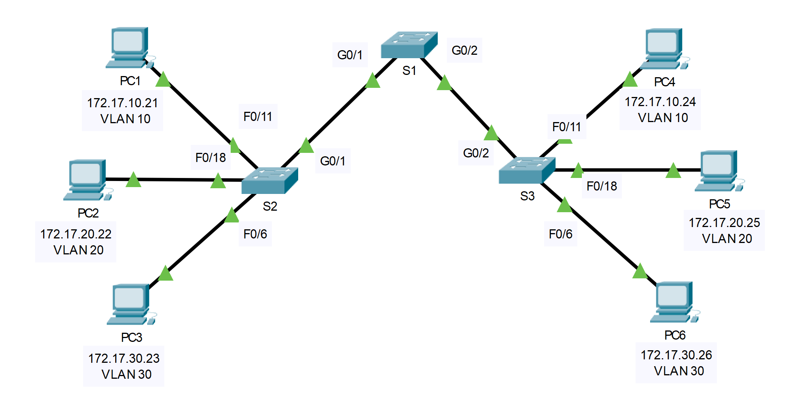

## Топология



## Таблица адресации

| Устройство | Интерфейс | IP-адрес     | Маска подсети | Порт коммутатора | VLAN                   |
|------------|-----------|--------------|---------------|------------------|------------------------|
| PC1        | NIC       | 172.17.10.21 | 255.255.255.0 | S2 F0/11         | 10                     |
| PC2        | NIC       | 172.17.20.22 | 255.255.255.0 | S2 F0/18         | В данном примере — 20. |
| PC3        | NIC       | 172.17.30.23 | 255.255.255.0 | S2 F0/6          | 30                     |
| PC4        | NIC       | 172.17.10.24 | 255.255.255.0 | S3 F0/11         | 10                     |
| PC5        | NIC       | 172.17.20.25 | 255.255.255.0 | S3 F0/18         | В данном примере — 20. |
| PC6        | NIC       | 172.17.30.26 | 255.255.255.0 | S3 F0/6          | 30                     |

## Задачи

Часть 1. Проверка сетей VLAN

Часть 2. Настройка магистральных каналов

## Общие сведения

Магистральные каналы необходимы для передачи информации VLAN между коммутаторами. Порт коммутатора можно настроить либо как порт доступа, либо как магистральный порт. Порты доступа служат для передачи трафика от определенной VLAN, назначенной конкретному порту. По умолчанию магистральный порт является членом всех VLAN. Таким образом, он передает трафик для всех VLAN. Целью данного задания является создание магистральных портов и назначение их сети VLAN с нетегированным трафиком, отличной от сети по умолчанию.

## Инструкции

### Часть 1. Проверка сетей VLAN

**Шаг 1. Отобразите текущие сети VLAN.**

1.  На коммутаторе **S1** выполните команду, с помощью которой отображаются все настроенные сети VLAN. Всего должно быть девять сетей VLAN. Обратите внимание, как все 26 порта доступа на коммутаторе назначены сети VLAN 1.

2.  На коммутаторах **S2** и **S3** отобразите все сети VLAN и убедитесь, что они настроены правильно и назначены соответствующим портам коммутаторов в соответствии с **таблицей адресации**.

**Шаг 2. Проверьте подключение между компьютерами в одной и той же сети.**

Ping между узлами одной и той же VLAN на разных коммутаторах. Хотя узлы **PC1** и **PC4** находятся в одной сети, они не могут отправлять друг другу эхо-запросы. Это связано с тем, что порты, соединяющие коммутаторы, назначены сети VLAN 1 по умолчанию. Для обеспечения коммуникации между компьютерами, находящимися в одной сети, и сетью VLAN следует настроить магистральные каналы.

### Часть 2. Настройка магистральных каналов

**Шаг 1. Настройте магистральный канал на коммутаторе S1 и настройте сеть VLAN 99 в качестве сети VLAN с нетегированным трафиком.**

1.  Настройте интерфейсы G0/1 и G0/2 на коммутаторе S1 для создания магистральных каналов.

    ```
    S1(config)# interface range g0/1 - 2
    S1(config-if)# switchport mode trunk
    ```

2.  Настройте VLAN 99 в качестве сети VLAN с нетегированным трафиком (Native VLAN) для интерфейсов G0/1 и G0/2 на коммутаторе **S1**.

    ```
    S1(config-if)# switchport trunk native vlan 99
    ```

    Из-за особенностей протокола STP (Spanning Tree Protocol) для включения магистрального порта потребуется около одной минуты. Нажмите на **Fast Forward Time (Ускорить)**, чтобы ускорить процесс. После включения портов вы будете периодически получать следующие сообщения системного журнала:

    ```
    %CDP-4-NATIVE_VLAN_MISMATCH: Native VLAN mismatch discovered on GigabitEthernet0/2 (99), with S3 GigabitEthernet0/2 (1).
    %CDP-4-NATIVE_VLAN_MISMATCH: Native VLAN mismatch discovered on GigabitEthernet0/1 (99), with S2 GigabitEthernet0/1 (1).
    ```

    Вы настроили VLAN 99 как сеть native VLAN на коммутаторе S1. При этом коммутаторы S2 и S3 используют сеть VLAN 1 в качестве сети VLAN с нетегированным трафиком по умолчанию, как указывается в syslog-сообщении.

    - ответьте на вопрос №1

**Шаг 2. Убедитесь, что на коммутаторах S2 и S3 включен магистральный канал.**

На коммутаторах **S2** и **S3** выполните команду **show interface trunk**, чтобы убедиться, что протокол DTP успешно согласовал магистральный канал на коммутаторах S2 и S3 с коммутатором S1. В выходных данных также отображается информация о магистральных интерфейсах на коммутаторах S2 и S3. Вы узнаете больше о DTP позже в ходе курса.

- ответьте на вопрос №2

**Шаг 3. Устраните несоответствие сети VLAN с нетегированным трафиком на коммутаторах S2 и S3.**

1.  Настройте сеть VLAN 99 как native VLAN для соответствующих интерфейсов на коммутаторах S2 и S3.

2.  Выполните команду **show interface trunk**, чтобы убедиться в правильности настройки сети VLAN.

**Шаг 4. Проверьте настройки на коммутаторах S2 и S3.**

1.  Выполните команду **show interface** *интерфейс* **switchport**, чтобы убедиться, что теперь сетью native VLAN является сеть 99.

2.  Чтобы отобразить информацию о настроенных сетях VLAN, используйте команду **show vlan**.

    - ответьте на вопрос №3

[Скачать файл Packet Tracer для локального запуска](./assets/3.4.5-lab.pka)
