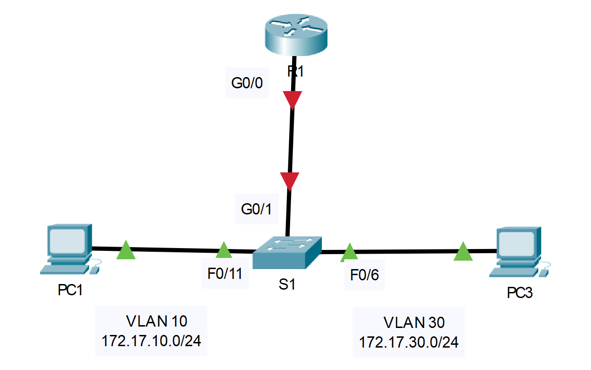

---

> **ВАЖНО**
> 
> Форма для ответов на вопросы будет доступна только при развертывании лабораторной работы 

---

## Топология



## Таблица адресации

| Устройство | Интерфейс | IPv4-адрес   | Маска подсети | Шлюз по умолчанию |
|------------|-----------|--------------|---------------|-------------------|
| R1         | G0/0.10   | 172.17.10.1  | 255.255.255.0 | —                 |
| R1         | G0/0.30   | 172.17.30.1  | 255.255.255.0 | —                 |
| PC1        | NIC       | 172.17.10.10 | 255.255.255.0 | 172.17.10.1       |
| PC2        | NIC       | 172.17.30.10 | 255.255.255.0 | 172.17.30.1       |

## Задачи

Часть 1. Добавление сетей VLAN на коммутаторе

Часть 2. Настройка подынтерфейсов

Часть 3. Проверка подключения с маршрутизацией между VLAN

## Сценарий

В этом задании вы настроите VLAN и маршрутизацию между VLAN. Необходимо активировать транковый канал и проверить подключение между сетями VLAN.

## Инструкции

### Часть 1. Добавление сетей VLAN в коммутатор

**Шаг 1. Создайте сети VLAN на коммутаторе S1.**

Создайте VLAN 10 и VLAN 30 на **S1**.

1.  Настройте интерфейсы F0/6 и F0/11 в качестве портов доступа и назначьте им сети VLAN.

    -   Назначьте порт, подключенный к **PC1** во VLAN 10.

    -   Назначьте порт, подключенный к **PC3** во VLAN 30.

2.  Выполните команду **show vlan brief,** чтобы проверить настройку VLAN.

    ```
    S1# show vlan brief
    VLAN Name Status Ports
    ---- -------------------------------- --------- -------------------------------
    1 default active Fa0/1, Fa0/2, Fa0/3, Fa0/4
                                                    Fa0/5, Fa0/7, Fa0/8, Fa0/9
                                                    Fa0/10, Fa0/12, Fa0/13, Fa0/14
                                                    Fa0/15, Fa0/16, Fa0/17, Fa0/18
                                                    Fa0/19, Fa0/20, Fa0/21, Fa0/22
                                                    Fa0/23, Fa0/24, Gig0/1, Gig0/2
    10 VLAN0010 active Fa0/11
    30 VLAN0030 active Fa0/6
    1002 fddi-default active
    1003 token-ring-default active
    1004 fddinet-default active
    1005 trnet-default active
    ```

**Шаг 2. Проверьте подключение между узлами PC1 и PC3.**

Отправьте эхо-запрос от узла **PC1** на **PC3**.

- ответьте на вопрос №1

### Часть 2. Настройка подынтерфейсов

**Шаг 1. Настройте подынтерфейсы на маршрутизаторе R1 с помощью инкапсуляции 802.1Q.**

1.  Создайте подынтерфейс G0/0.10.

    -   Установите для типа инкапсуляции значение 802.1Q и назначьте сеть VLAN 10 подынтерфейсу.

    -   См. **Таблицу адресации**, чтобы назначить подынтерфейсу верный IP-адрес.

    ```
    R1(config)# int g0/0.10
    R1(config-subif)# encapsulation dot1Q 10
    R1(config-subif)# ip address 172.17.10.1 255.255.255.0
    ```

2.  Повторите данную операцию для подынтерфейса G0/0.30.

**Шаг 2. Проверьте конфигурацию.**

1.  С помощью команды **show ip interface brief** проверьте конфигурацию подынтерфейса. Оба подынтерфейса отключены. Подынтерфейсы — это виртуальные интерфейсы, связанные с физическим интерфейсом. Поэтому, чтобы включить подынтерфейсы, необходимо сначала включить физический интерфейс, с которым они связаны.

2.  Включите интерфейс G0/0. Убедитесь в том, что теперь подынтерфейсы работают.

### Часть 3. Проверка подключения с маршрутизацией между VLAN

**Шаг 1. Отправьте эхо-запрос между узлами PC1 и PC3.**

- ответьте на вопрос №2

**Шаг 2. Включите магистральный канал.**

1.  На коммутаторе **S1** выполните команду **show vlan**.

    - ответьте на вопрос №3

2.  Поскольку в настройках маршрутизатора несколько подынтерфейсов назначены разным сетям VLAN, порт коммутатора, подключаемый к маршрутизатору, должен настраиваться как магистральный канал. Настройте интерфейс G0/1 как магистральный канал.

    - ответьте на вопрос №4

3.  Выполните команду **show interface trunk**, чтобы убедиться, что интерфейс настроен в качестве магистрального канала.

**Шаг 3. Проверка подключений**

Если конфигурации верны, PC1 и PC3 должны иметь возможность пинговать шлюзы по умолчанию и друг друга.

- ответьте на вопрос №5

[Скачать файл Packet Tracer для локального запуска](./assets/4.2.7-lab.pka)
