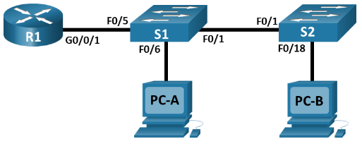

---

> **ВАЖНО**
> 
> Форма для ответов на вопросы будет доступна только при развертывании лабораторной работы 

---

## Топология



## Таблица адресации

| Устройство | Интерфейс | IP-адрес   | Маска подсети  | Шлюз по умолчанию |
|------------|-----------|------------|----------------|-------------------|
| **R1**     | G0/0/1.3  | 10.3.0.1   | 255.255.255.0  | —                 |
| **R1**     | G0/0/1.4  | 10.4.0.1   | 255.255.255.0  | —                 |
| **R1**     | G0/0/1.13 | 10.13.0.1  | 255.255.255.0  | —                 |
| **S1**     | VLAN 3    | 10.3.0.11  | 255.255.255.0  | 10.3.0.1          |
| **S2**     | VLAN 3    | 10.3.0.12  | 255.255.255.0  | 10.3.0.1          |
| **PC-A**   | NIC       | 10.4.0.50  | 255.255.255.0  | 10.4.0.1          |
| **PC-B**   | NIC       | 10.13.0.50 | 255.255.255.0  | 10.13.0.1         |

## Таблица VLAN

| VLAN              | Имя                            | Назначенный интерфейс                                        |
|-------------------|--------------------------------|--------------------------------------------------------------|
| 3<br><br><br><br> | <br><br><br><br>**Management** | <br><br><br>S1: VLAN 3<br>S2: VLAN 3                         |
| 4<br><br>         | <br><br>**Operations**         | <br><br>S1: F0/6                                             |
| <br>7             | <br>**ParkingLot**             | S1: F0/2-4, F0/7-24, G0/1-2<br>S2: F0/2-17, F0/19-24, G0/1-2 |
| 8                 | **Native**                     | —                                                            |
| 13                | **Обслуживание**               | S2: F0/18                                                    |

## Цели

Часть 1. Оценить работу сети.

Часть 2. Собрать информацию, создать план действий и внести исправления.

## Общие сведения и сценарий

Все сетевые устройства в режиме симуляции физического оборудования (PTPM) были предварительно настроены с включением преднамеренных ошибок, препятствующих маршрутизации между VLAN. Ваша задача состоит в том, чтобы оценить сеть, определить и исправить ошибки конфигурации для восстановления полной маршрутизации между VLAN. В конфигурациях, не связанных напрямую с маршрутизацией между VLAN, могут быть обнаружены ошибки, влияющие на способность сетевых устройств выполнять эту функцию.

**Примечание.** Подход к проектированию, используемый в данной лаборатории, заключается в оценке возможностей настройки и устранения неполадок только маршрутизации между VLAN. Такая конструкция может не отражать передовые методы работы по созданию сетей.

## Инструкции

### Часть 1. Оценка работы сети

**Условия**

-   Отсутствует трафик VLAN 7 в транке, так как в VLAN 7 нет устройств.

-   VLAN 8 является Native VLAN.

-   Все магистральные соединения – статические.

-   Необходимо проверить сквозное подключение.

1.  Используйте ноутбук и соответствующий кабель для подключения к сетевым устройствам для тестирования и настройки. Пароль для входа на всех сетевых устройствах — **cisco**, а пароль включения – **class**. Вы можете щелкнуть и перетащить консольное соединение с консольного порта одного устройства на другое, но вам придется начать новый сеанс.

2.  Используйте **ping** для проверки критериев и записи результатов в таблице ниже.  

    | От     | К                         | Результаты отправки команды ping |
    |--------|---------------------------|----------------------------------|
    | **R1** | **S1** VLAN 3 (10.3.0.11) |                                  |
    | **R1** | **S2** VLAN 3 (10.3.0.12) |                                  |
    | **R1** | **PC-A** (10.4.0.50)      |                                  |
    | **R1** | **PC-B** (10.13.0.50)     |                                  |
    | **S1** | **S2** VLAN 3 (10.3.0.12) |                                  |
    | **S1** | **PC-A** (10.4.0.50)      |                                  |
    | **S1** | **PC-B** (10.13.0.50)     |                                  |
    | **S2** | **PC-A** (10.4.0.50)      |                                  |
    | **S2** | **PC-B** (10.13.0.50)     |                                  |

### Часть 2. Сбор информации, создание плана действий и внесение исправлений

1.  О каждом требовании, которое не выполняется, нужно собрать информацию, изучив запущенные таблицы конфигурации и маршрутизации, и разработать гипотезу о том, что является причиной сбоя.

2.  Создайте план действий, который, по вашему мнению, решит проблему. Разработайте список всех команд, которые вы собираетесь ввести для устранения проблемы, и список всех команд, необходимых для восстановления конфигурации, если план действий не поможет устранить проблему.

    **Подсказка.** Если вам нужно сбросить порт коммутатора до конфигурации по умолчанию, используйте команду **default intrface _interface name_**.

    В качестве примера для F0/10:

    ```
    S1(config)# default interface f0/10
    ```

3.  Выполните планы действий по одному для каждого критерия, который не выполняется, и запишите действия, предпринятые для исправления.

<!-- [Скачать файл Packet Tracer для локального запуска](./assets/4.4.9-lab.pka) -->
