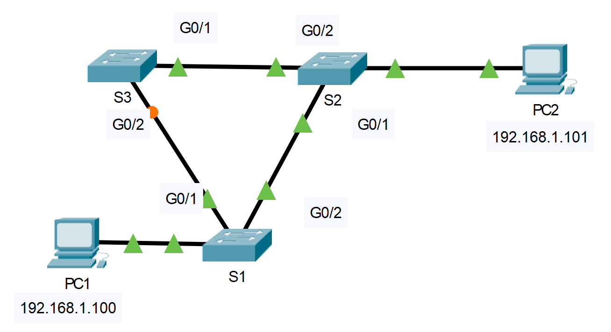

---

> **ВАЖНО**
> 
> Форма для ответов на вопросы будет доступна только при развертывании лабораторной работы 

---

## Топология

## Задачи

В этой лабораторной работе вы будете наблюдать состояния портов связующего дерева и следить за процессом совмещения STP.

-   Опишите операции и преимущества STP.

-   Объясните, как STP предотвращает петли коммутации, обеспечивая при этом резерв в коммутируемых сетях.

## Общие сведения и сценарий

В этом задании вы будете использовать Packet Tracer для наблюдения заработой STP в простой коммутируемой сети, которая имеет резервные пути.

## Инструкции

### Часть 1. Наблюдение за состоянием STP

**Шаг 1. Проверка связи**

Пошлите эхо-запрос с PC1 на PC2 для проверки подключения между узлами. Эхо-запрос (**ping**) должен пройти успешно.

**Шаг 2. Просмотр STP на каждом коммутаторе**

Используйте команду **show spanning-tree vlan 1** для сбора информации о состоянии STP каждого коммутатора. Заполните следующую таблицу. Учтите только сведения о магистральных портах Gigabit. **Порты Fast Ethernet** — это порты доступа, к которым подключены оконечные устройства и которые не являются частью STP на основе межкоммутационной магистрали.

| Коммутатор | Порт | Статус (FWD, BLK...) | Корневой мост? |
|------------|------|----------------------|----------------|
| S1         | G0/1 |                      |                |
| S1         | G0/2 |                      |                |
| S2         | G0/1 |                      |                |
| S2         | G0/2 |                      |                |
| S3         | G0/1 |                      |                |
| S3         | G0/2 |                      |                |

Packet Tracer использует другой источник связи на одном из соединений между коммутаторами.

Ответьте на:

- вопрос №1

- вопрос №2

- вопрос №3

- вопрос №4

### Часть 2. Наблюдение за совместимостью STP

**Шаг 1. Удалите канал между S1 и S2**

1.  Откройте окно интерфейса командной строки на коммутаторе S3 и выполните команду **show spanning-tree vlan 1**. Оставьте это окно открытым.

2.  Выберите инструмент удаления в строке меню и нажмите на кабель, соединяющий S1 и S2.

**Шаг 2. проследите совместимость STP**

1.  Быстро вернитесь к командной строке CLI на коммутаторе S3 и выполните команду **show spanning-tree vlan 1**.

2.  Используйте клавишу со стрелкой вверх, чтобы отозвать команду **show spanning-tree vlan 1** и повторять ее до тех пор, пока оранжевая линия кабеля не станет зеленой. Проверьте индикатор состояния порта G0/2.

    - Ответьте на вопрос №5

    Вы наблюдали переход в состоянии порта, который происходит при переходе STP из состояния блокировки в состояние пересылки.

3.  Проверьте возможности подключения путем эхо-запроса с PC1 на PC2. **Ping** должен пройти успешно.

    Существуют ли какие-то порты, отображающие оранжевый индикатор связи, указывающий на то, что порт находится в состоянии STP, отличном от пересылки? Поясните свой ответ.

[Скачать файл Packet Tracer для локального запуска](./assets/5.1.9-lab.pka)
