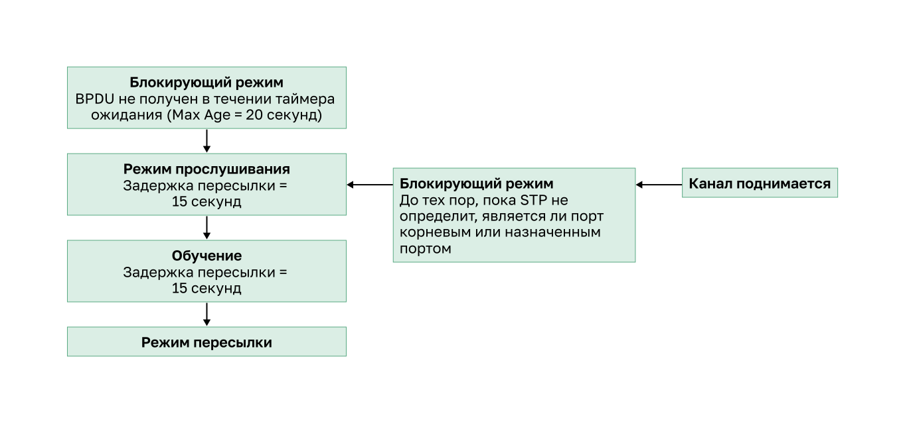

<!-- 5.2.1 -->
## Шаги к без петельной топологии

Теперь вы знаете, как возникают петли и как использовать STP для их предотвращения. В этой теме мы будем шаг за шагом рассматривать работу STP. Используя STA, STP строит топологию без петель в четырехэтапном процессе.

1. Выбор корневого моста.
2. Выбор корневых портов.
3. Выбор назначенных портов.
4. Выбор альтернативных (заблокированных) портов.

При работе STA и STP коммутаторы используют **блоки данных протокола моста** (BPDU) для обмена информацией о себе и своих каналах. BPDU используются для выбора корневого моста, корневых, назначенных и альтернативных портов. Каждый BPDU содержит идентификатор BID, который определяет коммутатор, отправивший BPDU. BID участвует в принятии многих решений STA, включая роли корневого моста и портов. Как показано на рисунке, BID содержит значение приоритета, MAC-адрес коммутатора и расширенный системный идентификатор. Самое низкое значение BID определяется комбинацией значений в этих трех полях.

На рисунке показаны три поля, каждое из которых является компонентом идентификатора моста. Слева направо: первое поле — Bridge Priority (приоритет моста), которое имеет длину 4 бита; второе поле — Extended System ID (расширеный системный идентификатор), длина которого составляет 12 бит; третье поле — MAC-адрес, длина которого составляет 48 бит. Текст справа от полей показывает идентификатор моста с расширенным идентификатором системы. Текст в нижней части рисунка гласит, что BID включает приоритет моста, расширенный идентификатор системы и MAC-адрес коммутатора.

BID включает в себя приоритет моста, расширенный идентификатор системы и MAC-адрес коммутатора.

**Bridge Priority**

Значение приоритета по умолчанию для всех коммутаторов Cisco равно десятичному значению 32768. Значения варьируются в диапазоне от 0 до 61440 с шагом в 4096. Предпочтительнее более низкий приоритет моста. Так, приоритет 0 имеет преимущество по сравнению со всеми остальными значениями.

**Extended System ID**

**Значение расширенного идентификатора системы** — это десятичное значение, добавляемое к приоритету моста в BID для определения приоритета и VLAN кадра BPDU.

Для сетей, в которых не использовались VLAN, разработаны более ранние реализации IEEE 802.1D. На всех коммутаторах использовался один общий STP. По этой причине в старых коммутаторах расширенный идентификатор системы не был включен в BPDU. Так как VLAN получили распространение, поскольку они позволяют сегментировать сетевую инфраструктуру, стандарт 802.1D был усовершенствован с добавлением поддержки таких сетей. Для этого потребовалось включение в кадр BPDU идентификатора VLAN. Сведения о такой сети включены в кадр BPDU с помощью расширенного идентификатора системы. Он позволяет более поздним реализациям STP, таким как Rapid STP (RSTP), иметь различные корневые мосты для разных наборов VLAN. Это дает возможность использовать резервные, непересылаемые каналы в топологии STP для одного набора VLAN другим набором VLAN с использованием другого корневого моста.

**MAC address**

Если два коммутатора настроены с одинаковым приоритетом и имеют одинаковый расширенный идентификатор системы, коммутатор с наименьшим значением MAC-адреса, выраженным в шестнадцатеричном формате, получит меньший идентификатор BID.

<!-- 5.2.2 -->
## 1. Выбор корневого моста

STA назначает один из коммутаторов в качестве корневого моста и использует его как точку привязки для расчёта всех путей. Коммутаторы обмениваются BPDU для создания безпетельной топологии, начиная с выбора корневого моста.

Процесс выбора определяет, какой из коммутаторов станет корневым мостом. Все коммутаторы в домене широковещательной рассылки участвуют в этом процессе. После загрузки коммутатора они начинают рассылать кадры BPDU с интервалом в две секунды. Эти кадры содержат BID передающего коммутатора и BID корневого моста, известный как Root ID.

Коммутатор с самым низким значением идентификатора моста (BID) становится корневым мостом. Сначала все коммутаторы объявляют себя корневым мостом с собственным BID, установленным в качестве корневого идентификатора. В конце концов через обмен BPDU они узнают, кто из них имеет самый низкий BID и будет согласовывать один корневой мост.

На рисунке S1 является корневым мостом, так как он имеет самый низкий BID.

<!-- 5.2.3 -->
## Влияние BID по умолчанию

Поскольку значение BID по умолчанию равно 32768, два или более коммутаторов могут иметь одинаковый приоритет. В этом сценарии устройство с самым низким MAC-адресом станет корневым мостом. Чтобы гарантировать, что решение относительно корневого моста соответствует требованиям сети, администратору рекомендуется настроить выбранный коммутатор корневого моста с наименьшим приоритетом.

На рисунке все коммутаторы настроены с одинаковым приоритетом 32769. Здесь MAC-адрес становится решающим фактором. В этом примере S2 имеет наименьшее значение MAC-адреса и, следовательно, назначается корневым мостом для этого экземпляра STP.

**Примечание.** В этом примере для всех коммутаторов используется значение 32769. Оно основано на значении приоритета по умолчанию 32768 и значении VLAN 1, связанном с каждым из коммутаторов (32768+1).

<!-- 5.2.4 -->
## Определение стоимости корневого пути

Если корневой мост выбран для экземпляра STP, STA начинает процесс определения оптимальных путей к корневому мосту от всех некорневых коммутаторов в домене широковещательной рассылки. Информация, известная как стоимость внутреннего корневого пути, равна сумме стоимости отдельных портов на пути от коммутатора к корневому мосту.

**Примечание.** BPDU включает стоимость корневого пути. Это стоимость пути от отправляющего коммутатора к корневому мосту.

Когда коммутатор получает блок BPDU, он добавляет стоимость входного порта сегмента для определения своей стоимости для внутреннего корневого пути.

Стоимость портов по умолчанию определяется скоростью работы порта. В таблице показаны расходы на порты по умолчанию, предложенные IEEE. Коммутаторы Cisco по умолчанию используют значения, определенные стандартом IEEE 802.1D, также известные как стоимость короткого пути, как для STP, так и для RSTP. Однако стандарт IEEE предлагает использовать значения, определенные в IEEE-802.1w, также известные как стоимость длинного пути, при использовании каналов 10 Гбит/с и быстрее.

**Примечание.** RSTP более подробно рассматривается в этом модуле позднее.

| **Скорость канала** | **Стоимость STP: IEEE 802.1D-1998** | **Стоимость RSTP: IEEE 802.1w-2004** |
| --- | --- | --- |
| 10 Гбит/с | 2 | 2 000 |
| 1 Гбит/с | 4 | 20 000 |
| 100 Мбит/с | 19 | 200 000 |
| 10 Мбит/с | 100 | 2 000 000 |

Хотя с портами коммутатора связано значение стоимости пути по умолчанию, значение стоимости порта можно настроить. Возможность настройки отдельных портов предоставляет администратору необходимую гибкость при контроле путей STP к корневому мосту.

<!-- 5.2.5 -->
## 2. Выбор корневых портов

После определения корневого моста для выбора корневого порта используется алгоритм STA. Каждый некорневой коммутатор выбирает один корневой порт. **Корневые порты** — порты коммутатора, ближайшие к корневому мосту с точки зрения общей стоимости маршрута к нему.

Стоимость внутреннего корневого пути равна сумме стоимостей путей от всех портов к корневому мосту, как показано на рисунке. Пути с наименьшей стоимостью становятся предпочтительными, а все остальные (резервные пути) блокируются. В этом примере стоимость внутреннего корневого пути от S2 до корневого моста S1 по пути 1 равна 19 (на основе указанной IEEE стоимости индивидуального порта), а стоимость для пути 2 равна 38. Поскольку общая стоимость пути 1 ниже, именно он является предпочтительным.

<!-- 5.2.6 -->
## 3. Выбор назначенных портов

Часть предотвращения петель STP становится более понятной на этом этапе. После того, как каждый коммутатор выбирает корневой порт, устройства будут выбирать назначенные порты. Каждый сегмент между двумя коммутаторами будет иметь один назначенный порт.

**Назначенный порт** — это порт в сегменте с двумя коммутаторами, который имеет минимальную стоимость внутреннего корневого пути к корневому мосту. Другими словами, назначенный порт имеет лучший путь для приема трафика, ведущего к корневому мосту.

То, что не является корневым или назначенным портом, становится альтернативным или заблокированным. Конечным результатом является один путь от каждого коммутатора к корневому мосту.

**Назначенные порты на корневом мосту**

Все порты на корневом мосту являются назначенными. Это связано с тем, что корневой мост имеет самую низкую стоимость для себя.

**Назначенный порт при наличии корневого порта**

Если на одном конце сегмента находится корневой порт, на другом конце будет назначенный. Чтобы продемонстрировать это, на рисунке показано, что коммутатор S4 подключен к S3. Интерфейс Fa0/1 на S4 является его корневым портом, поскольку он имеет лучший и единственный путь к корневому мосту. Таким образом, интерфейс Fa0/3 на S3 на другом конце сегмента будет назначенным портом.

**Примечание.** Все порты коммутатора с подключенными оконечными устройствами (хостами) являются назначенными портами.

Интерфейс Fa0/1 на S4 является назначенным портом, потому что интерфейс Fa0/3 на S3 является корневым портом.

**Назначенный порт при отсутствие корневого порта**

Это оставляет только сегменты между двумя коммутаторами, где ни один из них не является корневым мостом. В этом случае порт коммутатора с наименьшей стоимостью пути является назначенным портом для сегмента. Например, на рисунке последним является сегмент между S2 и S3. Оба устройства имеют одинаковую стоимость пути к корневому мосту. STA будет использовать идентификатор моста в качестве инструмента принятия решения. Хотя это не показано на рисунке, S2 имеет более низкий BID. Таким образом, порт F0/2 S2 будет выбран в качестве назначенного порта. Назначенные порты находятся в состоянии пересылки.

Интерфейс Fa0/2 S2 является назначенным портом на сегменте с S3.

<!-- 5.2.7 -->
## 4. Выбор альтернативных (заблокированных) портов.

Если порт не является корневым или назначенным, он становится альтернативным (резервным) портом. Такие порты находятся в состоянии отклонения или блокировки для предотвращения петель. На рисунке STA настроил порт F0/2 на коммутаторе S3 в роли альтернативного. Порт F0/2 на S3 находится в блокирующем состоянии и не будет пересылать кадры Ethernet. Все остальные порты между коммутаторами находятся в состоянии пересылки. Этот же работает как часть STP для предотвращения образования петель.

Интерфейс Fa0/2 S3 не является корневым или назначенным портом, поэтому он становится альтернативным или заблокированным портом.

<!-- 5.2.8 -->
## Выбор корневого порта из нескольких путей равной стоимости

Корневой и назначенные порты основаны на наименьшей стоимости пути к корневому мосту. Но что произойдет, если коммутатор имеет несколько равных по стоимости путей к корневому мосту? Как коммутатор определит корневой порт?

В таком случае он определяет порт, используя три критерия.

1. Самое низкое значение идентификатора BID моста-отправителя.
2. Самое низкое значение приоритета порта-отправителя.
3. Самое низкое значение идентификатора порта.

**1. Самое низкое значение идентификатора моста-отправителя**

На рисунке показана топология с четырьмя коммутаторами, включая S1 в качестве корневого моста. Если рассмотреть роли портов, порт F0/1 на S3 и порт F0/3 на S4 были выбраны в качестве корневых, поскольку они имеют наименьшую стоимость пути к корневому мосту для соответствующих коммутаторов. S2 содержит два порта — F0/1 и F0/2 — с путями равной стоимости. В этом случае для нарушения равнозначности будут использованы идентификаторы мостов соседних коммутаторов S3 и S4. Это называется BID отправителя. S3 имеет BID 32769.5555.5555.5555, а S4 имеет BID 32769.1111.1111.1111. Поскольку значение BID для S4 меньше, корневым портом будет порт коммутатора S2 F0/1, подключенный к S4.

**2. Самое низкое значение приоритета порта-отправителя**

Чтобы продемонстрировать два следующих критерия, топология изменяется на такую, где два коммутатора соединены двумя путями равной стоимости между ними.

S1 является корневым мостом, поэтому оба его порта являются назначенными. S4 имеет два порта с равными по стоимости путями к корневому мосту. Поскольку оба порта подключены к одному коммутатору, BID отправителя (S1) равен. Итак, первый шаг — ничья.

Далее в списке находится приоритет порта отправителя (S1). Приоритет порта по умолчанию равен 128, поэтому оба порта S1 имеют одинаковый приоритет. Это тоже ничья. Однако если любой порт на S1 настроен с более низким приоритетом, S4 помещал бы свой смежный порт в состояние пересылки. Другой порт на S4 будет в состоянии блокировки.

**3. Самое низкое значение идентификатора порта**

Последний определитель является самым низким идентификатором порта отправителя. Коммутатор S4 получил BPDU от порта F0/1 и порта F0/2 на S1. Помните, что решение основано на идентификаторе порта отправителя, а не на идентификаторе порта получателя. Поскольку идентификатор порта F0/1 на S1 меньше, чем порт F0/2, порт F0/6 коммутатора S4 будет корневым. Это порт на S4, который подключен к порту F0/1 на S1.

Порт F0/5 на S4 станет альтернативным и будет помещен в состояние блокировки, которое является частью STP для предотвращения петли.

<!-- 5.2.9 -->
## Таймеры STP и состояния портов

Для конвергенции STP требуется три таймера.

* **Hello Timer** \ Время приветствия (hello time) — это интервал между BPDU. По умолчанию это значение равно 2 секундам, но его можно настроить в диапазоне от 1 до 10 секунд.
* **Forward Delay Timer** \ Таймер задержки пересылки (Forward Delay Timer) — время, проводимое в состояниях прослушивания и обучения. Значение по умолчанию составляет 15 секунд, но может быть настроено в диапазоне от 4 до 30 секунд.
* **Max Age Timer** \ Максимальный возраст (max age) — это максимальное время ожидания коммутатора перед попыткой изменения топологии STP. По умолчанию это значение равно 20 секундам, но его можно настроить в диапазоне от 6 до 40 секунд.

**Примечание.** Время по умолчанию может быть изменено на корневом мосту, который определяет значение этих таймеров для домена STP.

STP упрощает создание логического беспетлевого пути по домену широковещательной рассылки. Этот протокол определяется с помощью данных, полученных в процессе обмена кадрами BPDU между соединенными друг с другом коммутаторами. Если порт коммутатора переходит непосредственно из состояния блокировкм в состояние пересылки, не получив информацию о полной топологии в процессе перехода, он может временно создать петлю данных. По этой причине STP имеет пять состояний портов, четыре из которых являются рабочими, как показано на рисунке. Отключенное состояние считается неработоспособным.

Подробные сведения о каждом состоянии порта приведены в таблице.

| **Состояние порта** | **Описание** |
| --- | --- |
| Блокирующий режим | Порт является альтернативным и не участвует в пересылке кадров. Он получает кадры BPDU для определения местоположения и корневого идентификатора корневого моста. Кадры BPDU также определяют роли портов коммутатора, которые каждый из них должен принимать в окончательной активной топологии STP. С таймером максимального возраста 20 секунд порт коммутатора, который не получил ожидаемый BPDU от соседнего коммутатора, перейдет в состояние блокировки. |
| Режим прослушивания | После состояния блокировки порт перейдет в состояние прослушивания. Он получает BPDU для определения пути к корню. Порт коммутатора также передает свои собственные кадры BPDU и сообщает смежным коммутаторам, что порт коммутатора готовится к участию в активной топологии. |
| Обучение | Порт коммутатора переходит в состояние обучения после состояния прослушивания. Во время обучения он получает и обрабатывает BPDU и готовится к участию в пересылке кадров. Он также начинает заполнять таблицу MAC-адресов. Однако в состоянии обучения пользовательские кадры не передаются. |
| Режим пересылки | В состоянии пересылки порт коммутатора считается частью активной топологии. Он пересылает пользовательский трафик, отправляет и получает кадры BPDU. |
| Отключено | Порт коммутатора в отключенном состоянии не участвует в STP и не пересылает кадры. Отключенное состояние устанавливается, когда порт коммутатора административно отключен. |

<!-- 5.2.10 -->
## Эксплуатационные данные каждого состояния порта 

В таблице приведены рабочие подробности каждого состояния порта.

| **Состояние порта** | **BPDU** | **Таблица MAC-адресов** | **Пересылка кадров данных** |
| --- | --- | --- | --- |
| Блокирующий режим | Только получение | Без обновления | Нет |
| Режим прослушивания | Получение и отправка | Без обновления | Нет |
| Обучение | Получение и отправка | Обновление таблицы | Нет |
| Режим пересылки | Получение и отправка | Обновление таблицы | Да |
| Отключено | Не отправлено или получено | Без обновления | Нет |

<!-- 5.2.11 -->
## Протокол PerVLAN Spanning Tree Protocol.

До сих пор мы обсуждали STP в среде, где существует только одна VLAN. Однако STP можно настроить для работы в среде с несколькими VLAN.

В версиях STP для каждого VLAN Spanning Tree (PVST) существует корневой мост, выбранный для каждого экземпляра протокола. Возможно наличие нескольких отдельных корневых мостов для различных наборов VLAN. STP управляет отдельным экземпляром протокола для каждой отдельной VLAN. Если все порты на всех коммутаторах являются участниками VLAN 1, значит, существует только один экземпляр STP.

<!-- 5.2.12 -->
<!-- quiz -->

