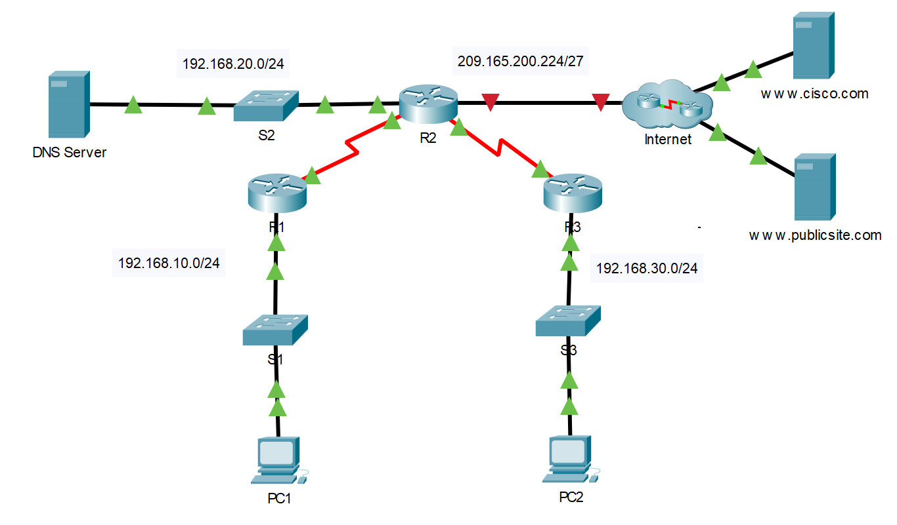

## Топология



## Таблица адресации

| Устройство | Интерфейс | IPv4-адрес       | Маска подсети    | Шлюз по умолчанию |
|------------|-----------|------------------|------------------|-------------------|
| R1         | G0/0      | 192.168.10.1     | 255.255.255.0    | —                 |
| R1         | S0/0/0    | 10.1.1.1         | 255.255.255.252  | —                 |
| R2         | G0/0      | 192.168.20.1     | 255.255.255.0    | —                 |
| R2         | G0/1      | Назначенный DHCP | Назначенный DHCP | —                 |
| R2         | S0/0/0    | 10.1.1.2         | 255.255.255.252  | —                 |
| R2         | S0/0/1    | 10.2.2.2         | 255.255.255.252  | —                 |
| R3         | G0/0      | 192.168.30.1     | 255.255.255.0    | —                 |
| R3         | S0/0/1    | 10.2.2.1         | 255.255.255.0    | —                 |
| PC1        | NIC       | Назначенный DHCP | Назначенный DHCP | Назначенный DHCP  |
| PC2        | NIC       | Назначенный DHCP | Назначенный DHCP | Назначенный DHCP  |
| DNS Server | NIC       | 192.168.20.254   | 255.255.255.0    | 192.168.20.1      |

## Задачи

Часть 1. Настройка маршрутизатора в роли DHCP-сервера

Часть 2. Настройка ретрансляции DHCP

Часть 3. Настройка маршрутизатора в роли DHCP-клиента

Часть 4. Проверка DHCP и подключения

## Сценарий

Выделенный сервер DHCP хорошо масштабируется и им относительно легко управлять, однако использование подобного сервера в каждой точке сети может оказаться слишком затратным. Вместе с тем маршрутизатор Cisco можно настроить для обеспечения DHCP-служб без необходимости в выделенном сервере. Будучи сетевым специалистом вашей компании, вам была назначена задача настройки маршрутизатора Cisco в качестве DHCP-сервера. Также необходимо настроить пограничный маршрутизатор в качестве DHCP-клиента таким образом, чтобы он получал IP-адрес от сети интернет-провайдера.

## Инструкции

### Часть 1. Настройка маршрутизатора в роли DHCP-сервера

**Шаг 1. Исключите зарезервированные IPv4-адреса из пула DHCP.**

Адреса, статически назначенные устройствам в сетях, которые будут использовать DHCP, должны быть исключены из пулов DHCP. Это позволяет избежать ошибок, связанных с дублирующимися IP-адресами. В этом случае IP-адреса интерфейсов LAN R1 и R3 должны быть исключены из пула DHCP. Кроме того, девять других адресов исключаются для статического назначения другим устройствам, таким как серверы и интерфейсы управления устройствами.

1.  Настройте маршрутизатор **R2** таким образом, чтобы исключить первые 10 адресов из локальных сетей маршрутизатора R1.

    ```
    R2(config)# ip dhcp excluded-address 192.168.10.1 192.168.10.10
    ```

2.  Настройте маршрутизатор **R2** таким образом, чтобы исключить первые 10 адресов из локальных сетей маршрутизатора R3.

**Шаг 2. На маршрутизаторе R2 создайте пул DHCP для локальной сети маршрутизатора R1.**

1.  Создайте пул DHCP под названием **R1-LAN** (с учетом регистра).

    ```
    R2(config)# ip dhcp pool R1-LAN
    ```

2.  Настройте пул DHCP с учетом сетевого адреса, шлюза по умолчанию и IP-адреса сервера DNS.

    ```
    R2(dhcp-config)# network 192.168.10.0 255.255.255.0
    R2(dhcp-config)# default-router 192.168.10.1
    R2(dhcp-config)# dns-server 192.168.20.254
    ```

**Шаг 3. На маршрутизаторе R2 создайте пул DHCP для локальной сети маршрутизатора R3.**

1.  Создайте пул DHCP под названием **R3-LAN** (с чувствительным регистром).

2.  Настройте пул DHCP с учетом сетевого адреса, шлюза по умолчанию и IP-адреса сервера DNS. См. таблицу адресации.

### Часть 2. Настройка DHCP-ретрансляции

**Шаг 1. Настройте маршрутизаторы R1 и R3 в качестве агентов-ретрансляторов.**

Чтобы клиенты DHCP получали адрес от сервера в другом сегменте локальной сети, интерфейс, к которому подключены клиенты, должен содержать вспомогательный адрес, указывающий на DHCP-сервер. В этом случае узлы локальных сетей, подключенных к R1 и R3, получат доступ к DHCP-серверу, настроенному на R2. IP-адреса последовательных интерфейсов R2, подключенных к R1 и R3, используются в качестве вспомогательных адресов. Трафик DHCP от узлов локальных сетей R1 и R3 будет перенаправляться на эти адреса и обрабатываться DHCP-сервером, настроенным на R2.

1.  Настройте helper address для интерфейса локальной сети на R1.

    ```
    R1(config)# interface g0/0
    R1(config-if)# ip helper-address 10.1.1.2
    ```

2.  Настройте helper address для интерфейса локальной сети на R3.

**Шаг 2. Настройте узлы для получения информации об IP-адресации от DHCP.**

1.  Настройте узлы PC1 и PC2 для получения IP-адресов от DHCP-сервера.

2. Убедитесь, что узлы получили адреса из нужных пулов DHCP.

### Часть 3. Настройка маршрутизатора в качестве DHCP-клиента

Так же, как ПК может получать адрес IPv4 от сервера, интерфейс маршрутизатора имеет возможность делать то же самое. Маршрутизатор **R2** должен быть настроен на получение адресации от поставщика услуг Интернета.

1. Настройте интерфейс Gigabit Ethernet 0/1 на маршрутизаторе **R2** для получения информации об IP-адресации через DHCP и включения интерфейса.

    ```
    R2(config)# interface g0/1
    R2(config-if)# ip address dhcp
    R2(config-if)# no shutdown
    ```

    Примечание. Используйте функцию Fast Forward Time Packet Tracer для ускорения процесса.

2. Используйте команду **show ip interface brief**, чтобы убедиться, что маршрутизатор R2 получил IP-адрес от DHCP-сервера.

### Часть 4. Проверка DHCP и связности

**Шаг 1. Проверьте ассоциации MAC- и IP-адресов в DHCP.**

```
R2# show ip dhcp binding
IP address Client-ID/ Lease expiration Type
                 Hardware address
192.168.10.11 0002.4AA5.1470 -- Automatic
192.168.30.11 0004.9A97.2535 -- Automatic
```

**Шаг 2. Проверьте конфигурации.**

Убедитесь в том, что **PC1** и **PC2** теперь могут отправлять эхо-запросы друг другу и другим устройствам.

[Скачать файл Packet Tracer для локального запуска](./assets/7.2.10-lab.pka)
