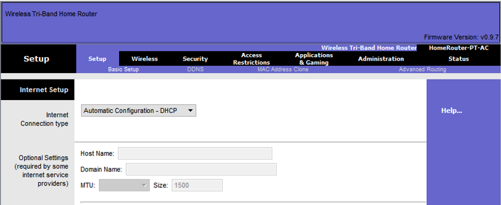

<!-- 7.3.1 -->
## Роутер Cisco как клиент DHCPv4

Существуют сценарии, в которых у вас может быть доступ к DHCP-серверу через поставщика Интернета. В этих случаях роутер Cisco IOS можно настроить в качестве клиента DHCPv4. В этой теме рассмотрим такой процесс.

В некоторых случаях роутеры Cisco в небольших или домашних офисах (SOHO) и филиалах должны быть настроены в качестве DHCPv4-клиентов аналогично настройке клиентских компьютеров. Используемый метод зависит от интернет-провайдера. В простейшей конфигурации для соединения с кабельным или DSL-модемом используется Ethernet-интерфейс.

Для настройки Ethernet-интерфейса в качестве DHCP-клиента используйте команду режима настройки интерфейса **ip address dhcp**.

Предположим, что на рисунке интернет-провайдер настроен на предоставление избранным клиентам IP-адресов из диапазона сети 209.165.201.0/27 после того, как интерфейс G0/0/1 настроен с помощью команды **ip address dhcp**.


<!-- 7.3.2 -->
## Пример конфигурации

Для настройки Ethernet-интерфейса в качестве DHCP-клиента используйте команду **ip address dhcp**. Эта конфигурация предполагает, что поставщик услуг Интернета был настроен на предоставление информации IPv4-адресации для отдельных клиентов.

```
SOHO(config)# interface G0/0/1
SOHO(config-if)# ip address dhcp
SOHO(config-if)# no shutdown
Sep 12 10:01:25.773: %DHCP-6-ADDRESS_ASSIGN: Interface GigabitEthernet0/0/1 assigned DHCP address 209.165.201.12, mask 255.255.255.224, hostname SOHO
```

Команда **show ip interface g0/0/1** подтверждает, что интерфейс запущен и что адрес был выделен сервером DHCPv4.

```
SOHO# show ip interface g0/0/1
GigabitEthernet0/0/1 is up, line protocol is up
  Internet address is 209.165.201.12/27
  Broadcast address is 255.255.255.255
  Address determined by DHCP
(output omitted)
```

<!-- 7.3.3 -->
## Домашний роутер как клиент DHCPv4

Роутеры беспроводной связи настраиваются для автоматического получения IPv4-адресов от интернет-провайдера. Это позволяет клиентам легко настроить роутер и подключиться к Интернету.

В качестве примера на рисунке показана страница настройки глобальной сети по умолчанию для беспроводного роутера в Packet Tracer. Обратите внимание, что в качестве типа веб-соединения выбрано **Automatic Configuration — DHCP** (автоматическая настройка — DHCP). Этот параметр используется, когда роутер подключен к кабельному или DSL-модему и выступает в качестве DHCPv4-клиента, запрашивая IPv4-адрес у интернет-провайдера.

Различные производители домашних роутеров будут иметь аналогичную настройку.



<!-- 7.3.4 -->
<!-- syntax -->

