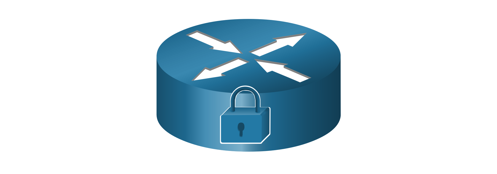
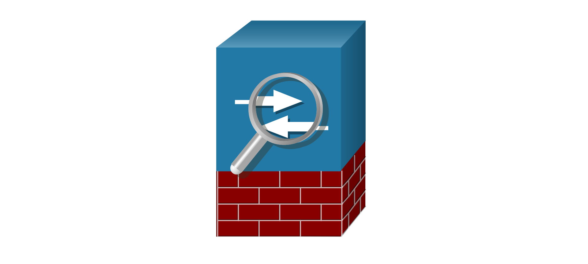
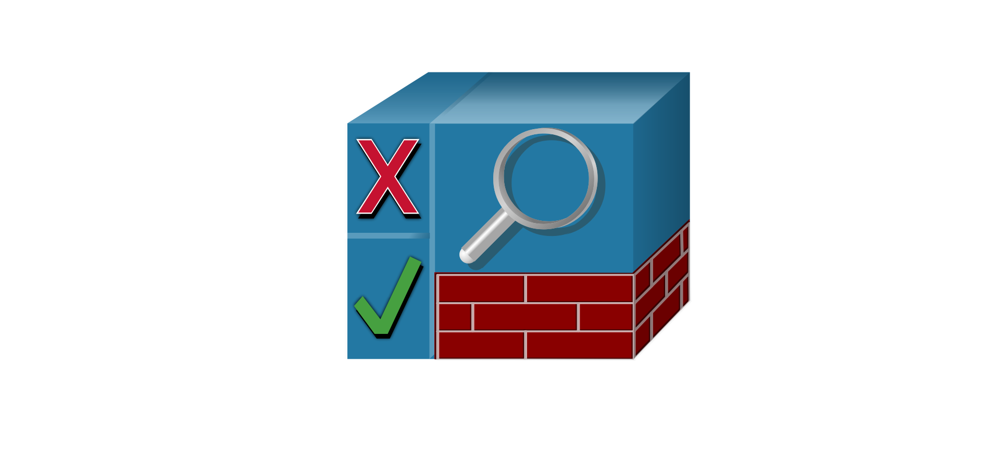
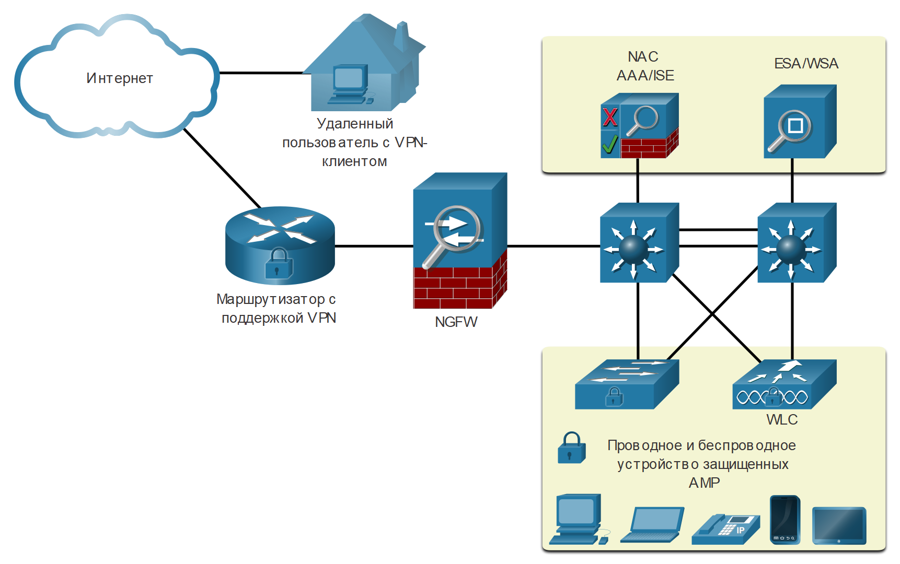
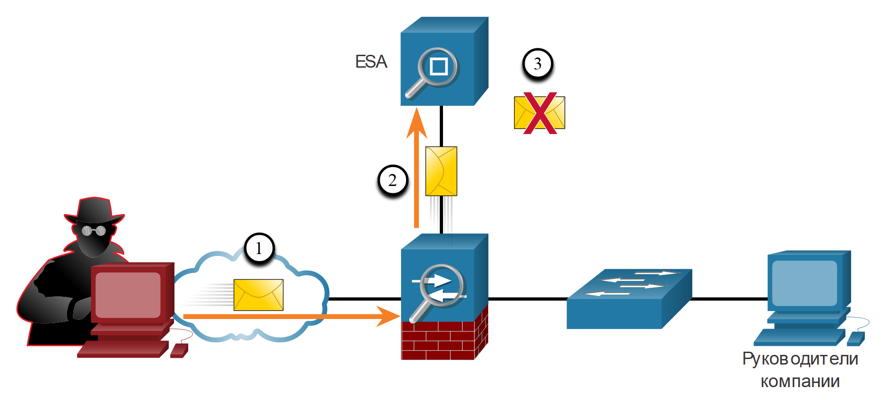
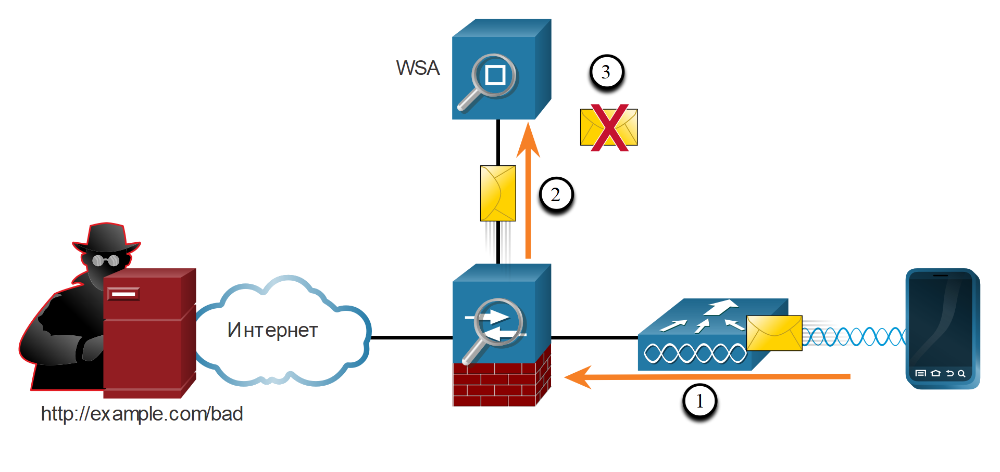

<!-- 10.1.1 -->
## Сетевые атаки сегодня 

В новостях часто рассказывают о внешних сетевых атаках на корпоративные сети. Просто найдите в Интернете «последние сетевые атаки», чтобы найти актуальную информацию о текущих атаках. Скорее всего, эти атаки будут включать одно или несколько из следующих действий:

* **Распределенный отказ в обслуживании (DDoS)** – это скоординированная атака со многих устройств, называемых зомби, с целью ослабления или прекращения публичного доступа к веб-сайту и ресурсам организации.
* **Кража данных** – это атака, при которой серверы или хосты организации подвергаются риску кражи конфиденциальной информации.
* **Вредоносное ПО** – Это атака, при которой узлы организации заражаются вредоносным программным обеспечением, вызывающим множество проблем. Например, вымогатель, такой как WannaCry, показанный на рисунке, шифрует данные на хосте и блокирует доступ к нему, пока выкуп не будет выплачен.

<!-- 10.1.2 -->
## Устройства сетевой безопасности 

Для защиты периметра сети от внешнего доступа необходимы различные устройства обеспечения сетевой безопасности. Эти устройства могут включать в себя маршрутизатор с поддержкой виртуальной частной сети (VPN), межсетевой экран следующего поколения (NGFW) и устройство контроля доступа к сети (NAC).

**Маршрутизатор с поддержкой VPN**

Маршрутизатор с поддержкой VPN обеспечивает безопасное соединение с удаленными пользователями в общедоступной сети и в корпоративной сети. VPN-сервисы могут быть интегрированы в брандмауэр.

<!-- /courses/srwe-dl/af9ece9c-34fe-11eb-b1b2-9b1b0c1f7e0d/afb6ea78-34fe-11eb-b1b2-9b1b0c1f7e0d/assets/ca3b2f01-1c27-11ea-af09-3b2e6521927c.svg -->

**NGFW**

NGFW предоставляет такие возможности, как отслеживание работы приложений и управление ими, система предотвращения вторжений нового поколения, расширенная защита от вредоносного ПО и фильтрация URL-адресов.

<!-- /courses/srwe-dl/af9ece9c-34fe-11eb-b1b2-9b1b0c1f7e0d/afb6ea78-34fe-11eb-b1b2-9b1b0c1f7e0d/assets/ca3b7d20-1c27-11ea-af09-3b2e6521927c.svg -->

**NAC**

Устройство NAC включает в себя сервисы (ААА) такие как аутентификация, авторизация и учет. На крупных предприятиях эти службы могут быть включены в устройство Cisco Identity Services Engine (ISE), которое может управлять политиками доступа для широкого круга пользователей и типов устройств и является примером устройства NAC.

<!-- /courses/srwe-dl/af9ece9c-34fe-11eb-b1b2-9b1b0c1f7e0d/afb6ea78-34fe-11eb-b1b2-9b1b0c1f7e0d/assets/ca3ba432-1c27-11ea-af09-3b2e6521927c.svg -->

<!-- 10.1.3 -->
## Защита оконечных устройств 

Устройства локальной сети, такие как коммутаторы, контроллеры беспроводной локальной сети (WLC) и другие устройства точки доступа (AP), соединяют конечные точки. Большинство из этих устройств подвержены атакам, связанным с локальной сетью, которые рассматриваются в этом модуле.

Однако, источники многих атак находятся внутри сети. Если было проникновение на внутренний хост, хакер может использовать его как отправную точку для получения доступа к критически важным системным устройствам, таким как серверы и хранилища конфиденциальной информации.

Конечные точки - это хосты, которые обычно состоят из ноутбуков, настольных компьютеров, серверов и IP-телефонов, а также принадлежащих сотрудникам устройств, которые обычно называются вашими собственными устройствами (BYOD) Конечные точки особенно восприимчивы к атакам, связанным с вредоносными программами, которые исходят из электронной почты или просмотра веб-страниц. На этих конечных точках обычно использовались традиционные функции безопасности на уровне хоста, такие как антивирусное ПО, брандмауэры на базе хоста и системы предотвращения вторжений на базе хоста (HIPS). Однако сегодня конечные точки лучше всего защищены комбинацией NAC, программного обеспечения AMP на основе хоста, устройства защиты электронной почты (ESA) и устройства веб-безопасности (WSA). Продукты Advanced Malware Protection (AMP) включают решения для конечных точек, такие как Cisco AMP для конечных точек.

На рисунке показана простая топология, представляющая все устройства сетевой безопасности и решения для оконечных устройств, обсуждаемые в этом модуле.

<!-- /courses/srwe-dl/af9ece9c-34fe-11eb-b1b2-9b1b0c1f7e0d/afb6ea78-34fe-11eb-b1b2-9b1b0c1f7e0d/assets/ca3c1960-1c27-11ea-af09-3b2e6521927c.svg -->

<!-- 10.1.4 -->
## Устройство Cisco для защиты электронной почты 

Устройства защиты контента включают детальный контроль над электронной почтой и просмотром веб-страниц для пользователей организации.

По данным Cisco Talos Intelligence Group, в июне 2019 года 85% всей отправленной электронной почты было спамом. Фишинговые атаки являются особо опасной формой спама. Напомним, что фишинговая атака побуждает пользователя щелкнуть ссылку или открыть вложение. Фишинг нацелен на высокопоставленных сотрудников или руководителей, которые могут иметь доступ к важным данным Это особенно важно в сегодняшних условиях, когда, по данным Института SANS, 95% всех атак на корпоративные сети являются результатом успешной атаки фишинг-атаки.

Cisco ESA - это устройство, предназначенное для мониторинга SMTP-протокола. Устройство Cisco ESA постоянно обновляется, используя информационные каналы в режиме реального времени от группы Talos Cisco, которая обнаруживает и сопоставляет угрозы, используя всемирную систему мониторинга баз данных. Эти данные об угрозах извлекаются устройствами Cisco ESA каждые три-пять минут. Вот некоторые из функций устройства Cisco ESA:

* Блокирование угроз.
* Защищает от вредоносного ПО, которое уклоняется от первоначального обнаружения.
* Отклоняет письма с плохими ссылками (как показано на рисунке).
* Блокирует доступ к новым зараженным сайтам.
* Шифрует содержимого в исходящей электронной почте, чтобы предотвратить потерю данных.

На рисунке Cisco ESA отбрасывает электронную почту с плохими ссылками.

<!-- /courses/srwe-dl/af9ece9c-34fe-11eb-b1b2-9b1b0c1f7e0d/afb6ea78-34fe-11eb-b1b2-9b1b0c1f7e0d/assets/ca3cb5a0-1c27-11ea-af09-3b2e6521927c.svg -->

1. Злоумышленник отправляет фишинговую атаку на важный хост в сети.
2. Брандмауэр пересылает всю электронную почту в ESA.
3. ESA анализирует электронную почту, регистрирует ее, и, если это вредоносное ПО, отбрасывает ее.

<!-- 10.1.5 -->
## Устройство для защиты веб-трафика Cisco Web Security Appliance

Устройство защиты веб-трафика Cisco (WSA) - это технология нейтрализации веб-угроз. Вместе они позволяют решить задачи, связанные с защитой и контролем веб-трафика. WSA предоставляет защиту от вредоносного ПО, мониторинг и контроль функционирования приложений, а также средства управления политиками допустимого использования, создания отчетов.

Cisco WSA обеспечивает полный контроль над доступом пользователей к сети Интернет. Некоторые функции и приложения, такие как чат, обмен сообщениями, видео и аудио, могут быть разрешены, ограничены по времени и полосе пропускания или заблокированы в соответствии с требованиями организации. WSA может выполнять внесение в черный список URL-адресов, фильтрацию URL-адресов, сканирование на наличие вредоносных программ, категоризацию URL-адресов, фильтрацию веб-приложений, а также шифрование и дешифрование веб-трафика.

На рисунке внутренний корпоративный сотрудник использует смартфон, чтобы попытаться подключиться к известному помещенному в черный список сайту.

<!-- /courses/srwe-dl/af9ece9c-34fe-11eb-b1b2-9b1b0c1f7e0d/afb6ea78-34fe-11eb-b1b2-9b1b0c1f7e0d/assets/ca3d2ad1-1c27-11ea-af09-3b2e6521927c.svg -->

1. Пользователь пытается подключиться к веб-сайту.
2. Брандмауэр направляет запрос веб-сайта в WSA.
3. WSA оценивает URL-адрес и определяет, что это известный черный список сайтов. WSA отбрасывает пакет и отправляет сообщение об отказе в доступе пользователю.

<!-- 10.1.6 -->
<!-- quiz -->