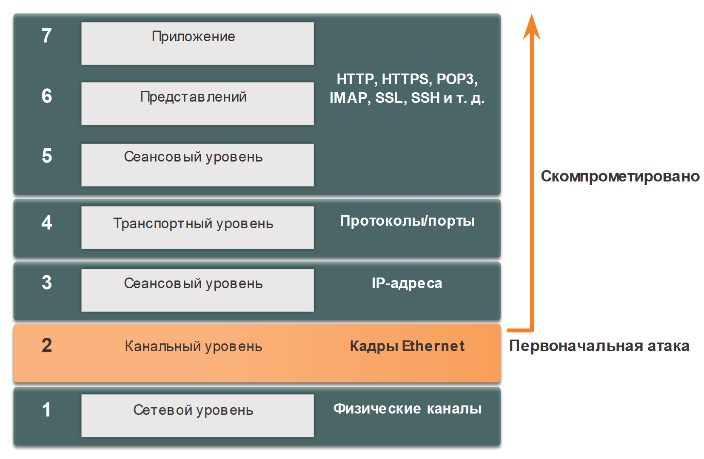

<!-- 10.3.1 -->
## Уязвимости на уровне 2

В двух предыдущих темах обсуждались вопросы обеспечения безопасности оконечных устройств. В этом разделе вы продолжите изучение способов защиты локальной сети, сосредоточившись на коммутаторах и кадрах канального уровня (уровень 2).

Напомним, что эталонная модель OSI разделена на семь уровней, которые работают независимо друг от друга. На рисунке показана функция каждого слоя и основные элементы, которые можно использовать.

Сетевые администраторы регулярно внедряют решения безопасности для защиты элементов от уровня 3 до уровня 7. Они используют VPN, межсетевые экраны и устройства IPS для защиты этих элементов. Однако, нарушение системы безопасности на уровне 2 также повлияет и на все уровни выше. Например, если исполнитель угрозы с доступом к внутренней сети захватил кадры уровня 2, то вся защита, реализованная на уровнях выше, будет бесполезной. Атакующий может нанести большой ущерб сетевой инфраструктуре LAN 2-го уровня.

<!-- /courses/srwe-dl/af9ece9c-34fe-11eb-b1b2-9b1b0c1f7e0d/afb6ea7c-34fe-11eb-b1b2-9b1b0c1f7e0d/assets/ca451a12-1c27-11ea-af09-3b2e6521927c.svg -->

<!-- 10.3.2 -->
## Категории атак на коммутаторы

Уровень безопасности определяется наиболее уязвимым звеном системы, которым в данном случае является 2-й уровень. Это связано с тем, что локальные сети традиционно находились под административным контролем единственной организации. Мы внутренне доверяли всем лицам и устройствам, подключенным к локальной сети. В нынешней ситуации, с учетом внедрения концепции BYOD и появления более изощренных способов атак, наши локальные сети становятся более уязвимыми для проникновения извне. Поэтому помимо защиты на уровнях с 3-го по 7-й специалисты по сетевой безопасности должны также противостоять атакам на инфраструктуру локальной сети 2-го уровня.

Первый шаг, который необходимо сделать, чтобы воспрепятствовать атакам на инфраструктуру уровня 2, заключается в том, чтобы понять основные функции уровня 2 и угрозы, которые могут создаваться инфраструктурой уровня 2.

Атаки на инфраструктуру локальной сети 2-го уровня представлены в таблице и обсуждаются более подробно позже в этом модуле.

| **Категория** | **Примеры** |
| --- | --- |
| **Атака на таблицу МАС** | Включает в себя атаки с переполнением таблицы CAM |
| **Атаки на сети VLAN** | Включат в себя атаки с переходам по VLAN и с двойным тегированием VLAN Так же включают атаки между устройствами в общей VLAN |
| **Атаки, связанные с DHCP** | Включает спуфинг и атаку истощения ресурсов DHCP |
| **ARP атаки** | Включает атаки подмены ARP и и «отравление» ARP-кэша. |
| **Атаки с подменой адреса** | Включает атаки подмены МАС и IP адресов |
| **Атака STP** | Включает в себя атаки путем манипуляции протокола STP |

<!-- 10.3.3 -->
## Технологии нейтрализации атак на коммутацию

В таблице представлен обзор решений Cisco, помогающих нейтрализовать атаки уровня 2.

| **Решение** | **Описание** |
| --- | --- |
| **Безопасность портов** | Предотвращает многие типы атак, включая атаки с переполнением САМ таблицы MAC-адресами и атака истощением DHCP-пула. |
| **Отслеживание DHCP-сообщений** | Предотвращает истощение ресурсов DHCP и DHCP-спуфинг. |
| **Динамический анализ ARP-трафика** | Предотвращает ARP-спуфинг и «отравление» ARP-кэша. |
| **Функция защиты от подмены IP-адреса отправителя (IP Source Guard)** | Предотвращает атаки спуфингом MAC-адресов и IP-адресов. |

Эти решения уровня 2 не будут эффективными, если протоколы управления не защищены. Например, протоколы управления Syslog, простой протокол управления сетью (SNMP), тривиальный протокол передачи файлов (TFTP), telnet, протокол передачи файлов (FTP) и большинство других распространенных протоколов небезопасны; поэтому рекомендуются следующие стратегии:

* Всегда используйте безопасные варианты этих протоколов, такие как SSH, протокол защищенного копирования (SCP), защищенный FTP (SFTP) и Secure Socket Layer/Transport Layer Security (SSL/TLS).
* Рассмотрите возможность использования сети внешнего управления для управления устройствами.
* Используйте выделенную сеть управления VLAN, по которой передается только трафик управления.
* Используйте списки контроля доступа для фильтрации несанкционированного доступа.

<!-- 10.3.4 -->
<!-- quiz -->