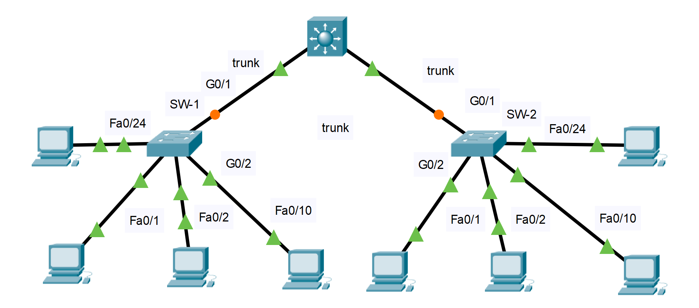

---

> **ВАЖНО**
> 
> Форма для ответов на вопросы будет доступна только при развертывании лабораторной работы 

---

## Топология

## Таблица VLAN

| **Коммутатор** | **Номер VLAN** | **Имя VLAN**      | **Членство в порту**   | **Сеть**            |
|------------|------------|---------------|--------------------|-----------------|
| SW-1       | 10         | Администратор | F0/1, F0/2         | 192.168.10.0/24 |
| SW-1       | 20         | Продажи       | F0/10              | 192.168.20.0/24 |
| SW-1       | 99         | Управление    | F0/24              | 192.168.99.0/24 |
| SW-1       | 100        | Собственный   | G0/1, G0/2         | Нет             |
| SW-1       | 999        | BlackHole     | Все неиспользуемые | Нет             |
| SW-2       | 10         | Администратор | F0/1, F0/22        | 192.168.10.0/24 |
| SW-2       | 20         | Продажи       | F0/10              | 192.168.20.0/24 |
| SW-2       | 99         | Управление    | F0/24              | 192.168.99.0/24 |
| SW-2       | 100        | Собственный   | Нет                | Нет             |
| SW-2       | 999        | BlackHole     | Все неиспользуемые | None            |

## Задачи

Часть 1. Создать защищенного магистрального соединения.

Часть 2. Обеспечить безопасность неиспользуемых портов коммутатора.

Часть 3. Обеспечить безопасность портов.

Часть 4. Включить отслеживание DHCP.

Часть 5. Настроить Rapid PVST, PortFast и BPDU Guard.

## Общие сведения

Вы повышаете безопасность на двух коммутаторах доступа в частично настроенной сети. Вы реализуете ряд мер, описанных в этом модуле, в соответствии с приведенными ниже требованиями. Обратите внимание, что в этой сети настроена маршрутизация, поэтому соединение между узлами в разных VLAN должно функционировать после завершения.

## Инструкции

### Шаг 1. Создание защищенного магистрального соединения

1.  Соедините порты **G0/2** двух коммутаторов уровня доступа.

2.  Настройте порты **G0/1** и **G0/2** как статическое магистральное соединение на обоих коммутаторах.

3.  Отключите согласование **DTP** на обеих сторонах канала.

4.  Создайте VLAN 100 и присвойте ей имя Native на обоих коммутаторах.

5.  Настройте все магистральные порты на обоих коммутаторах для использования VLAN 100 в качестве Native VLAN.

### Шаг 2. Безопасность неиспользуемых портов коммутатора

1.  Отключите все неиспользуемые порты на коммутаторе **SW-1**.

2.  На коммутаторе **S1** создайте VLAN 999 и присвойте ей имя BlackHole. Настроенное имя должно точно соответствовать требованию.

3.  Переместите все неиспользуемые порты коммутатора во VLAN BlackHole.

### Шаг 3. Обеспечение безопасности портов

1.  Активируйте защиту на всех активных портах доступа на коммутаторе **SW-1**.

2.  Сконфигурируйте активные порты, чтобы разрешить им изучение максимум четырех MAC-адресов.

3.  Для портов **F0/1** на **SW-1** статически сконфигурируйте MAC-адрес компьютера с использованием защиты.

4.  Настройте каждый активный порт доступа таким образом, чтобы он автоматически добавлял адреса МАС, изученные на нем, в текущую конфигурацию.

5.  Настройте режим нарушения безопасности порта, чтобы отбрасывать пакеты с MAC-адресов, которые превышают максимум, генерировать запись системного журнала, но не отключать порты.

### Шаг 4. Настройте анализ DHCP-трафика.

1.  Настройте магистральные порты на **SW-1** как доверенные.

2.  Ограничьте ненадежные порты на **SW-1** пятью DHCP-пакетами в секунду.

3.  На **SW-2** включите DHCP-snooping глобально и для VLAN 10, 20 и 99.

**Примечание.** Конфигурация отслеживания DHCP может не работать должным образом в Packet Tracer.

### Шаг 5. Выполнить настройку PortFast и BPDU Guard.

1.  Включите PortFast на всех портах доступа, которые используются на **SW-1**.

2.  Включите BPDU Guard на всех портах доступа, которые используются на **SW-1**.

3.  Настройте **SW-2**, чтобы все порты доступа использовали PortFast по умолчанию.

<!-- [Скачать файл Packet Tracer для локального запуска](./assets/11.6.1-lab.pka) -->
