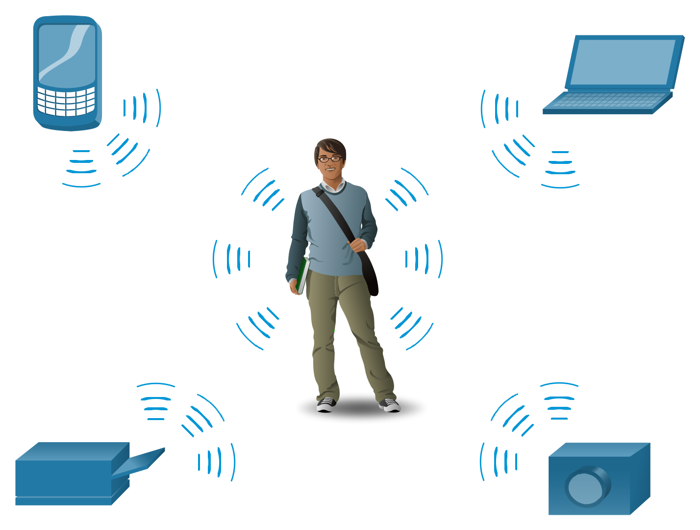
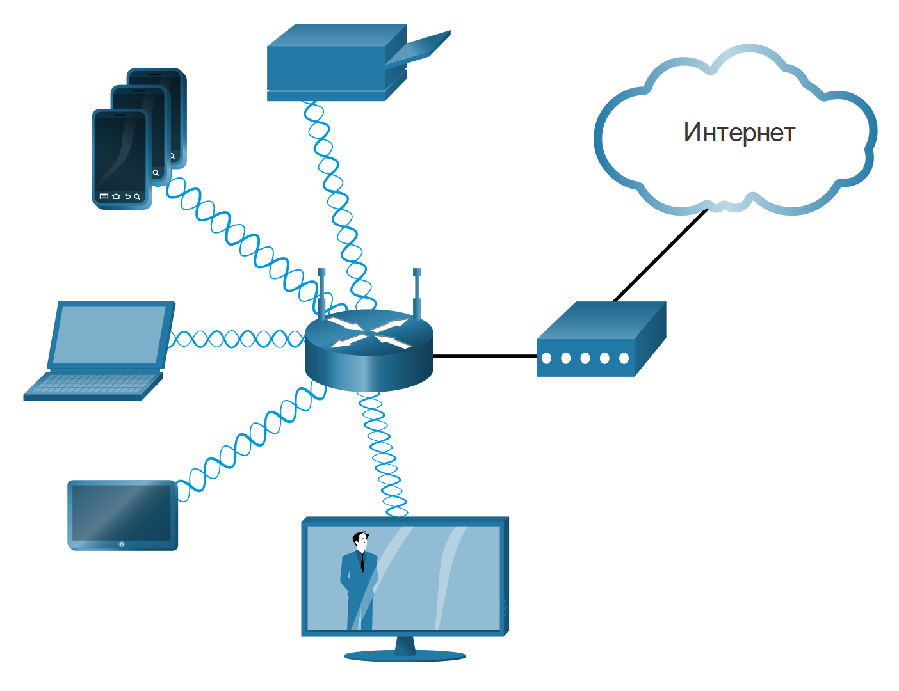
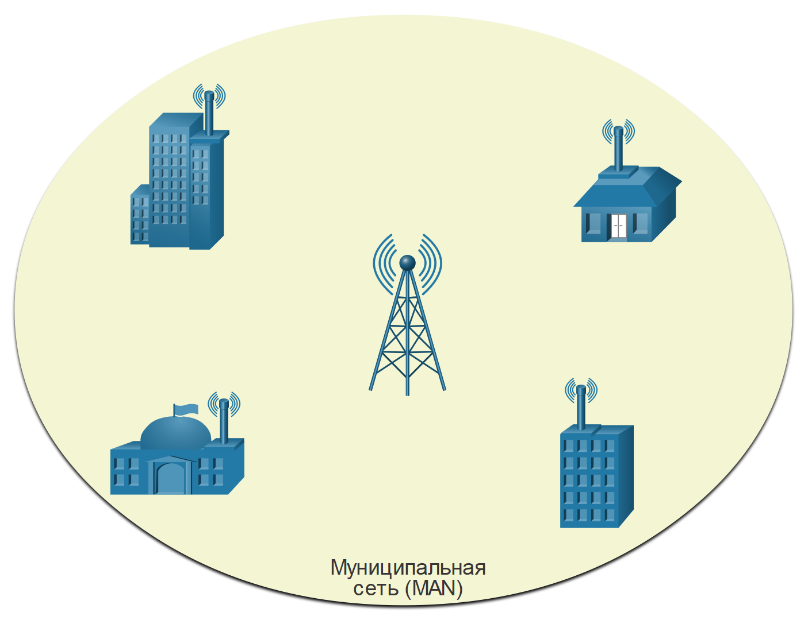
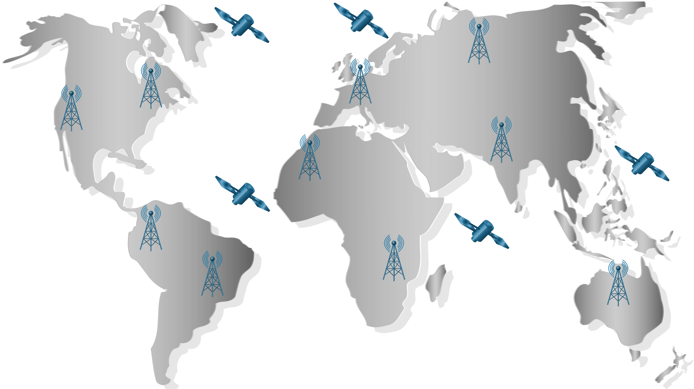

# Введение в технологии беспроводной связи

<!-- 12.1.1-->
## Преимущества беспроводной связи

Беспроводная сеть LAN (WLAN) относится к беспроводным сетям, которые обычно используются в домашних, офисных и корпоративных средах. Сети должны поддерживать людей, которые находятся в движении. Люди подключаются с помощью компьютеров, ноутбуков, планшетов и смартфонов. Существует множество различных сетевых инфраструктур, обеспечивающих доступ к сети, таких как проводные локальные сети, сети поставщиков услуг и сети сотовых телефонов. Но именно WLAN делает возможной мобильность в домашней и деловой среде.

На предприятиях, где имеется беспроводная инфраструктура, может произойти экономия затрат в любое время при замене оборудования или при перемещении сотрудника в здании, реорганизации оборудования или лаборатории или перемещении во временные местоположения или проектные площадки. Беспроводная инфраструктура может адаптироваться к быстро меняющимся потребностям и технологиям.

<!-- 12.1.2-->
## Типы беспроводных сетей

Беспроводные сети основаны на стандартах Института инженеров по электротехнике и электронике (IEEE) и могут быть разделены на четыре основных типа: WPAN, WLAN, WMAN и WWAN.

**Беспроводные персональные сети (WPAN)** - используют маломощные передатчики для сетей ближнего действия, обычно от 20 до 30 футов (от 6 до 9 метров). Устройства на базе Bluetooth и ZigBee обычно используются в WPAN. WPAN основаны на стандарте 802.15 и частоте 2,4 ГГц.

**Беспроводные локальные сети (WLAN)** - использует передатчики для покрытия сети среднего размера, обычно до 100 метров. Беспроводные локальные сети подходят для использования дома, в офисе и даже в кампусе. Сети WLAN основаны на стандарте 802.11 и частоте 2,4 ГГц или 5 ГГц.

**Беспроводные MAN (WMAN)** - использует передатчики для предоставления услуг беспроводной связи в большой географической зоне. WMAN подходят для обеспечения беспроводного доступа к столичному городу или конкретному району. WMAN используют определенные лицензированные частоты.

**Беспроводные глобальные сети (WWANs)** - использует передатчики для обеспечения покрытия в обширной географической области. WWAN подходят для национальных и глобальных коммуникаций. WWAN также используют определенные лицензированные частоты.

<!-- 12.1.3-->
## Беспроводные технологии

В беспроводных технологиях для отправки и приема данных используются нелицензированные полосы радиочастот. Нелицензированные полосы доступны всем, кто использует устройство, имеющее беспроводный маршрутизатор и поддерживающее беспроводную технологию.

**Bluetooth** - стандарт IEEE 802.15 WPAN, использующий процесс сопряжения устройств для связи на расстоянии до 100 м (300 футов). Его можно найти в устройствах «умный дом», аудиоподключениях, автомобилях и других устройствах, требующих подключения на небольшом расстоянии. Существует два типа Bluetooth:

**Bluetooth Low Energy (BLE)** - поддерживает несколько сетевых технологий, включая ячеистую топологию для крупномасштабных сетевых устройств.
**Bluetooth Basic Rate/Enhanced Rate (BR/EDR)** - поддерживает топологии «точка-точка» и оптимизирована для потоковой передачи звука.

**WiMAX (всемирная совместимость для микроволнового доступа)** - WiMAX является альтернативой широкополосным проводным интернет-соединениям, конкурирующим с DSL и кабелем. Тем не менее, он обычно используется в областях, которые еще не подключены к DSL или кабельному провайдеру. Это стандарт IEEE 802.16 WWAN, обеспечивающий высокоскоростной беспроводной широкополосный доступ на расстоянии до 30 миль (50 км). Сеть WiMAX функционирует подобно сети Wi-Fi, но на более высоких скоростях, на больших расстояниях и для большего числа пользователей. Она использует сеть вышек WiMAX, подобных вышкам сети мобильной телефонной связи. Передатчики WiMAX и сотовые передатчики могут совместно использовать пространство в одной башне, как показано на рисунке.

**Сотовая широкополосная связь.** - Сотовая связь 4G/5G - это беспроводные мобильные сети, которые в основном используются сотовыми телефонами, но могут использоваться в автомобилях, планшетах и ноутбуках. Сотовые сети - это сети с множественным доступом, по которым осуществляется передача как данных, так и голоса. Сотовый сайт создается сотовой вышкой, передающей сигналы в данной области. Соединяющиеся сотовые сайты образуют сотовую сеть. Двумя типами сотовых сетей являются Глобальная система мобильной связи (GSM) и Многостанционный доступ с кодовым разделением (CDMA). GSM признан во всем мире, в то время как CDMA в основном используется в США.

Сеть GSM 4-го поколения (4G) является текущей мобильной сетью. 4G обеспечивает скорость, которая в 10 раз выше, чем в предыдущих сетях 3G. Новый 5G обещает обеспечить в 100 раз более высокие скорости, чем 4G, и подключить к сети больше устройств, чем когда-либо прежде.

**Спутниковая широкополосная связь** - обеспечивает сетевой доступ к удаленным объектам посредством использования направленной спутниковой антенны, которая ориентирована на определенный геостационарный спутник на орбите Земли. Как правило, эта технология отличается более высокой стоимостью и к тому же требует обеспечения прямой видимости. Обычно это дороже и требует четкого обзора. Как правило, он используется сельскими домовладельцами и предприятиями, где нет кабеля и DSL.

<!-- 12.1.4-->
## Стандарты 802.11

Мир беспроводной связи огромен. Тем не менее, для определенных профессиональных навыков, мы хотим сосредоточиться на конкретных аспектах Wi-Fi. Лучше всего начать с стандартов IEEE 802.11 WLAN. Эти стандарты определяют, как радиочастоты используются для беспроводных каналов. В большинстве стандартов указано, что беспроводные устройства имеют одну антенну для передачи и приема беспроводных сигналов на указанной радиочастоте (2,4 ГГц или 5 ГГц). Некоторые из более новых стандартов, которые передают и принимают на более высоких скоростях, требуют, чтобы точки доступа (AP) и беспроводные клиенты имели несколько антенн, использующих технологию множественного входа и множественного выхода (MIMO). MIMO использует несколько антенн в качестве передатчика и приемника для улучшения характеристик связи. Может поддерживаться до четырех антенн. Технология поддерживает до четырех антенн.

За последние годы разработан ряд реализаций стандарта IEEE 802.11, показанных на рисунке. В таблице указаны эти стандарты.

|**IEEE WLAN Стандарты**|**Радиочастота, РЧ**|**Описание**|
|---|---|---|
|802.11|2,4 ГГц|скорость до 2 Мб/с|
|802.11a|5 ГГц|скорость до 54 Мб/с, малая зона покрытия, менее эффективен при проникновении в строительные конструкции, не совместим с 802.11b и 802.11g|
|802.11b|2,4 ГГц|скорость до 11 Мб/с, больше зона покрытия чем 802.11a, лучше проникает в строительные конструкции|
|802.11g|2,4 ГГц|скорость до 54 Мб/с, обратная совместимость с 802.11b с уменьшенной пропускной способностью|
|802.11n|2,4 ГГц и 5 ГГц|скорость передачи данных варьируется от 150 до 600 Мбит/с с расстоянием до 70 м (230 футов), Для точек доступа и беспроводных клиентов требуется несколько антенн, использующих технологию MIMO технологии, Этот стандарт обладает обратной совместимостью с устройствами стандартов 802.11a/b/g. с ограничением скорости передачи данных|
|802.11ac|5 ГГц|обеспечивает скорость передачи данных от 450 Мбит/с до 1,3 Гбит/с (1300 Мбит/с) с использованием технологии MIMO. Поддерживается до восьми антенн, обратная совместимость с устройствами 802.11a/n с ограничением скорости передачи данных|
|802.11ax|2,4 ГГц и 5 ГГц|выпущен в 2019 году - последний стандарт, также известный как высокоэффективный беспроводной (HEW), более высокие скорости передачи данных. Повышение пропускной способности канала, поддержка большого количества подключенных устройств. Оптимизация энергопотребления 1 ГГц и 7 ГГц, когда эти частоты становятся доступными. Поиск в Интернете для Wi-Fi поколения 6 для получения дополнительной информации|

<!-- 12.1.5-->
## Радиочастоты

Все беспроводные устройства работают в диапазоне радиоволн электромагнитного спектра. Сети WLAN работают в диапазоне частот 2,4 ГГц и в диапазоне 5 ГГц. Устройства беспроводной локальной сети имеют передатчики и приемники, настроенные на конкретные частоты диапазона радиоволн, как показано на рисунке. В частности, для беспроводных LAN стандарта 802.11 выделяются следующие частотные полосы:

2.4 GHz (UHF) - 802.11b/g/n/ax
5 GHz (SHF) - 802.11a/n/ac/ax
беспроводные устройства и другие технологии, и где они работают в определенном электромагнитном спектре

Спектр электромагнитных волн

<!-- 12.1.6-->
## Организации по стандартизации беспроводных сетей

Стандарты обеспечивают совместимость между устройствами разных производителей. На международном уровне тремя организациями, влияющими на стандарты WLAN, являются МСЭ-R, IEEE и Wi-Fi Alliance.

**Международный союз электросвязи (МСЭ)** регулирует распределение радиочастотного спектра и спутниковых орбит через МСЭ-R. МСЭ-R обозначает Сектор радиосвязи МСЭ.

**IEEE** определяет, как радиочастота модулируется для передачи информации. Эта организация обслуживает стандарты локальных и городских сетей (MAN), относящихся к группе стандартов сетей LAN/MAN IEEE 802. Стандарты 802.3 Ethernet и 802.11 WLAN являются основными в группе стандартов IEEE 802.

**Wi-Fi Alliance** - это глобальная некоммерческая отраслевая торговая ассоциация, призванная содействовать росту и принятию сетей WLAN. В эту ассоциацию вошли поставщики, ориентированные на повышение совместимости продуктов стандарта 802.11 путем сертификации поставщиков на соответствие отраслевым нормам и стандартам.