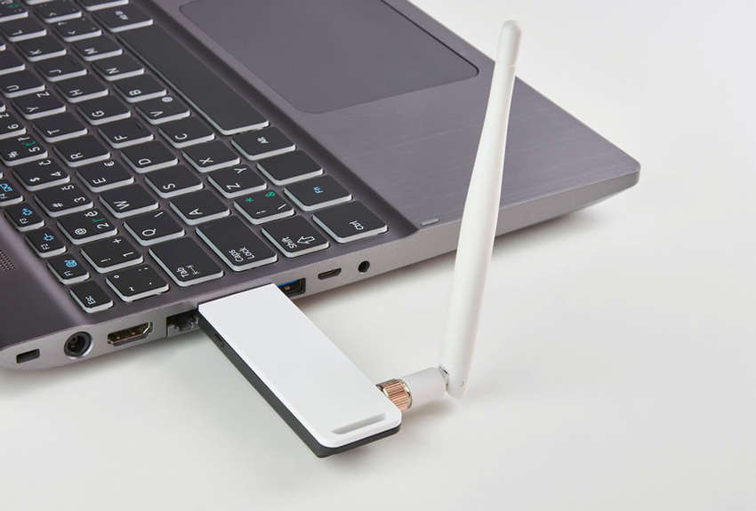
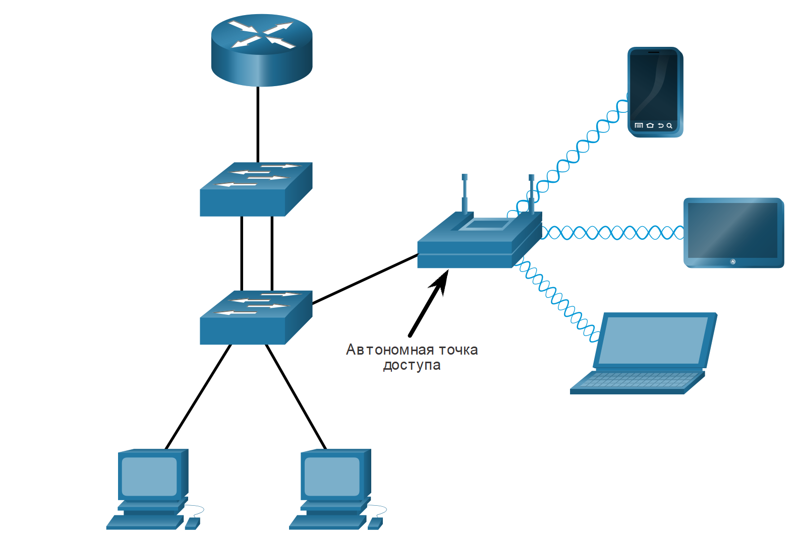
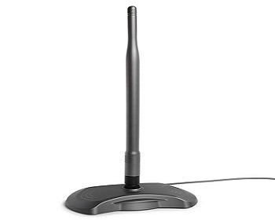
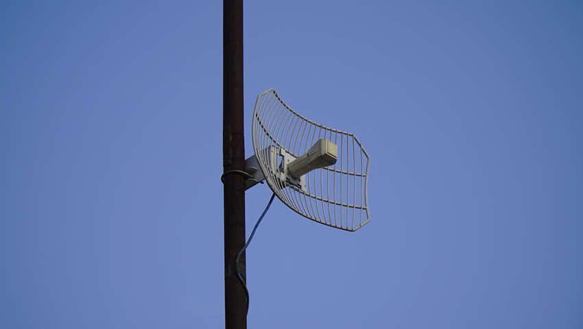

<!-- 12.2.1 -->
## Видео - Составляющие WLAN

В предыдущей теме вы узнали о преимуществах беспроводной связи, типах беспроводных сетей, стандартах 802.11 и радиочастотах. Здесь мы узнаем о компонентах WLAN.

Нажмите «Воспроизвести», чтобы просмотреть видео о компонентах WLAN.

<!-- 12.2.2 -->
## Беспроводные сетевые адаптеры

Для беспроводного развертывания требуется как минимум два устройства, которые имеют радиопередатчик и радиоприемник, настроенные на одни и те же радиочастоты:

* Оконечные устройства, оснащённые беспроводными сетевыми адаптерами
* Сетевое устройство, такое как беспроводной маршрутизатор или беспроводная точка доступа.

Для беспроводной связи ноутбуки, планшеты, смартфоны и даже новейшие автомобили оснащены встроенными беспроводными сетевыми картами, которые включают в себя радиопередатчик/приемник. Однако, если устройство не имеет встроенного беспроводного сетевого адаптера, можно использовать беспроводной адаптер USB, как показано на рисунке.

**Примечание**: Многие знакомые вам беспроводные устройства не имеют видимых антенн. Они встроены в смартфоны, ноутбуки и беспроводные домашние маршрутизаторы.

<!-- 12.2.3 -->
## Домашний беспроводной маршрутизатор

Тип устройства инфраструктуры, с которым конечное устройство связывается и аутентифицируется, зависит от размера и требований WLAN.

Например, домашний пользователь обычно подключает беспроводные устройства с помощью небольшого беспроводного маршрутизатора, как показано на рисунке. Беспроводной маршрутизатор служит как:

* **Точка доступа** - обеспечивает беспроводной доступ 802.11a/b/g/n/ac.
* **Коммутатор** - обеспечивает четырехпортовый полнодуплексный Ethernet-коммутатор 10/100/1000 для подключения проводных устройств
* **Маршрутизатор** - обеспечивает шлюз по умолчанию для подключения к другим сетевым инфраструктурам, таким как Интернет.

Беспроводной маршрутизатор обычно реализуется как устройство беспроводного доступа для небольших предприятий или жилых помещений. Беспроводной маршрутизатор объявляет о своих беспроводных услугах, отправляя маяки, содержащие идентификатор общего набора услуг (SSID). Устройства беспроводным способом обнаруживают SSID и пытаются подключиться и аутентифицироваться с ним для доступа к локальной сети и Интернету.

Большинство беспроводных маршрутизаторов также предоставляют расширенные функции, такие как высокоскоростной доступ, поддержка потокового видео, адресация IPv6, качество обслуживания (QoS), утилиты настройки и порты USB для подключения принтеров или портативных накопителей.

Кроме того, домашние пользователи, которые хотят расширить свои сетевые услуги, могут реализовать расширители диапазона Wi-Fi. Устройство может подключаться к расширителю по беспроводной связи, что повышает скорость его обмена данными с беспроводным маршрутизатором.

<!-- 12.2.4 -->
## Беспроводные точки доступа

Хотя расширители диапазона просты в настройке, лучшим решением будет установка другой точки беспроводного доступа для предоставления выделенного беспроводного доступа для пользовательских устройств. Беспроводные клиенты используют свои беспроводные сетевые адаптеры для обнаружения ближайших точек доступа, объявивших свой идентификатор SSID. Затем клиенты пытаются связаться и аутентифицироваться с AP. После прохождения аутентификации пользователи беспроводной сети получают доступ к ресурсам сети. Точки доступа Cisco Meraki Go показаны на рисунке.

<!-- 12.2.5 -->
## Категории АР

Точки доступа могут быть автономными и управляемыми контроллером.

**Автономные точки доступа**

Это автономные устройства, настроенные с использованием интерфейса командной строки или графического интерфейса, как показано на рисунке. Автономные AP полезны в ситуациях, когда в организации требуется только пара AP. Домашний маршрутизатор является примером автономной точки доступа, поскольку вся конфигурация точки доступа находится на устройстве. С увеличением спроса на ресурсы беспроводной сети может возникнуть потребность в большем количестве точек доступа. Каждая точка доступа будет работать независимо от других точек доступа, и каждая точка доступа потребует ручной настройки и управления. Это стало бы очень трудно настраиваемо, если бы понадобилось много точек доступа.

<!-- /courses/srwe-dl/af9ecea0-34fe-11eb-b1b2-9b1b0c1f7e0d/afb75fa4-34fe-11eb-b1b2-9b1b0c1f7e0d/assets/ca7a5ae0-1c27-11ea-af09-3b2e6521927c.svg -->

**AP на основе контроллера**

Эти устройства не требуют начальной настройки и часто называются облегченными точками доступа (LAP). LAP используют протокол облегченной точки доступа (LWAPP) для связи с контроллером WLAN (WLC), как показано на следующем рисунке. Точки доступа, управляемые контроллером, рекомендуется использовать в случаях, когда в сети требуется много точек доступа. Поскольку больше AP добавлено, каждый AP автоматически настраивается и управляется WLC.

Обратите внимание на рисунок, что WLC имеет четыре порта, подключенных к инфраструктуре коммутации. Эти четыре порта настроены как группа агрегации каналов (LAG) для объединения их вместе. Подобно тому, как работает EtherChannel, LAG обеспечивает избыточность и распределение нагрузки. Все порты на коммутаторе, которые связаны с WLC, должны быть транкингом и настроены с включенным EtherChannel. Однако LAG не работает точно так же, как EtherChannel. WLC не поддерживает протокол агрегирования портов (PaGP) или протокол управления агрегированием каналов (LACP).

<!-- /courses/srwe-dl/af9ecea0-34fe-11eb-b1b2-9b1b0c1f7e0d/afb75fa4-34fe-11eb-b1b2-9b1b0c1f7e0d/assets/ca7aa901-1c27-11ea-af09-3b2e6521927c.svg -->

<!-- 12.2.6 -->
## Антенны для беспроводных устройств

Большинству точек доступа бизнес-класса требуются внешние антенны, чтобы сделать их полностью функционирующими единицами.

**Всенаправленная антенна**

Всенаправленные антенны, такие как антенна, показанная на рисунке, обеспечивают 360-градусный охват и идеальны в домах, открытых офисных помещениях, конференц-залах и вне помещений.

**Направленная антенна**

Направленные антенны фокусируют радиосигнал в заданном направлении. Это усиливает сигнал к и от точки доступа в направлении, на которое указывает антенна. Это обеспечивает более сильный уровень сигнала в одном направлении и пониженный уровень сигнала во всех других направлениях. Примеры направленных антенн Wi-Fi включают в себя антенны Yagi и параболические тарелки.

**MIMO антенна**

Несколько выходов (MIMO) использует несколько антенн для увеличения доступной полосы пропускания для беспроводных сетей IEEE 802.11n/ac/ax. Для увеличения пропускной способности можно использовать до восьми передающих и принимающих антенн.

<!-- 12.2.7 -->
<!-- quiz -->