<!-- 13.1.1 -->
## Видео: конфигурация беспроводной сети 

Посмотрите видео, демонстрирующего настройку беспроводной сети.

<!-- 13.1.2 -->
## Беспроводной маршрутизатор

Удаленные работники, небольшие филиалы и домашние сети часто используют небольшой офис и домашний маршрутизатор. Эти маршрутизаторы иногда называют Маршрутизатором с интегрированными сервисами, потому что они обычно включают в себя коммутатор для проводных клиентов, порт для подключения к Интернету (иногда помеченный как «WAN») и беспроводные компоненты для беспроводного доступа клиентов, как показано для Cisco Meraki MX64W на рисунке. В остальной части этого модуля небольшие офисные и домашние маршрутизаторы называются беспроводными маршрутизаторами.

**Cisco Meraki MX64W**

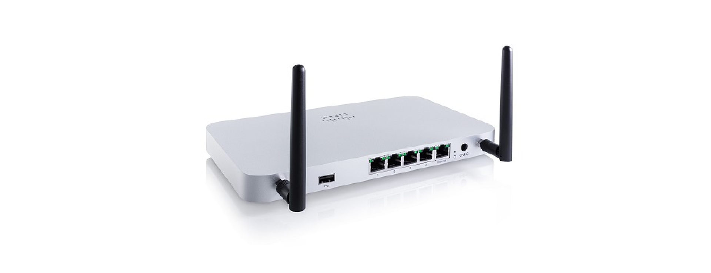
<!-- /courses/srwe-dl/af9ef5a0-34fe-11eb-b1b2-9b1b0c1f7e0d/afb7adc4-34fe-11eb-b1b2-9b1b0c1f7e0d/assets/ca9cfe10-1c27-11ea-af09-3b2e6521927c.svg -->

На следующем рисунке показана топология, изображающая физическое подключение проводного ноутбука к беспроводному маршрутизатору, который затем подключается к кабельному или DSL-модему для подключения к Интернету.

<!-- /courses/srwe-dl/af9ef5a0-34fe-11eb-b1b2-9b1b0c1f7e0d/afb7adc4-34fe-11eb-b1b2-9b1b0c1f7e0d/assets/ca9d2521-1c27-11ea-af09-3b2e6521927c.svg -->

Эти беспроводные маршрутизаторы обычно обеспечивают безопасность WLAN, службы DHCP, встроенную трансляцию имен (NAT), качество обслуживания (QoS), а также ряд других функций. Набор функций зависит от модели маршрутизатора.

**Примечание**: Конфигурирование кабельного или DSL-модема обычно выполняется представителем поставщика услуг либо на месте, либо удаленно через пошаговое руководство с вами по телефону. Если вы покупаете модем, он будет поставляться с документацией о том, как подключить его к вашему поставщику услуг, что, скорее всего, будет включать обращение к вашему поставщику услуг для получения дополнительной информации.

<!-- 13.1.3 -->
## Вход на беспроводной маршрутизатор

Большинство домашних беспроводных маршрутизаторов для небольших офисов готовы к работе сразу «из коробки». Они предварительно настроены для подключения к сети и предоставления услуг. Например, беспроводной маршрутизатор использует DHCP для автоматического предоставления адресной информации подключенным устройствам. Вместе с тем в Интернете легко находятся IP-адреса по умолчанию для беспроводных маршрутизаторов, имена пользователей и пароли. Просто введите такую фразу для поиска, как default wireless router ip address (IP-адрес по умолчанию для беспроводного маршрутизатора) или default wireless router passwords (пароли по умолчанию для беспроводных маршрутизаторов), для отображения списка многих веб-сайтов, которые предоставляют эту информацию. Например, имя пользователя и пароль для беспроводного маршрутизатора на рисунке - «admin». Таким образом, первоочередной задачей является изменение этих параметров по умолчанию с целью обеспечения безопасности.

Для доступа к графическому пользовательскому интерфейсу настройки беспроводного маршрутизатора откройте веб-браузер. В поле Address (Адрес) введите частный IP-адрес по умолчанию для беспроводного маршрутизатора. IP-адрес по умолчанию можно найти либо в документации, которая поставляется с беспроводным маршрутизатором, либо в Интернете. На рисунке показан IP-адрес 192.168.0.1, который является общим стандартным IP-адресом для некоторых производителей. Окно Security (Безопасность) запрашивает авторизацию для получения доступа к графическому пользовательскому интерфейсу маршрутизатора. Слово admin обычно используется в качестве имени пользователя и пароля по умолчанию. Как и в прошлый раз, сверьтесь с документацией к вашему беспроводному маршрутизатору или выполните поиск в Интернете.

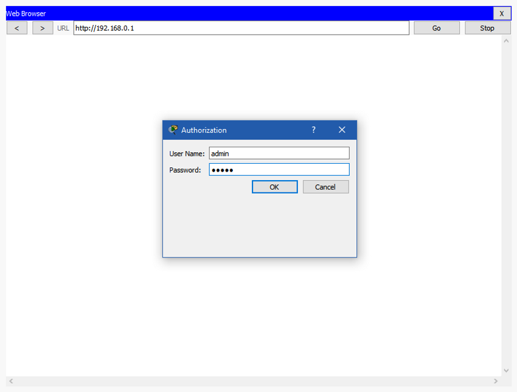

<!-- 13.1.4 -->
## Базовая настройка сети

Базовая настройка сети включает в себя следующие шаги:

1. Войдите на машрутизатор через веб-браузер.
2. Измените пароль администратора, заданный по умолчанию.
3. Войдите с новым административным паролем.
4. Измените диапазон адресов DHCP по умолчанию.
5. Обновите IP-адрес.
6. Войдите в маршрутизатор с новым IP-адресом.

**1. Войдите на маршрутизатор через веб-браузер.**

После входа в систему открывается графический интерфейс. На экране настройки будет присутствовать вкладки или меню, которые помогут переключаться на различные задачи настройки маршрутизатора. Часто необходимо сохранять параметры, измененные в одном окне, перед переходом в другое окно. В такой ситуации рекомендуется вносить изменения в параметры по умолчанию.

**2. Измените пароль администратора, заданный по умолчанию.**

Чтобы изменить пароль для входа по умолчанию, найдите административную часть графического интерфейса маршрутизатора. В этом примере была выбрана вкладка «Администрирование». Здесь пароль маршрутизатора может быть изменен. На некоторых устройствах, таких как в примере, вы можете изменить только пароль. Имя пользователя остается admin или любым другим именем пользователя по умолчанию для маршрутизатора, который вы настраиваете.

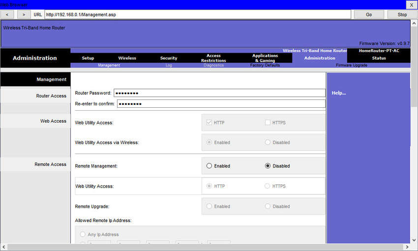

**3. Войдите с новым административным паролем.**

После изменения пароля беспроводной маршрутизатор снова запросит авторизацию. Введите имя пользователя и новый пароль, как показано в примере.

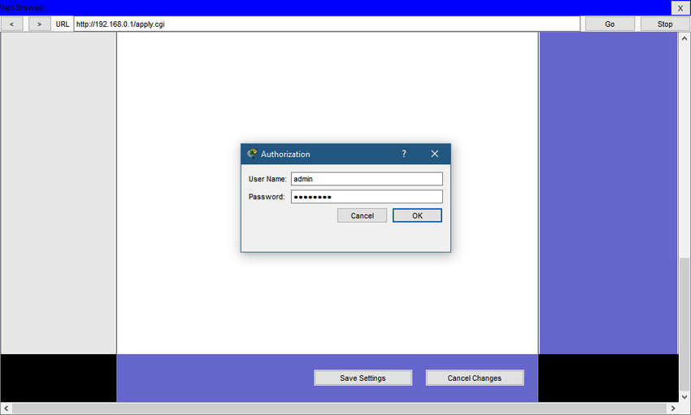

**4. Измените диапазон адресов DHCP по умолчанию.**

Измените IPv4-адрес маршрутизатора по умолчанию. Рекомендуется использовать частную IP-адресацию внутри своей сети. В примере используется адрес IPv4 10.10.10.1, но это может быть любой выбранный вами частный адрес IPv4.

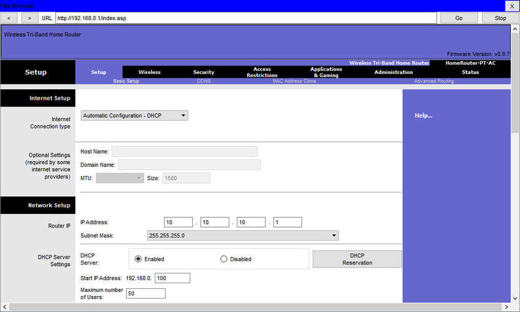

**5. Обновите IP-адрес.**

Нажатие кнопки Save (Сохранить) приведет к временной потере доступа к беспроводному маршрутизатору. Откройте окно командной строки и обновите свой IP-адрес с помощью команды ipconfig/renew, как показано в примере.

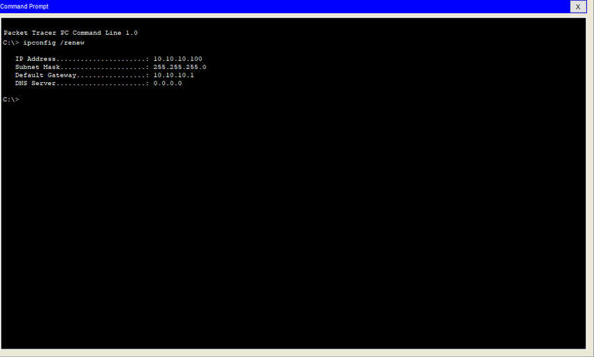

**6. Войдите в маршрутизатор с новым IP-адресом.**

Введите новый IP-адрес маршрутизатора, чтобы восстановить доступ к графическому интерфейсу конфигурации маршрутизатора, как показано в примере. Теперь вы готовы продолжить настройку маршрутизатора для беспроводного доступа.

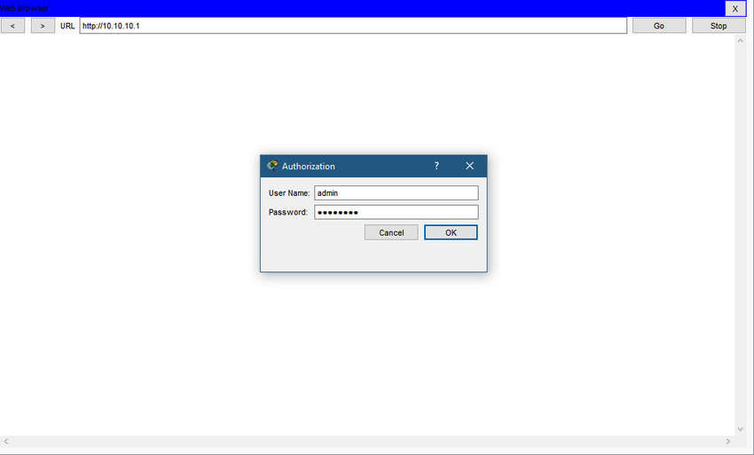

<!-- 13.1.5 -->
## Базовая настройка беспроводной сети

Базовая настройка беспроводной сети включает в себя следующие шаги:

1. Просмотр настроек WLAN по умолчанию.
2. Изменение режима сети.
3. Настройка идентификатора SSID.
4. Конфигурация канала.
5. Конфигурация режима безопасности .
6. Настройка парольной фразы.

**1. Просмотр настроек WLAN по умолчанию**

Из коробки беспроводной маршрутизатор обеспечивает беспроводной доступ к устройствам, используя имя и пароль беспроводной сети по умолчанию. Имя беспроводной сети называется идентификатором беспроводной сети (SSID). Найдите основные параметры беспроводной сети для вашего маршрутизатора, чтобы изменить эти значения по умолчанию, как показано в примере.

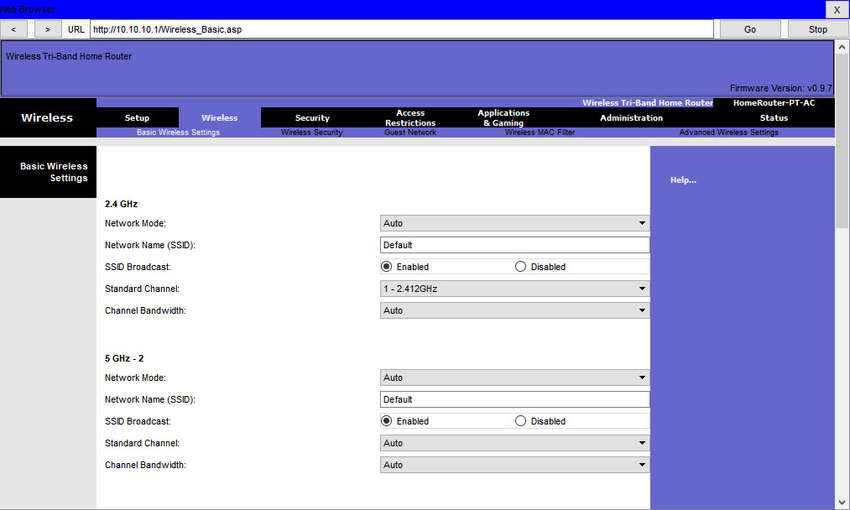

**2. Изменение режима сети**

Некоторые беспроводные маршрутизаторы позволяют выбирать, какой стандарт 802.11 следует поддерживать. Пример показывает, что «Legacy» был выбран. Это означает, что во всех беспроводных устройствах, которые подключаются к беспроводному маршрутизатору, должны быть установлены сетевые платы. Современные беспроводные маршрутизаторы, настроенные для устаревшего или смешанного режима, скорее всего поддерживают сетевые адаптеры 802.11a, 802.11n и 802.11ac.

**3. Настройка идентификатора SSID**

Назначьте SSID для WLAN. OfficeNet используется в примере для всех трех WLAN (третий WLAN не показан). Беспроводной маршрутизатор объявляет о своем присутствии посредством выполнения широковещательной рассылки его SSID. Это позволяет беспроводным узлам автоматически обнаруживать имя беспроводной сети. Если широковещательная рассылка SSID отключена, на беспроводных устройствах необходимо вводить SSID вручную.

**4. Конфигруация канала**

Устройства, сконфигурированные с одним и тем же каналом в диапазоне 2,4 ГГц, могут перекрываться и вызывать искажения, снижая производительность беспроводной связи и потенциально нарушая сетевые подключения. Решение, позволяющее избежать помех, заключается в настройке непересекающихся каналов на беспроводных маршрутизаторах и точках доступа, которые находятся рядом друг с другом. В частности, каналы 1, 6 и 11 не перекрываются. В этом примере беспроводной маршрутизатор настроен на использование канала 6.

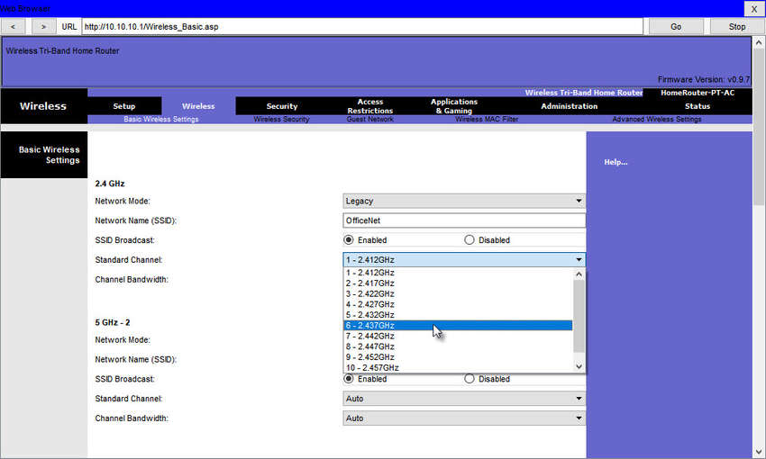

**5. Конфигурация режима безопасности**

Из коробки на беспроводном маршрутизаторе может быть не настроена защита WLAN. В этом примере персональная версия защищенного доступа Wi-Fi версии 2 (WPA2 Personal) выбрана для всех трех сетей WLAN. WPA2 с расширенным стандартом шифрования (AES) в настоящее время является самым надежным режимом безопасности.

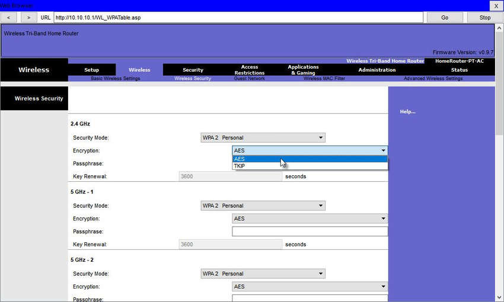

**6. Настройка парольной фразы**

Персональный WPA2 использует идентификационную фразу для аутентификации беспроводных клиентов. Персональный WPA2 легче использовать в небольшом офисе или дома, поскольку он не требует сервера аутентификации. Более крупные организации внедряют WPA2 для предприятий и требуют, чтобы беспроводные клиенты проходили аутентификацию с использованием имени пользователя и пароля.

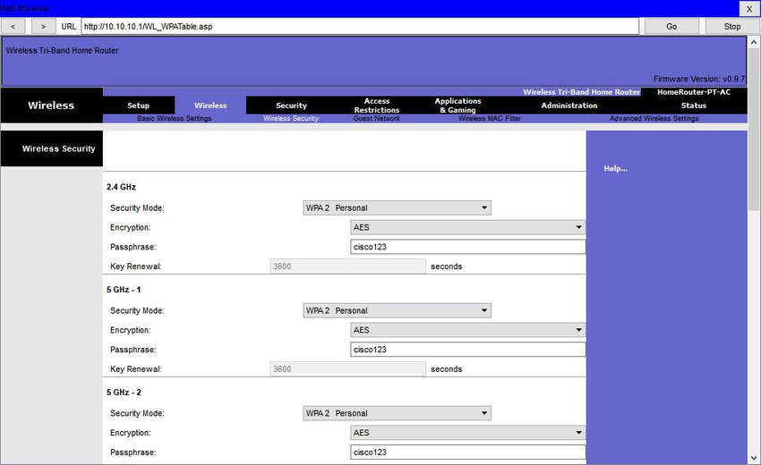

<!-- 13.1.6 -->
## Настройка беспроводной ячеистой сети

В небольшом офисе или домашней сети одного беспроводного маршрутизатора может быть достаточно для обеспечения беспроводного доступа ко всем клиентам. Однако, если вы хотите расширить радиус действия примерно на 45 метров в помещении и на 90 метров на улице, вы можете добавить точки беспроводного доступа. Как показано в беспроводной ячеистой сети на рисунке, две точки доступа настроены с одинаковыми настройками WLAN из нашего предыдущего примера. Обратите внимание, что выбраны каналы 1 и 11, чтобы точки доступа не мешали каналу 6, настроенному ранее на беспроводном маршрутизаторе.

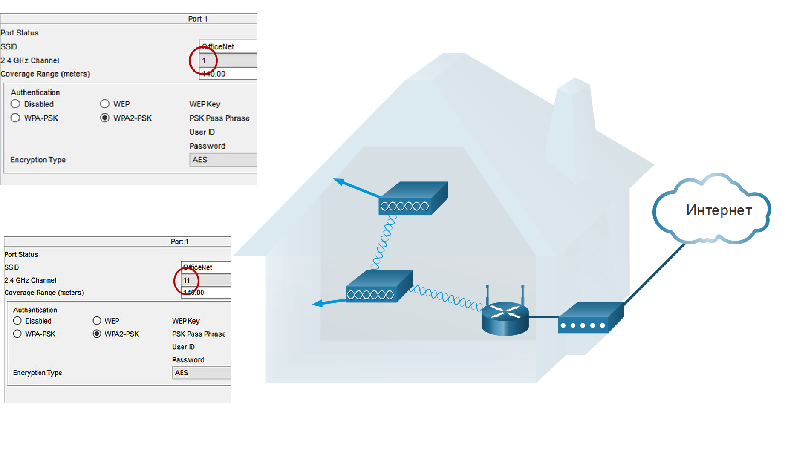
<!-- /courses/srwe-dl/af9ef5a0-34fe-11eb-b1b2-9b1b0c1f7e0d/afb7adc4-34fe-11eb-b1b2-9b1b0c1f7e0d/assets/caa25541-1c27-11ea-af09-3b2e6521927c.svg -->

Расширение сети WLAN в небольшом офисе или дома становится все проще. Производители сделали создание беспроводной ячеистой сети (WMN) простым с помощью приложений для смартфонов. Вы покупаете систему, расставляете точки доступа, подключаете их, загружаете приложение и настраиваете свой WMN за несколько шагов. Поищите в интернете «лучшую сетевую систему Wi-Fi», чтобы найти обзоры текущих предложений.

<!-- 13.1.7 -->
## NAT для IPv4

На беспроводном маршрутизаторе, если вы ищете страницу, подобную странице состояния, показанной на рисунке, вы найдете информацию об IPv4-адресации, которую маршрутизатор использует для отправки данных в Интернет. Обратите внимание, что адрес IPv4 209.165.201.11 - это сеть, отличная от адреса 10.10.10.1, назначенного интерфейсу локальной сети маршрутизатора. Все устройства в локальной сети маршрутизатора получат назначенные адреса с префиксом 10.10.10.

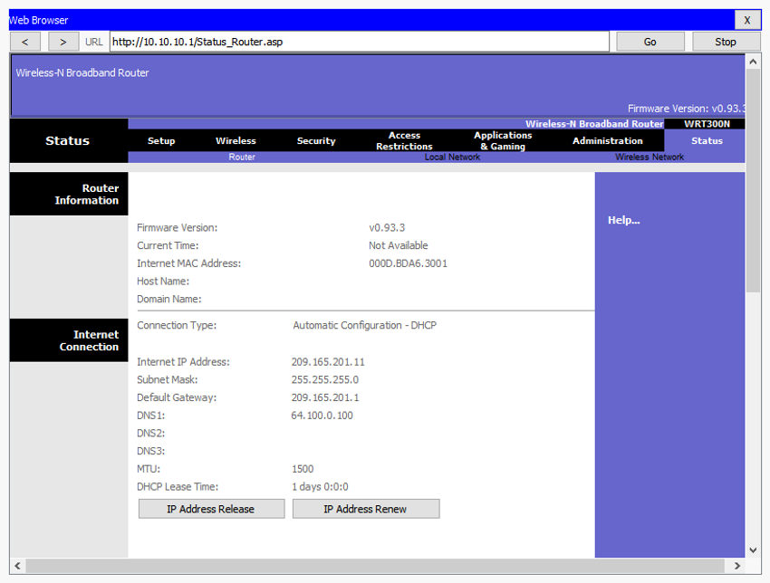

Адрес IPv4 209.165.201.11 общедоступен в Интернете. Любой адрес с цифрой 10 в первом октете является частным адресом IPv4 и не может быть маршрутизирован в Интернете. Следовательно, маршрутизатор будет реализовывать процесс преобразования частных адресов в маршрутизируемые в Интернете адреса, этот процесс называется преобразованием сетевых адресов (NAT). NAT обеспечивает преобразование частного (локального) адреса IPv4 источника в публичный (глобальный) адрес. Входящие пакеты проходят обратный процесс. Используя NAT, маршрутизатор может преобразовать многие внутренние IP-адреса в общедоступные.

Некоторые интернет-провайдеры используют частную адресацию для подключения к клиентским устройствам. Однако, в конце концов, ваш трафик покинет сеть провайдера и будет маршрутизироваться через Интернет. Чтобы просмотреть IP-адреса для ваших устройств, выполнте запрос в сети Интернете «какой у меня IP-адрес». Сделайте это для других устройств в той же сети, и вы увидите, что все они используют один и тот же общедоступный адрес IPv4. NAT делает это возможным, отслеживая номера портов источника для каждого сеанса, установленного устройством. Если у вашего интернет-провайдера включен IPv6, вы увидите уникальный IPv6-адрес для каждого устройства.

<!-- 13.1.8 -->
## Гарантированное качество обслуживания

Многие беспроводные маршрутизаторы имеют возможность настройки качества обслуживания (QoS). Можно добавить в сеть инструменты обеспечения качества обслуживания (QoS) и предоставить некоторым типам трафика, например голосу и видео, приоритет над трафиком, менее чувствительным к задержкам, таким как электронная почта и просмотр веб-страниц. На некоторых беспроводных маршрутизаторах трафик также может быть приоритетным для определенных портов.

На рисунке показан упрощенный макет интерфейса QoS на основе графического интерфейса Netgear. Обычно вы найдете настройки QoS в расширенных меню. Если у вас есть беспроводной маршрутизатор, проверьте настройки QoS. Иногда они могут быть перечислены в разделе «Управление пропускной способностью» или что-то подобное. Обратитесь к документации по беспроводному маршрутизатору или поищите в Интернете «параметры qos», чтобы узнать марку и модель вашего маршрутизатора.

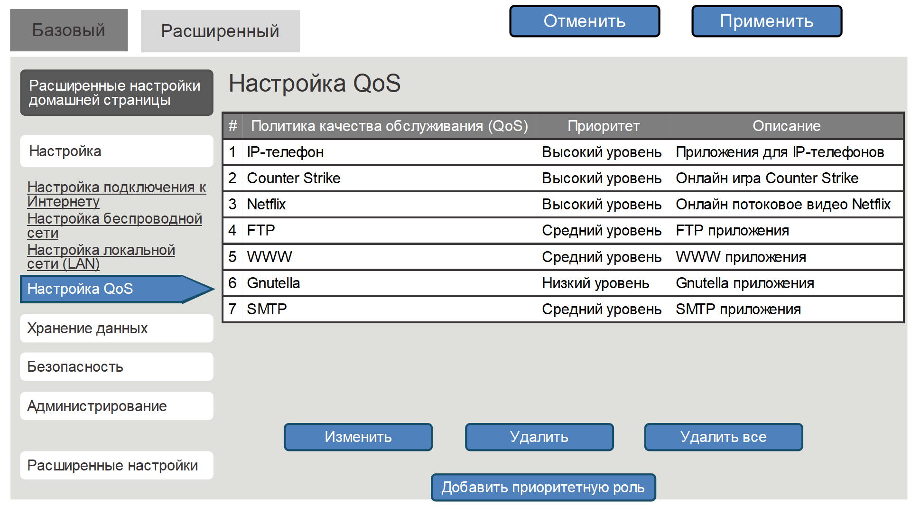
<!-- /courses/srwe-dl/af9ef5a0-34fe-11eb-b1b2-9b1b0c1f7e0d/afb7adc4-34fe-11eb-b1b2-9b1b0c1f7e0d/assets/caa33fa0-1c27-11ea-af09-3b2e6521927c.svg -->

<!-- 13.1.9 -->
## Перенаправление портов

Беспроводные маршрутизаторы обычно блокируют порты TCP и UDP, чтобы предотвратить несанкционированный доступ в локальную сеть и из нее. Однако в некоторых случаях необходимо открыть некоторые порты, чтобы определенные программы и приложения могли связываться с устройствами в других сетях. Переадресация (также перенаправление или проброс) портов (port forwarding) — это способ направления трафика между устройствами в различных сетях на основе правил.

Когда трафик достигает маршрутизатора, маршрутизатор определяет, должен ли трафик пересылаться определенному устройству, на основе номера порта, найденного в трафике. Например, маршрутизатор может быть настроен на перенаправление порта 80, который связан с HTTP. Когда маршрутизатор получает пакет с портом назначения 80, он пересылает трафик серверу в сети, обслуживающему веб-страницы. На рисунке показано, что на маршрутизаторе включено перенаправление для порта 80 на веб-сервер, размещенный по IP-адресу 10.10.10.50.

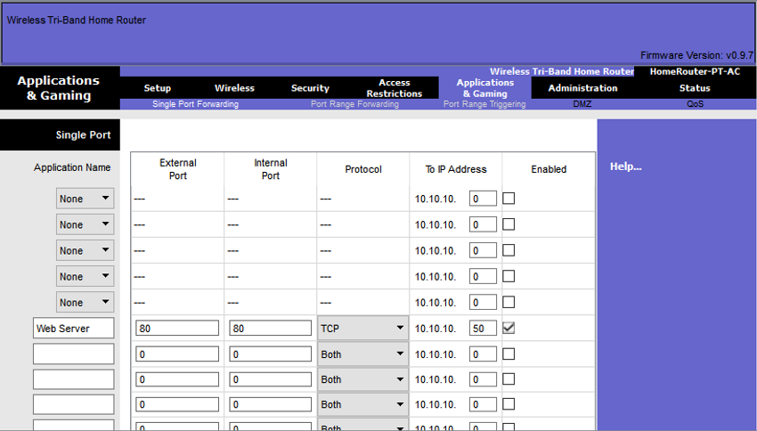

Включение портов (port triggering) позволяет маршрутизатору временно переадресовывать данные через входящие порты определенному устройству. Включение портов можно использовать для переадресации данных на компьютер, только если назначенный диапазон портов используется для создания исходящего запроса. Например, видеоигра может использовать порты 27000–27100 для связи с другими игроками. Это запускающие порты. Клиент чата может использовать порт 56 для связи с этими же игроками, чтобы они могли общаться друг с другом. Если в этом примере существует игровой трафик на исходящем порту с диапазоном запускающих портов, входящий трафик чата на порту 56 перенаправляется на компьютер, используемый для видеоигры и общения с друзьями. Когда игра завершается и запускающие порты больше не используются, порту 56 больше не будет разрешено пересылать какой-либо трафик этому компьютеру.

<!-- 13.1.10 -->
## Работа в симуляторе: настройка беспроводной сети

В этом упражнении вы настроите беспроводной маршрутизатор и точку доступа для приема беспроводных клиентов и маршрутизации IP-пакетов.

[Настройка беспроводной сети (pdf)](./assets/13.1.10-packet-tracer---configure-a-wireless-network_ru-RU.pdf)

[Настройка беспроводной сети (pka)](./assets/13.1.10-packet-tracer---configure-a-wireless-network_ru-RU.pka)

<!-- 13.1.11 -->