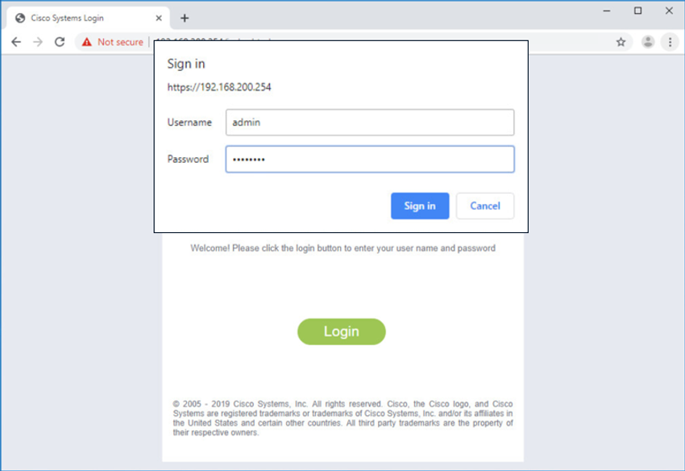
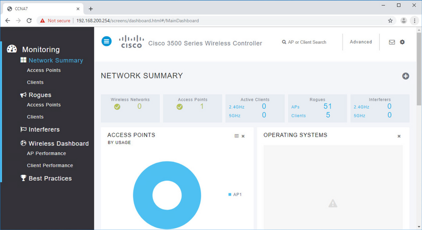
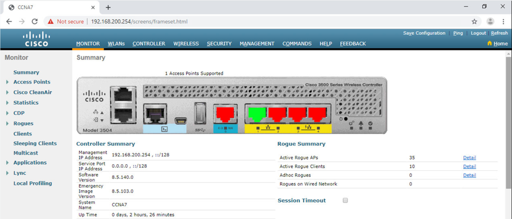
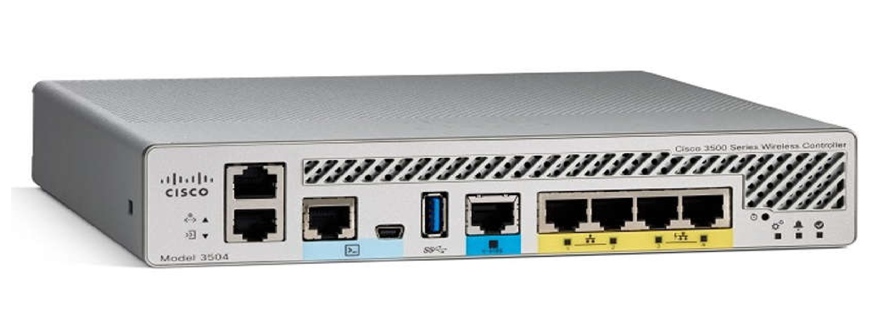
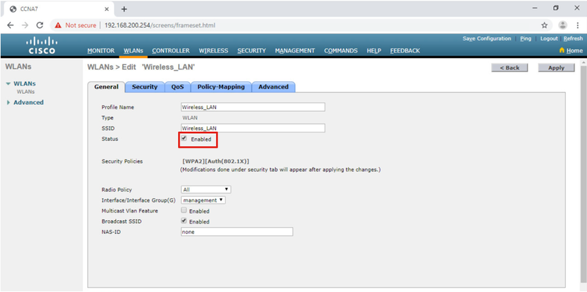
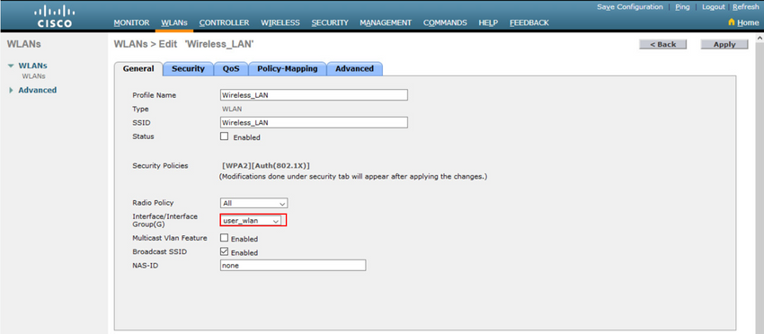
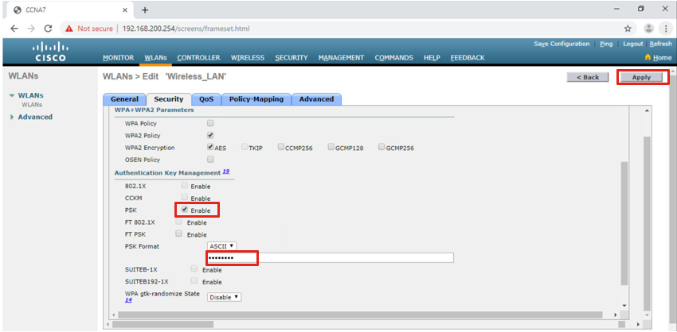
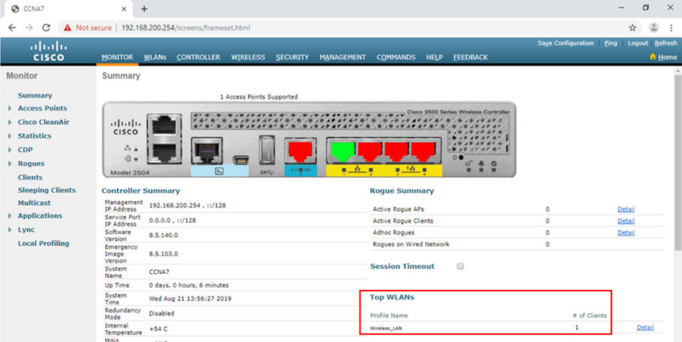

<!-- 13.2.1 -->
## Видео: конфигурация Базового WLAN с контроллером беспроводной сети

В предыдущей теме вы узнали о конфигурации удаленных возможностей WLAN. Этот раздел о настройке базовой WLAN на WLC.

Нажмите Воспроизвести, чтобы просмотреть демонстрацию настройки WLC Cisco 3504 с базовым WLAN-соединением.


<!-- 13.2.2 -->
## Топология WLC

Топология и схема адресации, используемые для видео и этой темы, показаны на рисунке и в таблице. Точка доступа (AP) является AP на основе контроллера, а не автономной AP. Напомним, что эти устройства не требуют начальной настройки и часто называются облегченными точками доступа (LAP). LAP используют протокол облегченной точки доступа (LWAPP) для связи с контроллером WLAN (WLC), как показано на следующем рисунке. Точки доступа, управляемые контроллером, рекомендуется использовать в случаях, когда в сети требуется много точек доступа. Поскольку больше AP добавлено, каждый AP автоматически настраивается и управляется WLC.

**Топология**


<!-- /courses/srwe-dl/af9ef5a0-34fe-11eb-b1b2-9b1b0c1f7e0d/afb7adc6-34fe-11eb-b1b2-9b1b0c1f7e0d/assets/caa53b73-1c27-11ea-af09-3b2e6521927c.svg -->

Точка доступа - это PoE, что означает, что она подключена к кабелю Ethernet, подключенному к коммутатору.

**Addressing Table**

| Устройство | Интерфейс | IP-адрес | Маска подсети |
| --- | --- | --- | --- |
| R1 | F0/0 | 172.16.1.1 | 255.255.255.0 |
| R1 | F0/1.1 | 192.168.200.1 | 255.255.255.0 |
| S1 | VLAN 1 | DHCP |
| WLC | Управление (Management) | 192.168.200.254 | 255.255.255.0 |
| AP1 | Wired 0 | 192.168.200.3 | 255.255.255.0 |
| ПК-A | Сетевой адаптер | 172.16.1.254 | 255.255.255.0 |
| PC-B | NIC | DHCP |
| Ноутбук с беспроводным подключением | NIC | DHCP |

<!-- 13.2.3 -->
## Зайдите на WLC

Настройка контроллера беспроводной локальной сети (WLC) не сильно отличается от настройки беспроводного маршрутизатора. Большая разница в том, что WLC контролирует точки доступа и предоставляет больше сервисов и возможностей управления, многие из которых выходят за рамки этого модуля.

**Примечание**: Цифры в этом разделе, которые показывают графический интерфейс пользователя (GUI) и меню, взяты из беспроводного контроллера Cisco 3504. Тем не менее, другие модели WLC будут иметь аналогичные меню и функции.

На рисунке показано, как пользователь входит в WLC с учетными данными, которые были настроены во время начальной настройки.



Страница **Network Summary** (Сводная информация о сети) представляет собой панель мониторинга, которая обеспечивает быстрый обзор количества настроенных беспроводных сетей, связанных точек доступа (AP) и активных клиентов. Вы также можете увидеть количество мошеннических точек доступа и клиентов, как показано на рисунке.



<!-- 13.2.4 -->
## Просмотр всей информации от точках доступа

Нажмите **Access Points** (Точки доступа) в левом меню, чтобы просмотреть общее представление о системной информации и производительности точки доступа, как показано на следующем рисунке.  AP использует адрес 192.168.200.3. Поскольку протокол Cisco Discovery (CDP) активен в этой сети, WLC знает, что AP подключен к порту FastEthernet 0/1 на коммутаторе.


Этот AP в топологии является Cisco Aironet 1815i, что означает, что вы можете использовать командную строку и ограниченный набор знакомых команд IOS. В этом примере сетевой администратор пропинговал шлюз по умолчанию, пропинговал WLC и проверил проводной интерфейс.

```
AP1# ping 192.168.200.1
Sending 5, 100-byte ICMP Echos to 192.168.200.1, timeout is 2 seconds
!!!!!
Success rate is 100 percent (5/5), round-trip min/avg/max = 1069812.242/1071814.785/1073817.215 ms
AP1# ping 192.168.200.254
Sending 5, 100-byte ICMP Echos to 192.168.200.254, timeout is 2 seconds
!!!!!
Success rate is 100 percent (5/5), round-trip min/avg/max = 1055820.953/1057820.738/1059819.928 ms
AP1# show interface wired 0
wired0    Link encap:Ethernet  HWaddr 2C:4F:52:60:37:E8
          inet addr:192.168.200.3  Bcast:192.168.200.255  Mask:255.255.255.255
          UP BROADCAST RUNNING PROMISC MULTICAST  MTU:1500  Metric:1
          RX packets:2478 errors:0 dropped:3 overruns:0 frame:0
          TX packets:1494 errors:0 dropped:0 overruns:0 carrier:0
          collisions:0 txqueuelen:80
          RX bytes:207632 (202.7 KiB)  TX bytes:300872 (293.8 KiB)
AP1#
```

<!-- 13.2.5 -->
## Расширенные настройки

Большинство WLC будут поставляться с некоторыми базовыми настройками и меню, к которым пользователи могут быстро получить доступ для реализации различных общих конфигураций. Однако, как сетевой администратор, вы обычно получаете доступ к дополнительным настройкам. Для беспроводного контроллера Cisco 3504 нажмите **Advanced** (Дополнительно) в правом верхнем углу, чтобы открыть страницу **Summary** (Сводная информация), как показано на рисунке. Отсюда вы можете получить доступ ко всем функциям WLC.



<!-- 13.2.6 -->
## Настройка WLAN

Контроллеры беспроводной локальной сети имеют порты и интерфейсы. Порты - это гнезда  для физических подключений к проводной сети. Они напоминают порты коммутатора. Интерфейсы виртуальные. Они созданы программно и очень похожи на интерфейсы VLAN. Фактически, каждый интерфейс, который будет передавать трафик от WLAN, настроен на WLC как другая VLAN. WLC Cisco 3504 может поддерживать 150 точек доступа и 4096 VLAN, однако он имеет только пять физических портов, как показано на рисунке. Это означает, что каждый физический порт может поддерживать множество AP и WLAN. Порты на WLC, по сути, являются магистральными портами, которые могут передавать трафик от нескольких VLAN к коммутатору для распределения по нескольким точкам доступа. Каждая точка доступа может поддерживать несколько сетей WLAN.


<!-- /courses/srwe-dl/af9ef5a0-34fe-11eb-b1b2-9b1b0c1f7e0d/afb7adc6-34fe-11eb-b1b2-9b1b0c1f7e0d/assets/caa90c00-1c27-11ea-af09-3b2e6521927c.svg -->

Базовая конфигурация WLAN на WLC включает следующие шаги:

1. Создание WLAN
2. Применение и активация WLAN
3. Выберите интерфейс
4. Безопасность WLAN
5. Проверка того, что WLAN работает
6. Мониторинг WLAN
7. Просмотр информации о беспроводном клиенте

**1. Создание WLAN**

На рисунке администратор создает новую WLAN, которая будет использовать **Wireless\_LAN** в качестве имени и идентификатора набора услуг (SSID). Идентификатор является произвольным значением, которое используется для идентификации WLAN в отображении вывода на WLC.


**2. Применение и активация WLAN**

После нажатия кнопки  **Apply** (Применить), администратор сети должен включить WLAN, прежде чем пользователи смогут получить к нему доступ, как показано на рисунке. Флажок Enable (Включить) позволяет сетевому администратору настраивать различные функции для WLAN, а также дополнительные WLAN, прежде чем включать их для беспроводного клиентского доступа. Отсюда сетевой администратор может настроить различные параметры для WLAN, включая безопасность, QoS, политики и другие дополнительные параметры.



**3. Выберите интерфейс**

Когда вы создаете WLAN, вы должны выбрать интерфейс, который будет передавать трафик WLAN. На следующем рисунке показан выбор интерфейса, который уже был создан на WLC. Мы узнаем, как создавать интерфейсы позже в этом модуле.



**4. Безопасность WLAN**

Перейдите на вкладку Security (Безопасность), чтобы получить доступ ко всем доступным параметрам защиты локальной сети. Администратор сети хочет защитить уровень 2 с помощью WPA2-PSK. WPA2 и 802.1X установлены по умолчанию. В раскрывающемся списке Безопасность уровня 2 убедитесь, что выбран **WPA+WPA2** (не показан). Нажмите PSK и введите предварительный общий ключ, как показано на рисунке. Затем нажмите **Apply** (Применить). Это активирует WLAN с аутентификацией WPA2-PSK. Беспроводные клиенты, которые знают предварительный общий ключ, теперь могут связываться и аутентифицироваться с AP.



**5. Проверка того, что WLAN работает**

Нажмите **WLAN** в меню слева, чтобы просмотреть вновь настроенную WLAN. На рисунке вы можете убедиться, что WLAN ID 1 настроен с в качестве имени **Wireless\_LAN** и SSID, он включен и использует защиту WPA2 PSK.


**6. Мониторинг WLAN**

Перейдите на вкладку **Monitor** (Мониторинг) вверху, чтобы снова перейти на расширенную страницу **Summary** (Сводная информация). Здесь вы можете видеть, что у **Wireless\_LAN** теперь есть один клиент, использующий его сервисы, как показано на рисунке.



**7. Просмотр сведений о беспроводном клиенте**

Нажмите **Clients** (Клиенты) в левом меню, чтобы просмотреть дополнительную информацию о клиентах, подключенных к WLAN, как показано на рисунке. Один клиент подключен к **Wireless\_LAN** через AP1 и получил IP-адрес 192.168.5.2. Службы DHCP в этой топологии предоставляются маршрутизатором.


