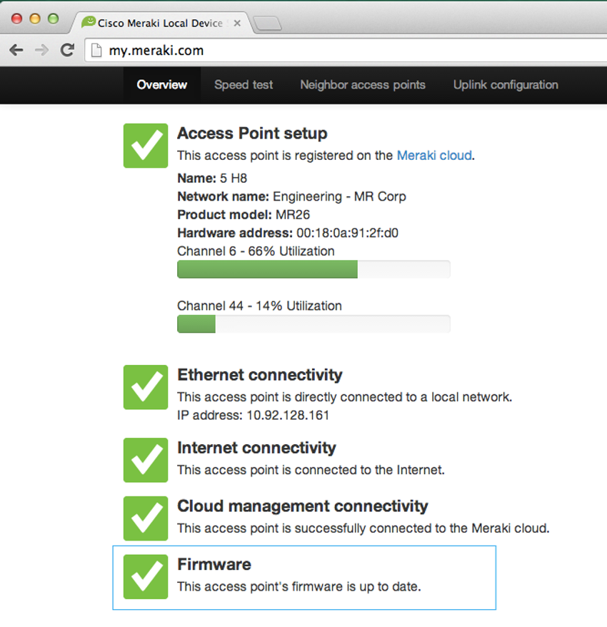

<!-- 13.4.1 -->
## Способы поиска и устранения неполадок

В предыдущей теме вы узнали о конфигурации удаленных возможностей WLAN. Здесь мы обсудим устранение проблем с WLAN.

Неполадки сетей бывают простыми и сложными. Они могут возникать из-за проблем с оборудованием, программным обеспечением и подключениями. Технические специалисты должны уметь проанализировать неполадку и определить причину ошибки, чтобы исправить ее. Этот процесс называется поиском и устранением неполадок.

Поиск и устранение любых неполадок в сети необходимо выполнять, используя систематический подход. Общепринятая эффективная процедура поиска и устранения неполадок основана на научном подходе и может быть разбита на шесть основных этапов, представленных на рисунке.

| **Шаг** | **Название** | **Описание** |
| --- | --- | --- |
| 1 | Определение проблемы | Первым этапом процедуры поиска и устранения неполадок является определение проблемы. На этом этапе можно использовать различные методы, в том числе, можно расспросить пользователя, что может оказаться очень полезным. |
| 2 | Формирование предположений о возможных причинах неполадки | После того, как вы поговорили с пользователем и определили проблему, вы можете пытаться сформировать предположения о возможных причинах неполадки. Этот шаг часто приводит к появлению более чем нескольких вероятных причин проблемы. |
| 3 | Проверка предположений о причине неполадки | Основываясь на вероятных причинах, проверяем свои теории, чтобы определить, какие из них могли быть причиной проблем. Техник часто применяет быструю процедуру для проверки и выяснения, решает ли она проблему. Если быстрая процедура не устранила проблему, вам может потребоваться дальнейшее изучение проблемы, чтобы установить точную причину. |
| 4 | Разработка плана действий по устранению неполадки и его реализация | После того, как вы определили точную причину проблемы, составьте план действий для решения проблемы и внедрите решение. |
| 5 | Полная проверка функционального состояния системы и принятие профилактических мер | После устранения неполадки выполните полную проверку функционального состояния системы и при необходимости примите профилактические меры. |
| 6 | Документирование полученных данных, принятых мер и результатов | На последнем этапе процедуры поиска и устранения неполадок выполняется документирование полученных данных, выполненных действий и результатов. Эта информация очень важна для использования в будущем. |

Для оценки неполадки необходимо определить количество устройств в сети, на которых она возникла. Если проблема выявлена только на одном устройстве в сети, начните процесс поиска и устранения неполадок на этом устройстве. Если проблема коснулась всех устройств в сети, начните процесс поиска и устранения неполадок на устройстве, к которому подключены все остальные устройства. Вы должны разработать логичную и последовательную процедуру диагностики сетевых неполадок, устраняя каждую из них по очереди.

<!-- 13.4.2 -->
## Невозможно подключить беспроводной клиент

При поиске и устранении неполадок в сети WLAN рекомендуется использовать процесс исключения кандидатов.

На рисунке беспроводной клиент не может подключиться к сети WLAN.

При отсутствии подключения необходимо проверить следующее:

* Подтвердите конфигурацию сети на ПК с помощью команды **ipconfig**. Убедитесь, что ПК получил IP-адрес по DHCP или был настроен с использованием статического IP-адреса.
* Проверьте возможность подключения устройства к проводной сети. Подключите устройство к проводной сети LAN и выполните команду ping для известного IP-адреса.
* При необходимости следует перезагрузить драйверы, соответствующие клиенту. Возможно, потребуется использование другого беспроводного сетевого адаптера.
* Если беспроводной сетевой адаптер исправен, следует проверить режим безопасности и настройки шифрования на клиенте. Если настройки безопасности не соответствуют, клиент не может получить доступ к сети WLAN.

Если компьютер исправен, но подключение к беспроводной сети работает некорректно, проверьте следующее:

* Как далеко от точки доступа находится компьютер? Находится ли компьютер за пределами запланированной зоны покрытия (BSA)?
* Проверьте настройки канала на беспроводном клиенте. Клиентское ПО должно выполнить обнаружение соответствующего канала, если имя SSID является верным.
* Проверьте наличие в зоне других устройств, которые могут создавать помехи в полосе 2,4 ГГц. Примерами данных устройств могут послужить радиотелефоны, радио-няни, микроволновые печи, беспроводные системы безопасности и потенциально вредоносные точки доступа. Данные, поступающие с этих устройств, могут создавать помехи в работе сети WLAN и вызывать перебои в соединении между беспроводным клиентом и точкой доступа.

Далее необходимо убедиться, что все устройства находятся на своих местах. Не забывайте о вероятности возникновения проблем с физической безопасностью. На все ли устройства подается питание? Все ли устройства включены?

Проверьте соединения между подключенными с помощью кабелей устройствами на предмет неисправных разъемов, повреждённых или отсутствующих кабелей. Если физически все необходимые компоненты на месте, проверьте проводную сеть LAN с помощью эхо-тестирования устройств, включая точку доступа. Если подключение на этом этапе все еще отсутствует, возможно, возникла проблема с точкой доступа или ее конфигурацией.

Если компьютер не является источником проблемы и физическое состояние устройств проверено, следует изучить работу точки доступа. Проверьте состояние питания точки доступа.

<!-- 13.4.3 -->
## Поиск и устранение неполадок в случае медленной работы сети

Для оптимизации и увеличения пропускной способности двухдиапазонных маршрутизаторов и точек доступа 802.11:

* **Обновите беспроводные клиенты** - старые устройства 802.11b, 802.11g и даже 802.11n могут замедлять работу всей беспроводной локальной сети. Чтобы добиться оптимальной производительности, все беспроводные устройства должны поддерживать одни и те же максимально допустимые стандарты. Несмотря на то, что 802.11ax был выпущен в 2019 году, скорее всего, 802.11ac - это самый новый стандарт, который предприятия могут применять в настоящее время.
* **Разделение трафика** - самый простой способ улучшить производительность беспроводной сети - это разделить беспроводной трафик между полосой 2,4 ГГц 802.11n и полосой 5 ГГц. Следовательно, в целях облегчения управления трафиком стандарт IEEE 802.11n (или выше) может использовать две полосы, как две отдельные беспроводные сети. Например, используйте сеть 2,4 ГГц для основных интернет-задач, таких как просмотр веб-страниц, электронная почта и загрузка, и используйте полосу 5 ГГц для потоковой передачи мультимедиа, как показано на рисунке.

Существует ряд предпосылок для использования разделения трафика:

* Полоса 2,4 ГГц подходит для базового интернет-трафика, который не чувствителен к задержкам.
* Полосу пропускания можно использовать совместно с другими ближайшими сетями WLAN.
* Полоса 5 ГГц гораздо менее загружена, чем полоса 2,4 ГГц, и идеально подходит для потоковой передачи медиаданных.
* Полоса 5 ГГц содержит больше каналов, следовательно, выбранный канал, скорее всего, не будет подвержен воздействию помех.

По умолчанию двухдиапазонные маршрутизаторы и точки доступа используют одно и то же имя сети как в диапазоне 2,4 ГГц, так и в диапазоне 5 ГГц. Самый простой способ сегментировать трафик - это переименовать одну из беспроводных сетей. При наличии отдельного описательного имени гораздо проще подключиться к нужной сети.

Чтобы расширить радиус действия беспроводной сети, убедитесь, что на беспроводном маршрутизаторе или в точке доступа нет препятствий, таких как мебель и бытовые приборы. Такие препятствия блокируют сигнал, из-за чего диапазон действия сети WLAN уменьшается. Если проблема по-прежнему не решена, можно использовать технологию увеличения покрытия Wi-Fi Range Extender или беспроводную технологию Powerline.

<!-- 13.4.4 -->
## Обновление микропрограммного обеспечения

Микропрограммное обеспечение (прошивку) большинства беспроводных маршрутизаторов можно обновлять. В обновлениях микропрограммы могут содержаться исправления распространенных проблем, о которых сообщали заказчики, а также исправления, позволяющие устранить уязвимости в системе безопасности. Рекомендуется регулярно проверять наличие обновленного микропрограммного обеспечения на веб-сайте производителя устройства. На рисунке администратор сети проверяет, обновлено ли встроенное ПО на точке доступа Cisco Meraki.

На WLC, скорее всего, будет возможность обновить микропрограмму на всех AP, которые контролирует WLC. На следующем рисунке администратор сети загружает образ микропрограммы, который будет использоваться для обновления всех точек доступа.

На беспроводном контроллере Cisco 3504 Wireless Controller, Нажмите следующие пункты меню **WIRELESS** > **Access Points** в меню слева > **Global Configuration**. Затем прокрутите страницу вниз до раздела «Предварительная загрузка образа AP».

В процессе обновления микропрограммы пользователи будут отключены от беспроводной локальной сети и Интернета. Для возобновления обычной работы беспроводному маршрутизатору может потребоваться несколько перезагрузок.

