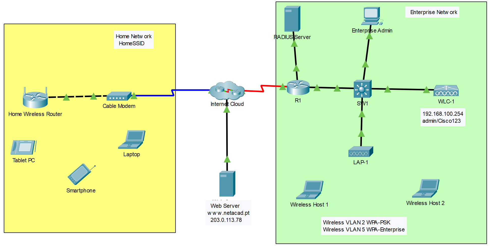

---

> **ВАЖНО**
> 
> Форма для ответов на вопросы будет доступна только при развертывании лабораторной работы 

---

## Топология

## Таблица адресации

| Устройство                          | Интерфейс       | IP-адрес           |
|-------------------------------------|-----------------|--------------------|
| Домашний беспроводной роутер | Интернет        | DHCP               |
| Домашний беспроводной роутер | LAN             | 192.168.6.1/27     |
| RTR-1                               | G0/0/0.2        | 192.168.2.1/24     |
| RTR-1                               | G0/0/0.5        | 192.168.5.1/24     |
| RTR-1                               | G0/0/0.100      | 192.168.100.1/24   |
| RTR-1                               | G0/0/1          | 10.6.0.1/24        |
| SW1                                 | VLAN 200        | 192.168.100.100/24 |
| LAP-1                               | G0              | DHCP               |
| WLC-1                               | Управление      | 192.168.100.254/24 |
| Сервер RADIUS                       | NIC             | 10.6.0.254/24      |
| Home Admin                          | NIC             | DHCP               |
| Enterprise Admin                    | NIC             | 192.168.100.200/24 |
| Веб-сервер                          | NIC             | 203.0.113.78/24    |
| DNS Server                          | NIC             | 10.100.100.252     |
| Ноутбук                             | Сетевой адаптер | DHCP               |
| Мини-компьютеры                     | Wireless0       | DHCP               |
| Смартфон                            | Wireless0       | DHCP               |
| Wireless Host 1                     | Wireless0       | DHCP               |
| Wireless Host 2                     | Wireless0       | DHCP               |

## Информация о WLAN

| WLAN          | SSID     | Аутентификация   | Имя пользователя | Пароль     |
|---------------|----------|------------------|------------------|------------|
| Домашняя сеть | HomeSSID | WPA2-Personal    | Не применимо     | Cisco123   |
| WLAN VLAN 2   | SSID-2   | WPA-2 Personal   | Не применимо     | Cisco123   |
| WLAN VLAN 5   | SSID-5   | WPA-2 Enterprise | userWLAN5        | userW5pass |

**Примечание.** Повторно использовать пароли, как это делается в этом упражнении, не рекомендуется. Здесь это сделано, чтобы упростить выполнение задач.

## Цели

В этом упражнении вы настроите беспроводной домашний роутер и сеть на основе WLC. Вы организуете безопасность WPA2-PSK и WPA2-Enterprise.

-   Настройте домашний роутер для обеспечения подключения Wi-Fi к различным устройствам.

-   Настройте безопасность WPA2-PSK на домашнем роутере.

-   Настройте интерфейсы на WLC.

-   Настройте WLAN на WLC.

-   Настройте безопасность WPA2-PSK в WLAN и подключите хосты к WLAN.

-   Настройте WPA2-Enterprise на WLAN и подключите хосты к WLAN.

-   Проверьте подключение.

## Общие сведения и сценарий

Вы примените свои навыки и знания в области WLAN, настроив домашний беспроводной роутер и корпоративный WLC. Также вы организуете безопасность WPA2-PSK и WPA2-Enterprise, подключите хосты к каждой WLAN и проверите подключение.

## Инструкции

### Часть 1. Конфигурация домашнего беспроводного роутера

Вы устанавливаете новый домашний беспроводной роутер для своего друга. Вам нужно будет изменить настройки устройства, чтобы повысить его безопасность и выполнить все требования клиента.

**Шаг 1. Измените настройки DHCP**

1.  Откройте графический интерфейс домашнего беспроводного роутера и измените настройки IP-адреса и DHCP устройства в соответствии с информацией в таблице адресации.

2.  Разрешите максимальное число адресов, используемых роутером, равное **20**.

3.  Настройте DHCP-сервер, чтобы начать с IP-адресом **3** локальной сети.

4.  Настройте интернет-интерфейс роутера для получения его IP-адреса через DHCP.

5.  Настройте статический DNS-сервер с адресом, указанным в таблице адресации.

**Шаг 2. Настройте беспроводную локальную сеть**

1.  Сеть будет использовать интерфейс 2,4 ГГц. Настройте интерфейс SSID, показанный в информационной таблице беспроводной локальной сети.

2.  Используйте **канал № 6**.

3.  Убедитесь, что все беспроводные устройства в доме смогут видеть SSID.

**Шаг 3. Настройте безопасность**

1.  Обеспечбте безопасность беспроводной сети, используя **WPA2 Personal** и пароли, показанные в информационной таблице.

2.  Защитите роутер, изменив пароль по умолчанию на значение, указанное в информационной таблице беспроводной локальной сети.

**Шаг 4. Подключение клиентских устройств**

1.  Откройте приложение PC Wireless на рабочем столе ноутбука и настройте клиент для подключения к сети.

2.  Откройте вкладку **Конфигурация** на планшете и смартфоне и настройте беспроводные интерфейсы для подключения к сети.

3.  Проверьте подключение. Хосты должны иметь возможность пинговать друг друга и веб-сервер. Они также должны иметь доступ к URL-адресу сервера.

### Часть 2. Настройте сеть контроллера WLC

Настройте контроллер беспроводной локальной сети с двумя WLAN. Одна будет использовать аутентификацию WPA2-PSK, другая WLAN – WPA2-Enterprise. Вы также настроите WLC на использование сервера SNMP и область DHCP, которая будет использоваться беспроводной сетью управления.

**Шаг 1. Настройте интерфейсы VLAN.**

1.  Из интерфейса администратора предприятия перейдите к интерфейсу управления WLC-1 через браузер. Чтобы войти в WLC-1, используйте **admin** в качестве имени пользователя и **Cisco123** в качестве пароля.

2.  Настройте интерфейс для первой WLAN.

    Имя: **WLAN 2**.

    VLAN-идентификатор: **2**.

    Номер порта: **1**.

    IP-адрес интерфейса: **192.168.2.254**.

    Маска: **255.255.255.0**.

    Шлюз: **адрес интерфейса RTR-1 G0/0/0.2**.

    Основной DHCP-сервер: **Адрес шлюза**.

3.  Настройте интерфейс для второй WLAN.

    Имя: **WLAN 5**.

    VLAN-идентификатор: **5**.

    Номер порта: **1**.

    IP-адрес интерфейса: **192.168.5.254**.

    Маска: **255.255.255.0**.

    Шлюз: **Адрес интерфейса RTR-1 G0/0/0.5**.

    Основной DHCP-сервер: **Адрес шлюза**.

**Шаг 2. Настройте область DHCP для беспроводной сети управления**

Настройте и включите внутреннюю область DHCP.

Имя области: **management**.

Начальный адрес пула: **192.168.100.235**.

Конечный адрес пула: **192.168.100.245**.

Сеть: **192.168.100.0**.

Маска: **255.255.255.0**.

Шлюз по умолчанию: **192.168.100.1**.

**Шаг 3. Настройте WLC с адресами внешнего сервера**

1.  Настройте информацию о сервере RADIUS.

    Идентификатор сервера: **1**.

    Адрес сервера: **10.6.0.254**.

    Секретный ключ: **RadiusPW**.

2.  Настройте WLC для отправки информации журналов на сервер SNMP.

    Имя компании: **WLAN**.

    IP-адрес: **10.6.0.254**.

**Шаг 4. Создание WLAN**

1.  Создайте первую WLAN.

    Имя профиля: **Wireless VLAN 2**.

    WLAN SSID: **SSID-2**.

    ID: **2**.

    Интерфейс: **WLAN 2**.

    Безопасность: **WPA2-PSK**.

    Парольная фраза: **Cisco123**.

    На вкладке **Дополнительно** перейдите в раздел **FlexConnect**. Включите **FlexConnect Local Switching** и **FlexConnect Local Auth.**

2.  Создайте вторую WLAN.

    Имя профиля: **Wireless VLAN 5**.

    WLAN SSID: **SSID-5**.

    Интерфейс: **WLAN 5**.

    ID: **5**.

    Безопасность: **802.1x - WPA2-Enterprise**.

    Настройка WLAN для использования RADIUS-сервера для аутентификации.

    Выполните настройки **FlexConnect**, как это было сделано в шаге 4.1.

**Шаг 5. Настройка хостов для подключения к WLAN**

Используйте приложение **Wireless** для стационарных ПК, чтобы настроить хосты следующим образом:

1.  Wireless Host 1 должен подключиться к Wireless VLAN 2;

2.  Wireless Host 2 должен подключиться к Wireless VLAN 5, используя учетные данные в информационной таблице WLAN.

**Шаг 6. Проверка связи**

Проверьте соединение между различными беспроводными хостами и веб-сервером по IP и URL.

<!-- [Скачать файл Packet Tracer для локального запуска](./assets/13.5.1-lab.pka) -->
