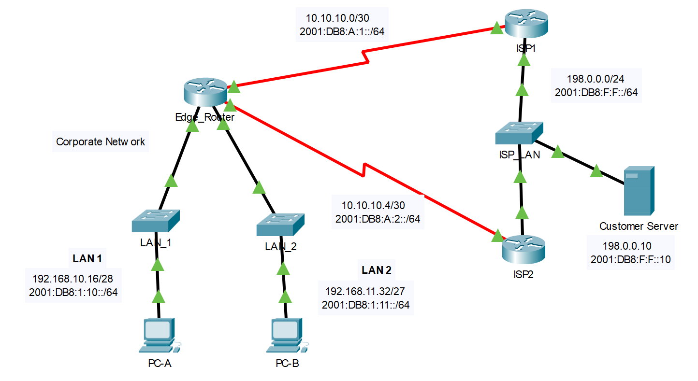

## Топология

## Таблица адресации

| Устройство      | Интерфейс | IP адрес/префикс     |
|-----------------|-----------|----------------------|
| Edge_Router     | S0/0/0    | 10.10.10.2/30        |
| Edge_Router     | S0/0/0    | 2001:db8:a:1::2/64   |
| Edge_Router     | S0/0/1    | 10.10.10.6/30        |
| Edge_Router     | S0/0/1    | 2001:db8:a:2::2/64   |
| Edge_Router     | G0/0      | 192.168.10.17/28     |
| Edge_Router     | G0/0      | 2001:db8:1:10::1/64  |
| Edge_Router     | G0/1      | 192.168.11.33/27     |
| Edge_Router     | G0/1      | 2001:db8:1:11::1/64  |
| ISP1            | S0/0/0    | 10.10.10.1/30        |
| ISP1            | S0/0/0    | 2001:db8:a:1::1/64   |
| ISP1            | G0/0      | 198.0.0.1/24         |
| ISP1            | G0/0      | 2001:db8:f:f። 1/64   |
| ISP2            | S0/0/1    | 10.10.10.5/30        |
| ISP2            | S0/0/1    | 2001:db8:a:2::1/64   |
| ISP2            | G0/0      | 198.0.0.2/24         |
| ISP2            | G0/0      | 2001:db8:f:f። 2/64   |
| PC-A            | NIC       | 192.168.10.19/28     |
| PC-A            | NIC       | 2001:db8:1:10::19/64 |
| PC-B            | NIC       | 192.168.11.4/27      |
| PC-B            | NIC       | 2001:db8:1:11::45    |
| Customer Server | NIC       | 198.0.0.10           |
| Customer Server | NIC       | 2001:db8:f:f።10      |

## Цели

В этом финальном задании Packet Tracer вы будете настраивать статические, стандартные и плавающие статические маршруты для протоколов IPv4 и IPv6.

-   Настройка IPv4 статический и Плавающих статических маршрутов по умолчанию.

-   Настройка IPv6 статический и Плавающих статических маршрутов по умолчанию.

-   Настройка статические и плавающие статические маршруты IPv4 во внутреннюю локальную сеть.

-   Настройка статические и плавающие статические маршруты IPv6 во внутреннюю локальную сеть.

-   Настройка IPv4 маршрутов хостов

-   Настройка IPv6 маршрутов хостов

## Общие сведения и сценарий

В этом финальном задании Packet Tracer вы будете настраивать статические, маршруты по умолчанию и плавающие статические маршруты для протоколов IPv4 и IPv6.

**Примечание. Статическая маршрутизация, используемая в данной лабораторной работе, используется для оценки возможности настройки только различных типов статических маршрутов. Такой подход может не соответствовать лучшим рекомендациями.**

## Инструкции

### Часть 1. Настройка IPv4 статический и Плавающих статических маршрутов по умолчанию.

Сеть PT требует статических маршрутов для обеспечения доступа в Интернет внутренним пользователям локальной сети через интернет-провайдеров. Кроме того, маршрутизаторам ISP требуются статические маршруты для достижения внутренних локальных сетей. В этой части задания будет настроен статический маршрут IPv4 по умолчанию и плавающий маршрут по умолчанию для добавления избыточности в сеть.

**Шаг 1. Настройте статический маршрут IPv4 по умолчанию.**

На Edge_Router настройте IPv4 статический маршрут с **прямым подключением**. Основной маршрут по умолчанию должен проходить через **ISP1**.

**Шаг 2. Настройка IPv4 Плавающих статических маршрутов по умолчанию.**

На Edge_Router настройте IPv4 плавающий статический маршрут с **прямым подключением**. Этот маршрут по умолчанию должен проходить через маршрутизатор **ISP2**. Он должен иметь административное расстояние **5**.

### Часть 2. Настройка IPv6 статический и Плавающих статических маршрутов по умолчанию.

В этой части задания вы будете настраивать статические маршруты IPv6 по умолчанию и плавающие статические маршруты по умолчанию для IPv6.

**Шаг 1. Настройте IPv6 статический маршрут по умолчанию.**

На Edge_Router настройте статический маршрут по умолчанию с указанием **следующего перехода**. Основной маршрут по умолчанию должен проходить через **ISP1**.

**Шаг 2. Настройка IPv6 Плавающих статических маршрутов по умолчанию.**

На Edge_Router настройте плавающий статический маршрут по умолчанию с указанием **следующего перехода**. Маршрут должен быть через маршрутизатор **ISP2**. Он должен иметь административное расстояние **5**.

### Часть 3. Настройка статических и плавающих статических маршрутов IPv4 во внутренние локальные сети

В этой части лабораторной работы вы будете настраивать статические и плавающие статические маршрутизаторы от маршрутизаторов ISP до внутренних локальных сетей.

**Шаг 1. Настройте статические маршруты IPv4 во внутренние локальные сети.**

1.  На ISP1 настройте статический маршрут IPv4 с указанием **следующего перехода** к сети **LAN 1** через Edge_Router.

2.  На ISP1 настройте статический маршрут IPv4 с указанием **следующего перехода** к сети **LAN 2** через Edge_Router.

**Шаг 2. Настройте плавающие статические маршруты IPv4 во внутренние локальные сети.**

1.  На ISP1 настройте непосредственно подключенный плавающий статический маршрут к локальной сети 1 через маршрутизатор ISP2. Он должен иметь административное расстояние **5**.

2.  На ISP1 настройте непосредственно подключенный плавающий статический маршрут к локальной сети 2 через маршрутизатор ISP2. Он должен иметь административное расстояние **5**.

### Часть 4. Настройка статических и плавающих статических маршрутов IPv6 во внутренние локальные сети.

**Шаг 1. Настройте статические маршруты IPv6 во внутренние локальные сети.**

1.  На ISP1 настройте статический маршрут IPv6 следующего перехода к сети **LAN 1** через Edge_Router.

2.  На ISP1 настройте статический маршрут IPv6 следующего перехода к сети **LAN 2** через Edge_Router.

**Шаг 2. Настройте плавающие статические маршруты IPv6 во внутренние локальные сети.**

1.  На ISP1 настройте плавающий статический маршрут IPv6 с указанием следующего перехода к локальной сети 1 через маршрутизатор ISP2. Он должен иметь административное расстояние **5**.

2.  На ISP1 настройте следующий прыжок плавающий статический маршрут IPv6 к локальной сети 2 через маршрутизатор ISP2. Он должен иметь административное расстояние **5**.

Если конфигурация была выполнена правильно, вы должны иметь возможность выполнить эхо-запрос веб-сервера с узлов LAN 1 и LAN 2. Кроме того, если основной канал маршрута отключен, связь между узлами локальной сети и веб-сервером должна существовать.

### Часть 5. Настройка маршрутов хостов

Пользователи корпоративной сети часто обращаются к серверу, принадлежащему важному клиенту. В этой части действия вы будете настраивать статические маршруты узлов к серверу. Один маршрут будет плавающим статическим маршрутом для поддержки избыточных подключений ISP.

**Шаг 1. Настройка IPv4 маршрутов хостов**

1.  На маршрутизаторе Edge настройте маршрут узла IPv4 **с прямым подключением** к серверу клиента.

2.  На маршрутизаторе Edge настройте плавающий маршрут узла Pv4 с прямым подключением к серверу клиента. Он должен иметь административное расстояние **5**.

**Шаг 2. Настройка IPv6 маршрутов хостов**

1.  На маршрутизаторе Edge настройте маршрут узла с указанием следующего перехода IPv6 на клиентский сервер через маршрутизатор ISP1.

2.  На маршрутизаторе Edge настройте маршрут плавающего узла с прямым подключением IPv6 к серверу клиента через маршрутизатор ISP2. Он должен иметь административное расстояние **5**.

[Скачать файл Packet Tracer для локального запуска](./assets/15.6.1-lab.pka)
