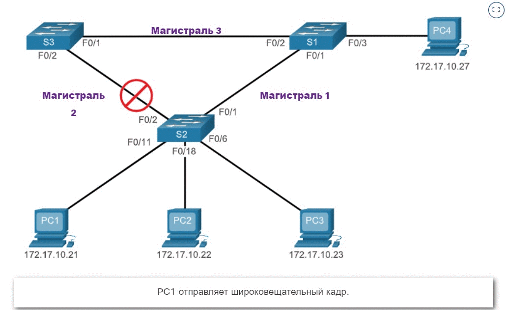
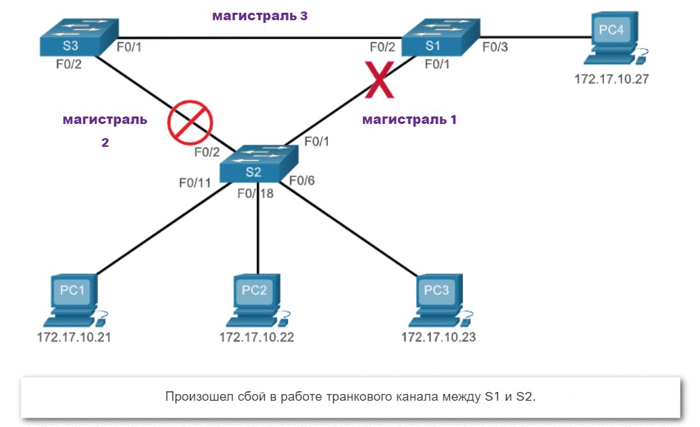
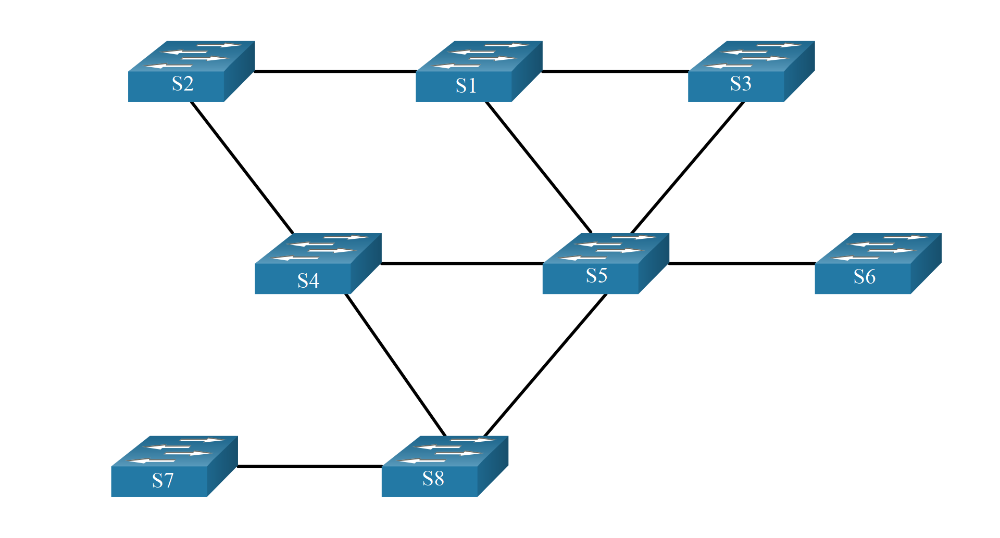
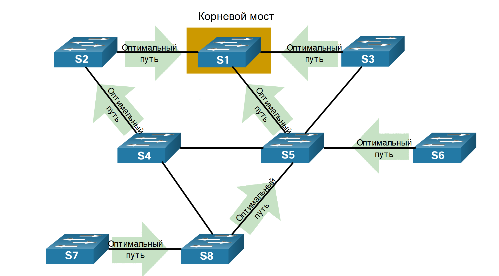
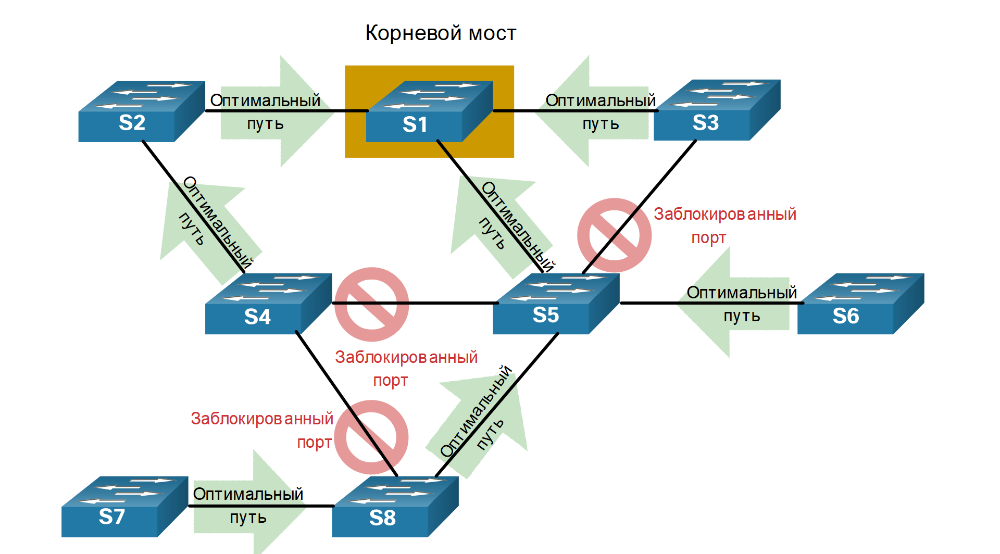
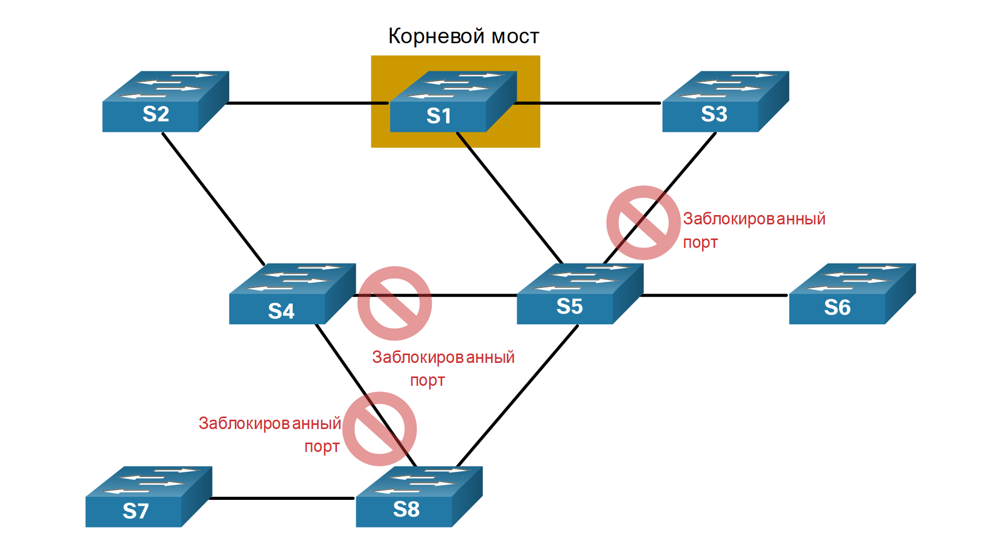
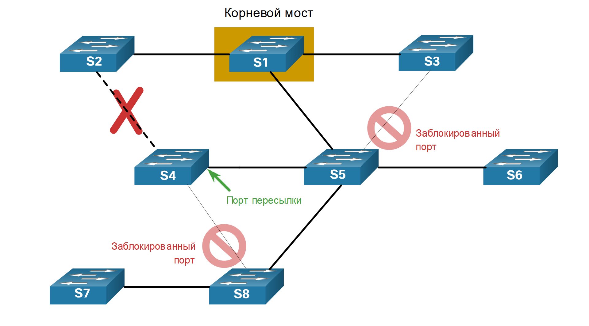

<!-- 5.1.1 -->
## Резервирование в коммутируемых сетях уровня 2

В этом разделе рассматриваются причины возникновения петель в коммутируемых сетях и кратко описывается, как работает протокол связующего дерева. Резервирование является важной частью иерархической модели, предотвращающей перебои в оказании сетевых сервисов пользователям. Для сетей с резервированием требуется добавление физических путей, но необходимо также предусмотреть и логическое резервирование. Наличие альтернативных физических каналов для передачи данных по сети позволяет пользователям получить доступ к сетевым ресурсам даже в случае сбоя одного из каналов. Тем не менее избыточные маршруты в коммутируемой сети Ethernet могут привести к возникновению физических и логических петель 2-го уровня.

Для локальных сетей Ethernet требуется топология без петель с одним путем между любыми двумя устройствами. Петля в локальной сети Ethernet может вызывать постоянное распространения кадров Ethernet до тех пор, пока соединение не будет разорвано и это не ликвидирует петлю.

<!-- 5.1.2 -->
## Протокол STP

Протокол связующего дерева (STP) - это сетевой протокол предотвращения петель, который обеспечивает избыточность при создании топологии уровня 2 без петель. IEEE 802.1D является исходным стандартом IEEE MAC соединения мостов для STP.

Посмотрите на работу STP в нормальном режиме:

<!-- 5.1.3 -->
## Перестройка STP

Посмотрите анимацию пересчета STP в случае сбоя:

На анимации, видно что произошел сбой в работе транкового канала между S1 и S2. S2 разблокирует порт для Trunk2. Компьютер PC1 отправляет широковещательный кадр на S2. S2 пересылает его из всех портов, за исключением порта источника и неисправного канала для Trunk1.  S3 пересылает его из всех доступных портов, за исключением порта источника.  S1 передает его только из F0/3.

<!-- 5.1.4 -->
## Проблемы с избыточными каналами коммутатора

Резервирование путей обеспечивает необходимую доступность множества сетевых сервисов, устраняя вероятность перебоев в работе всех сетевых служб в случае отказа в отдельной точке. При наличии нескольких путей между двумя устройствами и отсутствии реализации протокола spanning-tree возникает петля 2-го уровня. Петли уровня 2 могут привести к нестабильности таблицы MAC-адресов, перегрузке каналов и высокой загрузке ЦП на коммутаторах и конечных устройствах, в результате чего сеть становится непригодной для использования.

В отличие от протоколов уровня 3, IPv4 и IPv6, уровень 2 Ethernet не включает в себя механизм распознавания и устранения бесконечно зацикливающихся кадров. Некоторые протоколы 3-го уровня используют механизмы времени жизни (TTL), которые ограничивают количество попыток повторной передачи пакетов сетевыми устройствами 3-го уровня. Маршрутизатор уменьшит TTL (Time to Live) в каждом пакете IPv4 и поле Hop Limit в каждом пакете IPv6. Когда эти поля уменьшатся до 0, маршрутизатор отбрасывает пакет. Коммутаторы Ethernet и Ethernet не имеют сопоставимого механизма ограничения числа раз, когда коммутатор передает кадр уровня 2. STP был разработан специально в качестве механизма предотвращения петли для Ethernet уровня 2.

<!-- 5.1.5 -->
## Петли 2-го уровня

Без включения STP петли уровня 2 могут формироваться, что приводит к бесконечному циклу широковещательных, многоадресных и неизвестных одноадресных кадров. Это может привести к разрушению сети в течение очень короткого промежутка времени, иногда всего за несколько секунд. Например, широковещательные кадры, такие как запрос ARP, перенаправляются на все порты коммутатора, кроме исходного входного порта. Это гарантирует, что все устройства в домене широковещательной рассылки могут получить кадр. При наличии более одного пути, из которого пересылается кадр, может возникнуть бесконечная петля. При появлении петли возникает возможность постоянного изменения таблицы MAC-адресов на коммутаторе обновлениями из кадров широковещательной рассылки, что приводит к нестабильности базы данных MAC-адресов. Это может привести к высокой загрузке ЦП, что приводит коммутатор в не рабочее состоянии.

Кадры широковещательной рассылки являются не единственным типом кадров, на которые влияет возникновение петель. Неизвестные одноадресные кадры, отправленные в циклическую сеть, могут приводить к появлению дублирующихся кадров, поступающих на целевое устройство. Неизвестный одноадресный кадр с коммутатора формируется, когда у коммутатора нет MAC-адреса назначения в таблице MAC-адресов, и он должен переслать этот кадр со всех своих портов, за исключением входного порта.

Нажмите Воспроизвести для просмотра анимации. Когда анимация приостанавливается, прочитайте текст, описывающий действие. Анимация продолжится после короткой паузы.

<!--
The figure is an animation with the same topology as in the previous animation.There are no blocked ports. p c 1 sends a broadcast frame. s 2 updates the mac address table. pc 1s mac address is mapped to f0-/11. s 2 forwards the broadcast out all ports, except the receiving port. s 3 and s 1 update their mac address tables with p c 1 information. s 3 and s 1 forward the broadcast out all ports, except the receiving port.  s 1 and s 3 receive a packet from p c 1 on a new port. they update their mac address table accordingly. s 1 and s 3 forward the broadcast out all ports, except the receiving port. s 2 updates its mac address table for p c 1 with the last port on which it received the broadcast frame. s 2 forwards teh broadcast frame out all ports, except the last received port. the cycle starts again. 
-->

<!-- 5.1.6 -->
## Широковещательный шторм

Широковещательный шторм - это ненормально большое количество широковещательных передач, подавляющих сеть в течение определенного периода времени. Широковещательные штормы могут отключить сеть за считанные секунды, перегружая коммутаторы и конечные устройства. Широковещательные штормы могут быть вызваны аппаратными проблемами, такими как неисправный сетевой адаптер или петля 2-го уровня в сети.

Широковещательные рассылки уровня 2 в сети, такие как ARP-запросы, очень распространены. Петля Уровня 2, вероятно, будет иметь немедленные и разрушительные последствия в сети. Многоадресные рассылки второго уровня обычно пересылаются так же, как и широковещательные рассылки коммутатором. Таким образом, хотя пакеты IPv6 никогда не пересылаются как широковещательная передача уровня 2, ICMPv6 Neighbor Discovery использует многоадресную рассылку уровня 2.

Просмотрите анимацию, которая демонстрирует все более неблагоприятные последствия петли, поскольку широковещательные и неизвестные кадры одноадресной передачи продолжают распространяться в течение широковещательного шторма.

Узел, участвующий в сетевой петле, недоступен для других узлов в сети. Кроме того, вследствие постоянных изменений в таблице MAC-адресов коммутатор не знает, из какого порта следует пересылать кадры одноадресной рассылки. В вышеуказанном примере для PC1 перечислены неправильные порты. Любой одноадресный кадр, предназначенный для PC1, пересылается в сети по петле, подобно широковещательным кадрам. Из-за возрастающего числа кадров, формирующих петлю в сети, в конечном итоге образуется широковещательный шторм.

Во избежание подобных проблем в сети с избыточностью, на коммутаторах должны быть включены определённые типы протокола spanning-tree. Протокол spanning-tree по умолчанию включено на коммутаторах Cisco, предотвращая, таким образом, возникновение петель 2-го уровня.

<!-- 5.1.7 -->
## Алгоритм связующего дерева

Протокол STP основан на алгоритме, изобретенном Радией Перлман (Radia Perlman) во время ее работы в Digital Equipment Corporation и опубликованном в статье 1985 г. «Алгоритм распределенного вычисления протокола связующего дерева в расширенной сети LAN» (An Algorithm for Distributed Computation of a Spanning Tree in an Extended LAN). Ее алгоритм связующего дерева (STA) создает топологию без петли, выбрав один корневой мост, где все остальные коммутаторы определяют один путь с наименьшей стоимостью.

Без протокола предотвращения петель возникли бы петли, делающие избыточную коммутируемую сеть неработоспособной.

**Сценарий топологии STA**

В этом сценарии STA используется сеть Ethernet с избыточными соединениями между несколькими коммутаторами.

<!-- /courses/srwe-dl/af9ece92-34fe-11eb-b1b2-9b1b0c1f7e0d/afb62728-34fe-11eb-b1b2-9b1b0c1f7e0d/assets/c9cdc731-1c27-11ea-af09-3b2e6521927c.svg -->

**Выбор корневого мост**

Алгоритм связующего дерева начинается с выбора одного корневого моста. На рисунке показано, что коммутатор S1 был выбран в качестве корневого моста. В этой топологии все каналы имеют одинаковую стоимость (та же пропускная способность). Каждый коммутатор определяет один путь с наименьшей стоимостью от себя до корневого моста.

**Примечание**: STA и STP называют коммутаторы - мостами. Это связано с тем, что в первые дни Ethernet коммутаторы назывались мостами.

<!-- /courses/srwe-dl/af9ece92-34fe-11eb-b1b2-9b1b0c1f7e0d/afb62728-34fe-11eb-b1b2-9b1b0c1f7e0d/assets/c9ce1552-1c27-11ea-af09-3b2e6521927c.svg -->

**Блокирование избыточных путей**

Протокол STP обеспечивает наличие только одного логического пути между всеми узлами назначения в сети путем намеренного блокирования резервных путей, которые могли бы вызвать петлю. Порт считается заблокированным, когда заблокирована отправка и прием данных на этот порт. Для предотвращения петель в сети чрезвычайно важно блокировать резервные пути.

<!-- /courses/srwe-dl/af9ece92-34fe-11eb-b1b2-9b1b0c1f7e0d/afb62728-34fe-11eb-b1b2-9b1b0c1f7e0d/assets/c9ce8a82-1c27-11ea-af09-3b2e6521927c.svg -->

Коммутаторы S4, S5 и S8 заблокировали избыточные пути к корневому мосту.

**Топология без петель**

Заблокированный порт приводит к тому, что эта ссылка не пересылает между двумя коммутаторами, как показано на рисунке. Обратите внимание, что это создает топологию, в которой каждый коммутатор имеет только один путь к корневому мосту, аналогично ветвям дерева, которые подключаются к корню дерева.

<!-- /courses/srwe-dl/af9ece92-34fe-11eb-b1b2-9b1b0c1f7e0d/afb62728-34fe-11eb-b1b2-9b1b0c1f7e0d/assets/c9cf74e1-1c27-11ea-af09-3b2e6521927c.svg -->

Теперь у каждого коммутатора есть только один путь пересылки данных к корневому мосту.

**Сбой связи вызывает перерасчет**

Физические пути по-прежнему используются для обеспечения избыточности, однако эти пути отключены в целях предотвращения петель. Если путь потребуется для компенсации неисправности сетевого кабеля или коммутатора, протокол STP повторно рассчитывает пути и снимает блокировку с требуемых портов, чтобы разрешить активацию избыточного пути. Перерасчет STP также могут происходить в любой момент, когда новый коммутатор или новый межкоммутационный канал добавляется в сеть.

На рисунке показан сбой канала между коммутаторами S2 и S4, который приводит к перерасчету STP. Обратите внимание, что ранее избыточный канал между S4 и S5 теперь перенаправляется для компенсации этого сбоя. Между каждым коммутатором и корневым мостом остается только один путь.

<!-- /courses/srwe-dl/af9ece92-34fe-11eb-b1b2-9b1b0c1f7e0d/afb62728-34fe-11eb-b1b2-9b1b0c1f7e0d/assets/c9d01120-1c27-11ea-af09-3b2e6521927c.svg -->

Протокол STP предотвращает возникновение петель за счет настройки беспетлевого пути в сети с использованием портов, стратегически настроенных на заблокированное состояние. Коммутаторы, использующие протокол STP, могут компенсировать сбои за счет динамической разблокировки ранее блокированных портов и разрешения передачи трафика по альтернативным путям.

<!-- 5.1.8 -->
## Видео - Наблюдение за работой STP

Посмотрите видео о работе протокола STP.

<!-- 5.1.9 -->
## Packet Tracer - изучение работы STP для предотвращения петли 

В рамках данного упражнения Packet Tracer необходимо решить следующие задачи.

* Создайте и настройте простую сеть с тремя коммутаторами с STP.
* Обзор работы протокола STP
* Отключите STP и снова просмотрите работу сети.

[изучение  работы  STP для предотвращения петли (pdf)](./assets/5.1.9-packet-tracer---investigate-stp-loop-prevention_ru-RU.pdf)

[изучение  работы  STP для предотвращения петли (pka)](./assets/5.1.9-packet-tracer---investigate-stp-loop-prevention_ru-RU.pka)

<!-- 5.1.10 -->
<!-- quiz -->