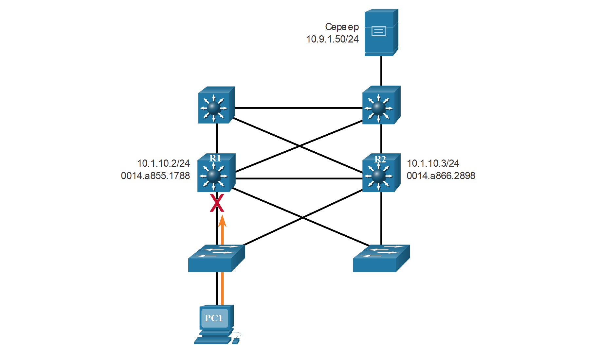
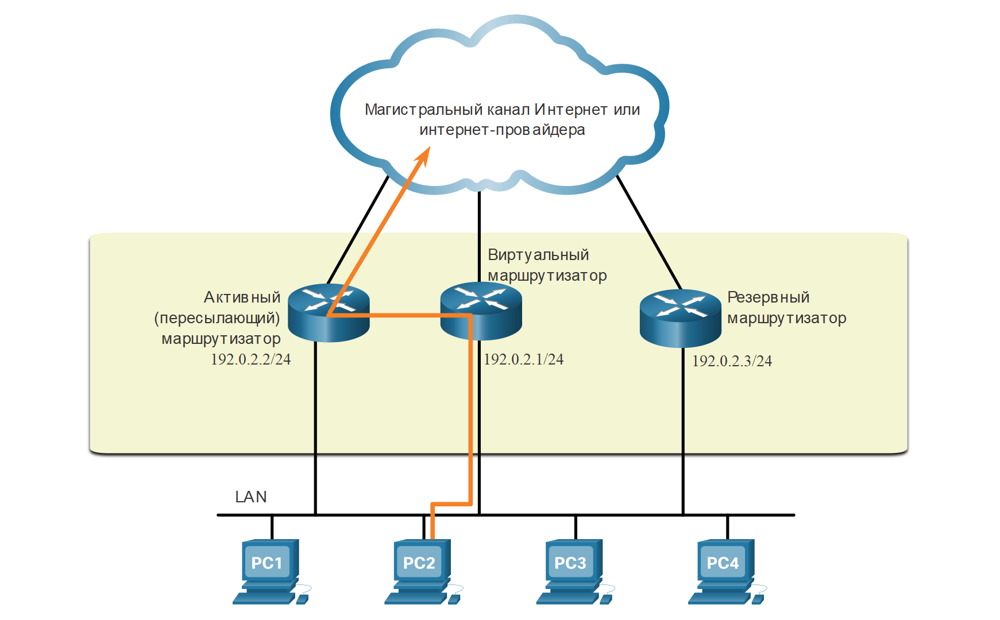
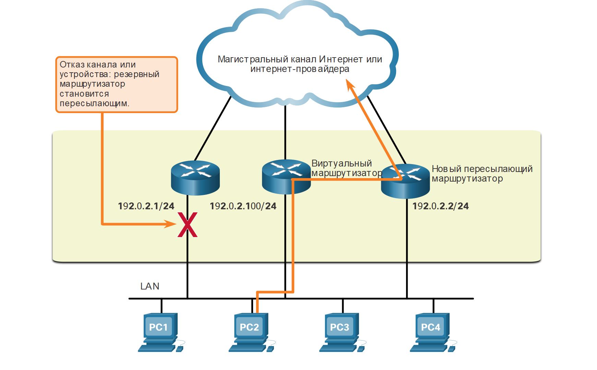

<!-- 9.1.1 -->
## Ограничения шлюза по умолчанию

В случае сбоя маршрутизатора или интерфейса маршрутизатора (который выступает в качестве шлюза по умолчанию), узел, для которого настроено использование этого шлюза по умолчанию, изолируется от внешних сетей. Требуется механизм для предоставления альтернативных шлюзов по умолчанию в коммутируемых сетях, где два или более маршрутизаторов подключены к одним и тем же сетям VLAN. Этот механизм обеспечивается протоколами резервирования первого перехода (FHRP).

В коммутируемой сети все клиенты получают только один шлюз по умолчанию. Невозможно использовать дополнительный шлюз, даже если существует второй путь для передачи пакетов из локального сегмента.

На рисунке R1 отвечает за маршрутизацию пакетов от PC1. В случае недоступности R1 протоколы маршрутизации выполняют динамическое схождение. Теперь R2 маршрутизирует пакеты из внешних сетей, которые должны были пройти через R1. Тем не менее трафик из внутренней сети, связанный с R1, включая трафик с рабочих станций, серверов и принтеров, для которых R1 настроен в качестве шлюза по умолчанию, до сих пор отправляется на R1 и сбрасывается.

**Примечание**: В рамках обсуждения обеспечения избыточности маршрутизатора, мы не делаем функциональное различие между многоуровневым коммутатором и маршрутизатором на уровне распределения. На практике многоуровневые коммутаторы часто выступают в роли шлюза по умолчанию для всех сетей VLAN в коммутируемой сети. В этом обсуждении основное внимание уделяется функциональности маршрутизации, независимо от используемого физического устройства.

<!-- /courses/srwe-dl/af9ece9a-34fe-11eb-b1b2-9b1b0c1f7e0d/afb6ea70-34fe-11eb-b1b2-9b1b0c1f7e0d/assets/ca30cec2-1c27-11ea-af09-3b2e6521927c.svg -->

PC1 не может подключиться к шлюзу по умолчанию.

Конечные устройства, как правило, настраиваются с одним IP-адресом для шлюза по умолчанию. Этот адрес не изменяется при изменении топологии сети. Если IP-адрес шлюза по умолчанию недоступен, локальное устройство не может отправлять пакеты из локального сегмента сети, что по факту отключает это устройство от остальных сетей. Даже при наличии избыточного маршрутизатора, который может выступать в качестве шлюза по умолчанию для этого сегмента, динамический метод, с помощью которого эти устройства могут определять адрес нового шлюза по умолчанию, недоступен.

**Примечание**: Устройства IPv6 получают адрес шлюза по умолчанию динамически из объявления маршрутизатора RA ICMPv6. Однако при использовании FHRP устройства IPv6 получают более быстрое переключение на новый шлюз по умолчанию.

<!-- 9.1.2 -->
## Резервирование маршрутизаторов

Один из способов устранения единой точки отказа на шлюзе по умолчанию — реализация виртуального маршрутизатора. Для реализации этого типа избыточности маршрутизатора несколько маршрутизаторов настраиваются для совместной работы, что создает иллюзию одного маршрутизатора на узлах сети LAN, как показано на рисунке. При совместном использовании IP-адреса и MAC-адреса два или более маршрутизаторов могут работать как один виртуальный маршрутизатор.

<!-- /courses/srwe-dl/af9ece9a-34fe-11eb-b1b2-9b1b0c1f7e0d/afb6ea70-34fe-11eb-b1b2-9b1b0c1f7e0d/assets/ca316b01-1c27-11ea-af09-3b2e6521927c.svg -->

Адрес IPv4 виртуального маршрутизатора настраивается в качестве шлюза по умолчанию для рабочих станций в отдельном сегменте IPv4. При отправке кадров с хост-устройств на шлюз по умолчанию хосты используют ARP для разрешения MAC-адреса, связанного с адресом IPv4 шлюза по умолчанию. С помощью протокола ARP определяется MAC-адрес виртуального маршрутизатора. После этого кадры, которые отправлены на MAC-адрес виртуального маршрутизатора, можно обработать физически с помощью текущего активного маршрутизатора в пределах группы виртуального маршрутизатора. Протокол используется для определения двух или более маршрутизаторов в качестве устройств, отвечающих за обработку кадров, отправляемых на MAC- или IP-адрес одного виртуального маршрутизатора. Конечные устройства отправляют трафик на адреса виртуального маршрутизатора. Физический маршрутизатор, который пересылает этот трафик, является прозрачным для конечных устройств.

Протокол резервирования предоставляет механизм для определения маршрутизатора, который должен выполнять активную роль в пересылке трафика. Он также определяет, когда роль пересылки должна перейти к избыточному маршрутизатору. Переход от одного пересылающего маршрутизатора к другому является прозрачным для конечных устройств.

Способность сети динамически восстанавливаться после сбоя устройства, выполняющего функцию шлюза по умолчанию, называется избыточностью на первом хопе.

<!-- 9.1.3 -->
## Действия при переключении в случае отказа маршрутизатора

В случае сбоя активного маршрутизатора протокол резервирования переводит резервный маршрутизатор на новые функции активного маршрутизатора. В случае сбоя активного маршрутизатора происходит следующее.

1. Резервный маршрутизатор перестает видеть сообщения приветствия от пересылающего маршрутизатора.
2. Резервный маршрутизатор принимает роль передающего маршрутизатора.
3. Поскольку новый пересылающий маршрутизатор использует как адрес IPv4, так и MAC-адрес виртуального маршрутизатора, хост-устройства не замечают перебоев в обслуживании.

<!-- /courses/srwe-dl/af9ece9a-34fe-11eb-b1b2-9b1b0c1f7e0d/afb6ea70-34fe-11eb-b1b2-9b1b0c1f7e0d/assets/ca31e031-1c27-11ea-af09-3b2e6521927c.svg -->

<!-- 9.1.4 -->
## Варианты FHRP

FSRP, используемая в производственной среде, в значительной степени зависит от оборудования и потребностей сети. В таблице перечислены все варианты, доступные для FHRP.

| Варианты FHRP | Описание |
| --- | --- |
| Протокол HSRP | HRSP является собственной разработкой Cisco-FHRP, которая предназначена для обеспечения прозрачного переключение на резервное устройство IPv4 первого перехода. HSRP обеспечивает высокую доступность сети путем обеспечения избыточности маршрутизации первого перехода для IPv4 сетей, настроенных с адресом шлюза IPv4 по умолчанию. HSRP HSRP используется группой маршрутизаторов для выбора активного и резервное устройства. В группе интерфейсов устройств активным устройством является устройство, которое используется для маршрутизации пакетов; резервное устройство - устройство, которое берет на себя, когда активное устройство выходит из строя, или когда предварительно установленные условия сработали. Функция резервного маршрутизатора HSRP заключается в контроле работоспособного состояния группы HSRP и быстрого принятия роли переадресации пакетов в случае сбоя активного маршрутизатора. |
| HSRP для IPv6 | Это патентованная Cisco-FHRP, которая обеспечивает ту же функциональность HSRP, но в среде IPv6. Группа HSRP IPv6 имеет виртуальный MAC адрес, полученный из номера группы HSRP и виртуального канала IPv6, полученный из виртуального MAC-адреса HSRP. Периодические объявления маршрутизатора (RA) отправляются для локального адреса канала виртуальной IPv6 HSRP, когда группа HSRP активна. Когда группа становится неактивной, эти RAs останавливаются после отправки последнего RA. |
| Протокол избыточного резервирования виртуальных маршрутизаторов версии 2 (VRRPv2) | Открытый протокол выбора, динамически назначающий VRRP-маршрутизаторам ответственность за один или несколько виртуальных маршрутизаторов в IPv4-сети LAN. Таким образом, несколько маршрутизаторов в канале с множественным доступом могут использовать один виртуальный IPv4-адрес. Маршрутизатор VRRP настроен для запуска VRRP в сочетании с одним или несколькими другими маршрутизаторами, подключенными к локальной сети. В конфигурации VRRP один из маршрутизаторов выбирается в качестве основного виртуального маршрутизатора, а другие выступают в роли резервных на случай сбоя основного виртуального маршрутизатора. |
| VRRPv3 | VRRPv3 предоставляет функции поддержки IPv4- и IPv6-адресов. VRRPv3 поддерживает адреса IPv4 и IPv6, работает в неоднородных средах и предоставляет более широкие возможности масштабирования, чем VRRPv2. |
| Протокол распределения нагрузки для шлюзов (GLBP) | Проприетарный протокол FHRP Cisco, который обеспечивает защиту трафика данных от неисправного маршрутизатора или сети (например, HSRP и VRRP), одновременно обеспечивая балансировку нагрузки (т. н. распределение нагрузки) по группе избыточных маршрутизаторов. |
| GLBP для IPv6 | Проприетарный протокол FHRP Cisco, который предоставляет те же функции GLBP, но для среды IPv6. GLBP для IPv6 обеспечивает автоматическое резервирование маршрутизаторов для узлов IPv6, настроенных с одним шлюзом по умолчанию в сети LAN . Несколько маршрутизаторов первого перехода в сети LAN объединены в целях предоставления одного виртуального IPv6-маршрутизатора первого перехода при одновременном распределении нагрузки в процессе пересылки IPv6-пакетов. |
| Протокол обнаружения маршрутизаторов с использованием ICMP (IRDP) | Указанный в RFC 1256, IRDP является устаревшим решением FHRP. IRDP позволяет IPv4 определять местоположение маршрутизаторов, обеспечивающих подключение по IPv4 к другим (нелокальным) IP-сетям. |

<!-- 9.1.5 -->
<!-- quiz -->